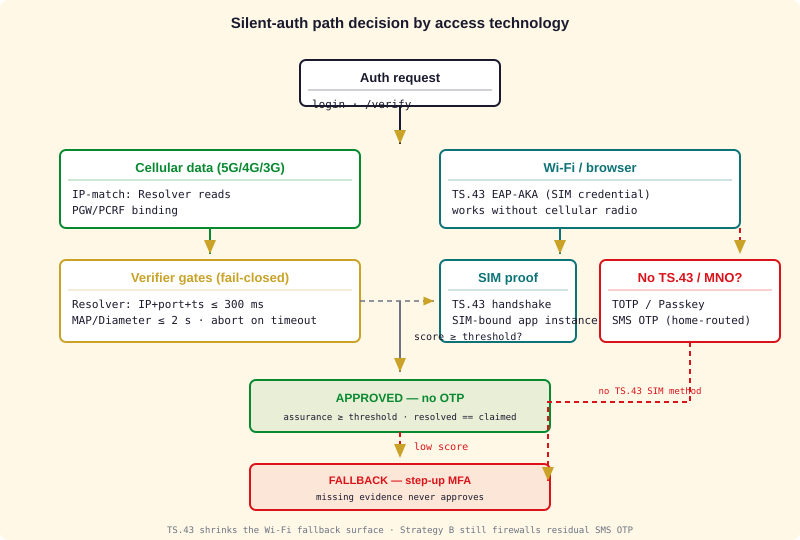
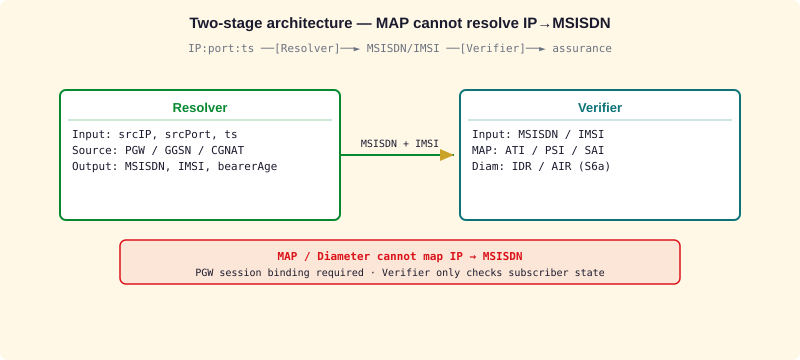
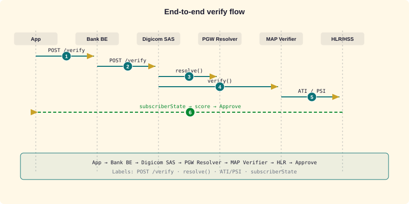
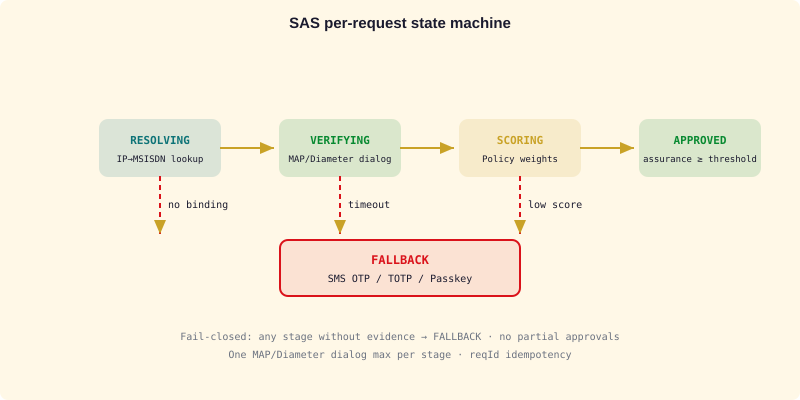
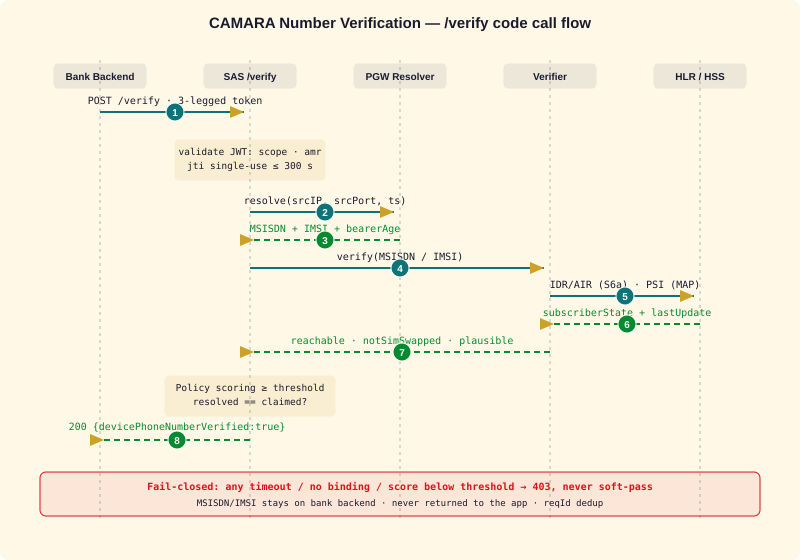

# Silent Authentication

[](LICENSE.md)

Research / implementation workspace for **network-side silent authentication** (no SMS OTP), seeded from Supermemory (2026-07-18).

## What it is

Silent Authentication verifies that a claimed phone number matches the device currently on the cellular network — zero user friction, mitigates SIM swap and SS7 SMS interception.

Primary app-facing surface: **CAMARA Number Verification API**.

## Core mechanism (IP ↔ subscriber match)

1. App/client sends the device’s **current cellular session IP** with the auth request.
2. Network resolves **MSISDN / IMSI / subscriber state** via signaling.
3. Match cellular-session IP to the verified subscriber identity.
4. Success → authenticated; failure / unavailable → fallback MFA.

**Constraints**

- **Network / IP-matching method** requires **active cellular data** (not Wi‑Fi-only).
- **SIM method (GSMA TS.43, EAP-AKA)** works across **Wi‑Fi + browsers** — the SIM
  credential, not the bearer IP, is the root of trust. This widens coverage and shrinks
  the fallback-to-OTP surface. See `docs/design/unified-identity-sms-security-architecture.md`.
- Coverage can be limited (~50% in some regions for the IP method).
- Fallback when unavailable: TOTP, Passkey, or push notification.

## Call flows (diagrams)

### 1. Access-tech decision & fail-closed pipeline

Which method applies (cellular IP-match vs Wi-Fi SIM / TS.43), and the gates that
must all pass before approval. Missing evidence at any gate → **FALLBACK**, never a
soft-pass.



### 2. End-to-end silent-auth verify flow

Signaling call flow: Bank Backend → SAS → IP Resolver → MAP/Diameter Verifier →
HLR/HSS — and the inner SAS state machine.







### 3. CAMARA NV `/verify` code call flow

REST-level sequence for the Number Verification API: JWT validation, resolver +
verifier round-trips, and the boolean verdict (fail-closed → 403, never a soft-pass).



### 4. Verifier signalling detail

| Diagram | Access | Operations |
|---------|--------|-----------|
| `v2_ati_flow.svg` | 2G/3G MAP | ATI — intra-network only (FS.11 Cat 1) |
| `v2_psi_sai.svg` | 2G/3G MAP | PSI reachability + SAI SIM-swap signal |
| `v2_diameter_s6a.svg` | 4G/5G S6a | IDR/IDA + AIR/AIA |

See `docs/design/silent-auth-flow.md` for the full sequence and timeout table
(Resolver 300 ms · MAP/Diameter 2 s · total SAS ≤ 3 s).

All diagrams generated by `slides/scripts/generate_svgs_v2.py` (Ethiopian-flag palette).

## Signaling backends

### 2G/3G — SS7 MAP (HLR/VLR)

| Message | Role |
|---------|------|
| SRI-SM  | Routing / MSISDN resolution |
| ATI     | Any Time Interrogation |
| PSI     | Provide Subscriber Info |
| SAI     | Send Authentication Info |

### LTE/5G — Diameter S6a (HSS)

| Message   | Role |
|-----------|------|
| AIR / AIA | Authentication Information |
| ULR / ULA | Update Location |
| NOR / NOA | Notify |
| PUR / PUA | Purge |
| IDR / IDA | Insert Subscriber Data |

## Related CAMARA / security context

- **CAMARA**: Number Verification, SIM Swap, OTP SMS, Scam Signal, KYC Match / Number Recycling.
- **GSMA**: FS.11 (SS7 interconnect monitoring), FS.19 (Diameter), FS.20 (GTP), FS.21 (umbrella).
- Silent Auth does **not** replace SS7/Diameter firewalls; it operates at the application / identity layer.

## Layout

| Path | Role |
|------|------|
| `worktrees/silent-authentication/main` | This checkout (source of truth) |

## UE SDKs (device side)

Four standalone artifacts post the session tuple to the SAS. Build output
(`target/`, `.build/`, `node_modules/`) and the local H2 database
(`sas-host/data/`) are git-ignored — never commit them to a public tree.

| Module | Language / toolchain | Cellular 2G/3G/4G/5G login |
|--------|----------------------|----------------------------|
| `ue-sdk` | Java 25 (`mvn`) | declares `AccessTech` from the interface name; `CellularRequirement` fails closed; `Connector` seam for platform pinning |
| `ue-sdk-android` | Java 8 (`mvn`, minSdk 24, no `android.jar` dep) | **pins its own socket** to the cellular `Network` (`CellularBearer`), reads radio via `TelephonyManager`, `requestNetwork` for app-owned binding |
| `ue-sdk-ios` | Swift (SPM, iOS 14+) | `NWPathMonitor` + CoreTelephony gate; URLSession cannot pin (documented limitation), fails closed on Wi-Fi |
| `ue-sdk-web` | ES2020 (`node --test`) | observation only (`navigator.connection`); `requireCellular` refuses before `fetch` |

```bash
python3 harness/run_hardness.py          # incl. H22 bearer parity + H23 license parity
(cd ue-sdk && mvn -o test)               # JDK 25 (mise: zulu-25)
(cd ue-sdk-android && mvn -o test)
(cd ue-sdk-web && node --test)
(cd ue-sdk-ios && swift test)            # macOS/Xcode only
```

See [`docs/design/cellular-bearer-login.md`](docs/design/cellular-bearer-login.md).

## Design

- [`docs/design/silent-auth-flow.md`](docs/design/silent-auth-flow.md) — banking flow
  (no login, no OTP): Resolver (IP→MSISDN via PGW) + Verifier (MAP/Diameter) + Policy,
  with sequence diagram, SAS state machine, timeout & FS.11/FS.19 security constraints.
- [`docs/design/unified-identity-sms-security-architecture.md`](docs/design/unified-identity-sms-security-architecture.md)
  — umbrella tying two complementary strategies: **replace OTP** (silent auth) +
  **protect OTP** (SMS Home Routing + SS7/Diameter/5G firewall); decision flow by access
  tech, threat→mitigation matrix, rollout sequencing.
- [`docs/design/3gpp-spec-coverage.md`](docs/design/3gpp-spec-coverage.md) — 3GPP spec → SAS
  stage map (TS 29.002 MAP PSI/ATI/SAI/SRI-SM; TS 29.272 S6a ULR/AIR/IDR/PUR) with the
  fail-closed / dialog / privacy rules carried into every gate.
- [`docs/design/cellular-bearer-login.md`](docs/design/cellular-bearer-login.md) — UE SDK
  **cellular (2G/3G/4G/5G) login**: bearer declaration on `/session-tuple`, the SAS refusal
  of Wi-Fi tuples, and the verified platform matrix for pinning a socket (Android
  `Network.openConnection`; iOS cannot pin `URLSession`; browsers cannot pin at all).
- [`docs/design/hardness.md`](docs/design/hardness.md) — DeepSeek-Hardness: harness-driven
  pass/fail gates anchored to 3GPP clauses (skill `deepseek-hardness`).
- [`docs/result_p1_reaudit.md`](docs/result_p1_reaudit.md) — **what is production-gated
  today**: the `prod` profile (`sas-host/src/main/resources/application-prod.properties`),
  the 28-check pre-boot deployment gate (`harness/preflight_prod.py`, gates H15–H21) and
  the explicit list of what is still unproven (HSTS, live mTLS/SS7/Diameter UAT, key lifecycle).

```bash
python3 harness/run_hardness.py     # 34/34 — design contract (H1–H14) + deployment (H15–H21)
                                    #       + device bearer-declaration parity (H22)
                                    #       + dual-license parity (H23)
                                    #       + micro-jainslee boundary (H24)
python3 harness/run_hardness.py --mutations   # H24 checker mutation self-test (10/10)
python3 harness/preflight_prod.py   # refuse a lab-shaped prod deployment; exit = #failed checks
```


## Security research

Two strategies protect the same phone-number identity from opposite sides — silent auth
removes SMS where it can; a signalling firewall protects the SMS that must still be sent.

- [`docs/research/sms-channel-protection.md`](docs/research/sms-channel-protection.md) —
  SS7 (Home Routing / SRI-SM filtering / MT-spoofing / Double MAP), Diameter (S6c/S6a/SGd
  via DEA), 5G (SEPP/N32/PRINS/SMSF); appendix maps controls to jSS7 `service/sms` classes.
- [`docs/research/gsma-fs-index.md`](docs/research/gsma-fs-index.md) — FASG document index
  (FS.07/11/19/20/21/31/36, SG.22, FF.09) + FS.11 MAP categorisation.
- [`docs/research/3gpp-spec-reference-index.md`](docs/research/3gpp-spec-reference-index.md) —
  index of the 3GPP specs the SAS depends on (TS 29.002, TS 29.272, TS 33.402).
- [`docs/research/3gpp-ts29-002-map.md`](docs/research/3gpp-ts29-002-map.md) — MAP
  (PSI/ATI/SAI/SRI-SM) operation & ASN.1 notes for the 2G/3G Verifier.
- [`docs/research/3gpp-ts29-272-s6a.md`](docs/research/3gpp-ts29-272-s6a.md) — Diameter
  S6a/S6d (ULR/AIR/IDR/PUR) command reference for the LTE Verifier.

## Proposal DOCX

[`proposal/DigicomET_Silent_Auth_Proposal_v3.docx`](proposal/DigicomET_Silent_Auth_Proposal_v3.docx) —
~50-page formal proposal derived from `slides/DigicomET_Silent_AuthProposal_v3.pptx`:
fraud/UN–ITU evidence, two-stage MAP/Diameter design, CAMARA + GSMA FASG tables,
commercial ROI (illustrative), roadmap. Chapters in `proposal/chapters/`; rebuild via
`python3 proposal/scripts/build_proposal_docx.py`.

## Pitch decks

### Mix v3 (recommended)

[`slides/DigicomET_Silent_Auth_Mix_v3.pptx`](slides/DigicomET_Silent_Auth_Mix_v3.pptx) —
**28 slides**: government/bank story + MAP/Diameter tech **plus** CAMARA API table and
GSMA FASG security tables (FS.07–FS.36, SG.22, FF.09, FS.11 categories).

```bash
python3 slides/scripts/generate_svgs.py      # v1 story assets
python3 slides/scripts/generate_svgs_v2.py   # v2 protocol diagrams
python3 slides/scripts/build_pptx_v3.py
```

### Technical v2 only

[`slides/DigicomET_Silent_Auth_Technical_v2.pptx`](slides/DigicomET_Silent_Auth_Technical_v2.pptx) —
17 slides, message-flow only. `generate_svgs_v2.py` + `build_pptx_v2.py`.

### Marketing v1 only

[`slides/DigicomET_Silent_Auth_Ethiopia.pptx`](slides/DigicomET_Silent_Auth_Ethiopia.pptx) —
20-slide bank pitch. `generate_svgs.py` + `build_pptx.py`.

## Next steps

- [ ] Resolver: PGW/PCRF/CGNAT binding source (IP+port+ts → MSISDN)
- [ ] CAMARA Number Verification adapter (API contract + mock) over SAS `/verify`
- [ ] MAP verifier on jSS7 (PSI/ATI/SAI) + jDiameter S6a (IDR/AIR)
- [ ] Assurance scoring weights + per-risk thresholds
- [ ] Fallback MFA policy when cellular path unavailable
- [ ] Digicom-ET pilot packaging (API contract for Ethiopian banks)

## License & Commercial Model (dual-license)

**SPDX:** `AGPL-3.0-or-later OR LicenseRef-Silent-Auth-Operator-1.0`

Silent Authentication (SAS) is released under a **dual-license model**
(MySQL/Sidekiq pattern), both grants held by the copyright owner (Tran Nhan):
one **AGPL-3.0 Community** license and one proprietary **Operator** license.
Full terms: [`LICENSE.md`](LICENSE.md) — notice — plus the verbatim grant text
[`LICENSES/AGPL-3.0.txt`](LICENSES/AGPL-3.0.txt). **Pick exactly one** — they are not
stacked, and the Operator grant is not a supplement to AGPL.

| Edition | License | Who | Gets | Channel |
|---|---|---|---|---|
| **Community** | AGPL-3.0-or-later | Free — **whole repo** (sas-api + sas-entitlement + sas-host + UE SDKs; D1=A) | Source, mods, redistribution — **copyleft incl. network use** (AGPL §13: serve it, publish your changes) | Public source |
| **Operator** | Commercial (owner-held) | Banks / SIs / operators (Digicom-ET deployments) | **Production rights without copyleft** (incl. micro-jainslee, D2) + license key, L1/L2 SLA, training, integration engineering | Private offers, license-key enforced |

Neither edition is a warranty or a compliance claim: `/verify` answers for
**network reachability of the MSISDN**, never for the human behind the app, and
the lab profile (plain HTTP, mock transports, no auth) is **not** a deployable
configuration — see [`harness/preflight_prod.py`](harness/preflight_prod.py).

**Why AGPL-3.0, not GPL/BSL/SSPL:** the SAS Diameter path (S6a/SWx) links a
local fork of Mobius **corsac-diameter, which is AGPL-3.0** — any distributed
combined binary is legally AGPL. AGPL is therefore the only compatible *and*
the monetization lever (same posture as the Mobicents/jSS7 ecosystem). All
other deps (Quarkus, Log4j2, Jackson, jSS7) are Apache-2.0/LGPL —
AGPL-compatible; `micro-jainslee` is in-house and owner-held under the same
dual license (D2).

**UE SDK note (deliberate, not an oversight):** the client SDKs are AGPL too,
so an app that embeds them and ships a modified SDK must publish that source.
A bank that wants a permissive client (Apache-2.0/MIT) takes it through the
**Operator** license — that is the intended commercial boundary, not a fork.

**Open source + revenue ("trả tiền"):** Community edition is the free funnel
(bank/operator onboarding, PoCs); the paid Operator edition earns per-deployment
license revenue (per verify / node / year) through the Digicom-ET VAS model,
supported by L1/L2 SLA, training and integration engineering.

Research & decision records and the commercial / go-to-market plan are
maintained privately (outside this public tree).
Owner decisions (2026-08-28, shared with the Elisa Roaming product family):
**D1 = open everything** (single all-AGPL tree, incl. SAS host);
**D2 = micro-jainslee dual-licensed** (AGPL/commercial);
**D3 = Mobius corsac handled by direct relationship** — no open blocker.