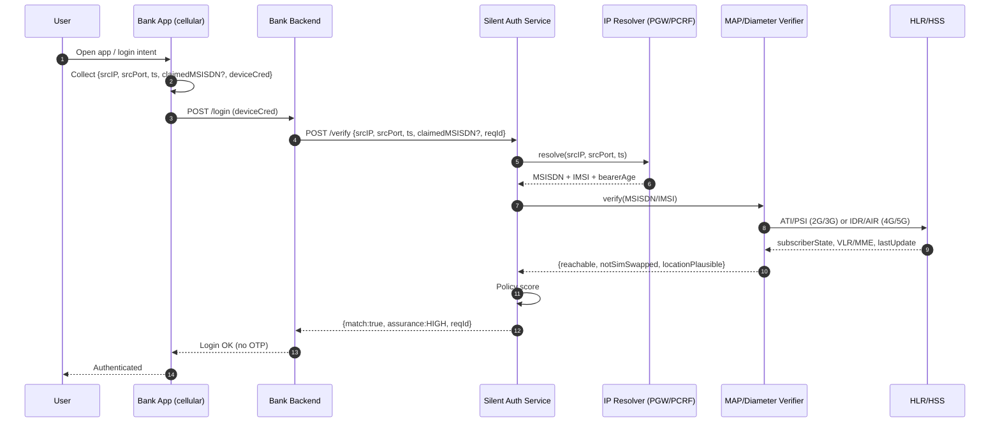
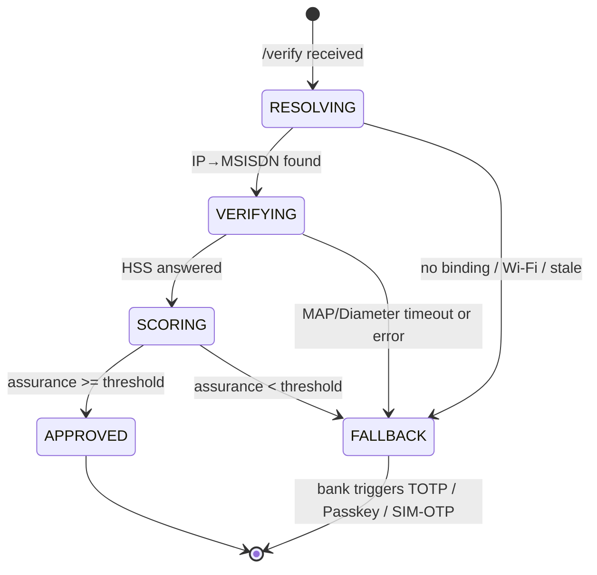

# Silent Authentication — Banking Flow Design

Redesign target: **bank app login with no password re-entry and no SMS OTP**.
Auth = *proof that the phone currently on the cellular network owns the claimed MSISDN*.

Seeded from Supermemory (2026-07-18) + GSMA FS.11/FS.19 review (2026-07-20).

---

## 1. The one hard fact that shapes everything

**MAP / Diameter cannot map `IP → MSISDN`.**

| Question | Who answers it |
|----------|----------------|
| Which MSISDN owns cellular IP `A.B.C.D:port` right now? | **PGW / GGSN session binding** (Gi/SGi accounting, PCRF Gx/Sd, or CGNAT log) |
| Is that MSISDN a live, non-SIM-swapped subscriber? | **MAP** (ATI/PSI/SAI) or **Diameter S6a** (AIR/IDR) |

So the service is **two stages**, not one:

```
IP:port:ts  ──[Resolver]──►  MSISDN/IMSI  ──[Verifier: MAP/Diameter]──►  assurance
```

CGNAT is why the app MUST send **IP + source port + timestamp**: many subscribers
share one public IPv4, only the 5-tuple + time disambiguates. Collecting `port` is correct.

---

## 2. Actors

| Actor | Role |
|-------|------|
| Bank App (mobile) | Runs on **cellular data**, collects local session info, calls SAS |
| Bank Backend | Owns the login decision; calls SAS server-to-server |
| **SAS** (Silent Auth Service) | Our component. Resolver + Verifier + Policy |
| IP Resolver | Reads PGW/GGSN session store (operator-hosted) |
| MAP/Diameter Verifier | jSS7 (2G/3G) + jDiameter S6a (4G/5G) |
| HLR / HSS | Operator subscriber DB (intra-network only) |

> **FS.11 constraint:** `AnyTimeInterrogation` (ATI) is **Category 1** — blocked on
> interconnect. SAS therefore runs **inside the operator** and queries its **own** HLR/HSS.
> No cross-operator ATI. This is a deployment invariant, not a detail.

---

## 3. End-to-end flow (happy path)



If `claimedMSISDN` is supplied, SAS asserts `resolved == claimed`. If omitted,
SAS *returns* the verified MSISDN (number-verification style) and the bank binds it.

---`

## 4. SAS internal state machine

Per-request FSM. One request = one MAP/Diameter dialog max per stage.



**No partial approvals.** Any stage that cannot produce evidence → `FALLBACK`,
never a soft-pass. Fail-closed.

---

## 5. Verifier: which signalling message

| Access | Primary | Purpose | FS category |
|--------|---------|---------|-------------|
| 2G/3G | **PSI** (ProvideSubscriberInfo) | subscriber state + location, intra-net | Cat 2.1 |
| 2G/3G | **ATI** | any-time interrogation (intra-net ONLY) | Cat 1 on interconnect |
| 2G/3G | **SAI** | auth vectors / SIM-swap freshness | Cat 3.2 |
| 4G/5G | **IDR/IDA** (S6a) | insert/inspect subscriber data | FS.19 |
| 4G/5G | **AIR/AIA** (S6a) | authentication info | FS.19 |

SIM-swap signal = compare `lastUpdateLocation` / IMSI-change age vs. request time.
Fresh swap (minutes/hours) → downgrade assurance → FALLBACK.

jSS7 wiring (already present in `coral-valley/jSS7`):

- `service/mobility/subscriberInformation/AnyTimeInterrogationRequestImpl` — ATI
- `service/mobility/subscriberInformation/ProvideSubscriberInfoRequestImpl` — PSI
- `service/mobility/authentication/SendAuthenticationInfoRequestImpl` — SAI
- Dialogs opened via `MAPProviderImpl` → `MAPServiceMobility`.

---

## 6. Assurance scoring (policy)

```
score =  w1 * ipBindingFresh(bearerAge)      // PGW binding age < N sec
       + w2 * subscriberReachable            // PSI/IDR says attached
       + w3 * notSimSwapped(lastImsiChange)   // > swapCooldown
       + w4 * locationPlausible               // VLR/MME vs expected region
APPROVE if score >= threshold AND resolved==claimed (when claimed present)
```

Tunable per transaction risk (login vs. money transfer). High-value → raise threshold
or force step-up even on HIGH.

---

## 7. Timeout strategy

| Stage | Budget | On expiry |
|-------|--------|-----------|
| Resolver lookup | 300 ms | FALLBACK |
| MAP dialog (PSI/ATI) | 2 s (TC dialog timer) | abort dialog, FALLBACK |
| Diameter S6a (IDR/AIR) | 2 s | FALLBACK |
| Total SAS budget | 3 s | bank shows normal login |

SAS is the **dialog anchor**: it never lets a hung HSS query stall the app.
On timeout it aborts the MAP dialog cleanly (no dialog leak) and returns FALLBACK.

---

## 8. Security / correctness checklist (AGENTS.md)

- **No interconnect ATI** — Cat 1; intra-network HLR only.
- **Fail-closed** — missing evidence never approves.
- **Idempotency** — `reqId` dedups retries; one dialog per stage.
- **Dialog leak** — every MAP dialog has a bounded TC timer; timeout ⇒ `abort()`.
- **Race** — bearer binding read must be point-in-time (`ts`), not "latest".
- **Replay** — SAS request signed bank→SAS (mTLS); `ts` + `reqId` window.
- **CGNAT ambiguity** — require IP+port+ts; reject if resolver returns >1 MSISDN.
- **Spoofed source GT** (FS.11 §3.3.4) — verifier trusts only own HSS responses.
- **Privacy** — MSISDN/IMSI never returned to the mobile app, only bank backend.

---

## 9. Why "no login, no OTP" holds

- Possession proof is the **live cellular bearer** bound to the SIM's MSISDN.
- SIM-swap (the classic OTP defeat) is explicitly checked via SAI / lastUpdate age.
- SMS interception (SS7) is irrelevant — no SMS is sent.
- Only degrades to OTP/Passkey/SIM-OTP when the cellular path is unavailable
  (Wi-Fi-only, no binding, stale) — see `README.md` fallback list.

---

## 10. Open items

- [ ] Resolver interface: PGW RADIUS accounting vs PCRF Sd vs CGNAT log — pick per operator.
- [ ] jDiameter S6a client module (mirror jSS7 MAP verifier).
- [ ] CAMARA Number Verification adapter mapping SAS `/verify` → CAMARA contract.
- [ ] Assurance weights + per-risk thresholds config.
