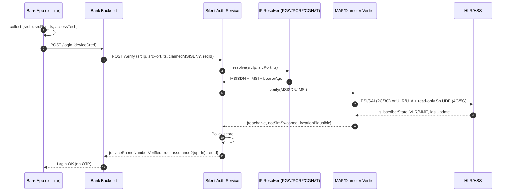
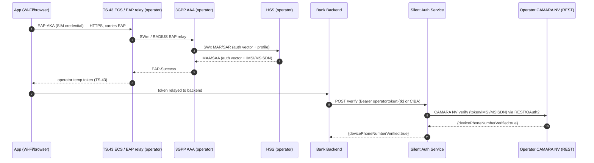
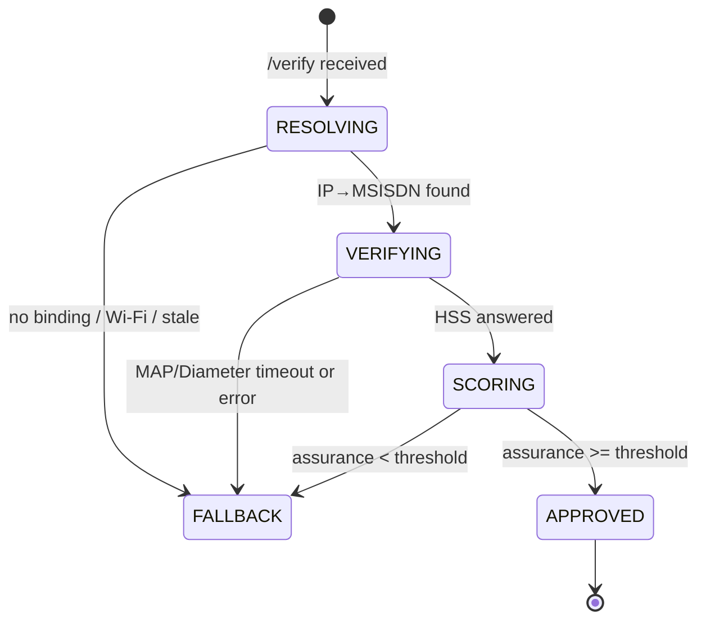

# Silent Authentication — Standard Flow (normalized)

> This document is the **normalized** version, superseding an old chatbot log
> (removed) that got several Diameter/Stx claims wrong. §11 lists each incorrect
> claim alongside the correct replacement.
>
> Source-of-Truth for the app-facing contract:
> `docs/research/camara-number-verification.md` and
> `docs/research/camara/nv-flow-analysis.md`.

- Date: 2026-09-01
- Scope: Restlink Silent Authentication (Ethiopia) — SAS acts as an **adapter
  above** the operator.
- Audience: bank backend + SAS development team.

---

## 1. What Silent Authentication is

Silent Authentication = **proving that the phone currently present on the network
is the owner of the claimed MSISDN**, **without re-entering a password and without
SMS OTP** on the happy path.

App-facing surface (global standard): **CAMARA Number Verification (NV) v2.1.0**
on the SAS `/verify`. This contract returns **only one boolean**:

```json
{ "devicePhoneNumberVerified": true }
```

Non-goal: Silent Auth does **not** replace SS7/Diameter firewalls — it complements
them (strategy A "replace OTP" in `unified-identity-sms-security-architecture.md`).

---

## 2. Invariant #1 — MAP/Diameter do NOT map `IP → MSISDN`

This shapes the entire design. MAP and Diameter have **no** answer to
"which MSISDN currently owns IP `A.B.C.D:port`".

| Question | Who answers |
|----------|-------------|
| Which MSISDN currently owns cellular IP `A.B.C.D:port` right now? | **PGW / GGSN session** (Gi/SGi accounting) or **PCRF Gx/Sd** or **CGNAT log** → **Resolver** tier |
| Is that MSISDN still live / not SIM-swapped? | **MAP** (PSI/SAI, never ATI) or **Diameter** (S6a ULR/ULA + read-only Sh UDR) → **Verifier** tier |

Therefore the service is always **two tiers**, never one:

```
IP:port:ts  ──[Resolver]──►  MSISDN/IMSI  ──[Verifier: MAP/Diameter]──►  assurance
```

CGNAT is why the app **must send IP + source port + timestamp**: many subscribers
share one public IPv4; only the 5-tuple + point-in-time can disambiguate.

---

## 3. Two silent-auth methods (complementary, not replacements)

| Method | Root of trust | Needs cellular data? | Resolver | Verifier |
|--------|---------------|----------------------|----------|----------|
| **IP-match** | PGW IP↔MSISDN + MAP/Diameter | **Yes** | PGW/GGSN, PCRF Gx/Sd, CGNAT log | 2G/3G: MAP (PSI/SAI) · 4G/5G: S6a ULR/ULA + Sh UDR |
| **SIM / TS.43 EAP-AKA** | SIM credential | **No** (Wi-Fi + browser OK) | — (token issued by 3GPP AAA) | SWm/SWx (EAP-AKA) → HSS |

> **Correcting a common wrong claim:** *"silent auth always needs cellular"* is
> **wrong for TS.43**. The SIM/TS.43 EAP-AKA method works over Wi-Fi and browsers
> because the root of trust is the SIM (EAP-AKA), not the PGW IP binding.
>
> Conversely, the **IP-match method requires cellular** — on Wi-Fi-only there is no
> PGW IP↔MSISDN binding, so it must **FALLBACK**.

## 4. Actors

| Actor | Role |
|-------|------|
| Bank App (mobile) | Runs on **cellular data**, collects the session tuple, calls SAS |
| Bank Backend | Owns the login decision; calls SAS server-to-server (mTLS) |
| **SAS** (Silent Auth Service) | Restlink component: Resolver + Verifier + Policy |
| IP Resolver | Reads PGW/GGSN session store / CGNAT log (owned by the operator) |
| MAP/Diameter Verifier | jSS7 (2G/3G) + corsac-diameter S6a (4G/5G) + SWx (TS.43, lab) |
| HLR / HSS | Operator subscriber DB (intra-network only, no interconnect) |
| 3GPP AAA (TS.43) | Terminates EAP-AKA, issues temporary operator token (Wi-Fi) |

> **FS.11 constraint:** `AnyTimeInterrogation` (ATI) is **Category 1**, blocked on
> interconnect. Therefore SAS runs **inside the operator network** and only queries
> **its own HLR/HSS**. No cross-network ATI.

---

## 5. E2E standard flow — IP-match (cellular happy path)



If `claimedMSISDN` is sent, SAS asserts `resolved == claimed`. If omitted, SAS
**returns** the verified MSISDN (number-verification style) for the bank to bind.
FSM + timeout details: §7.

---

## 6. E2E standard flow — TS.43 EAP-AKA (Wi-Fi happy path)

No cellular needed: the device authenticates with the SIM via EAP-AKA against the
operator's 3GPP AAA (optionally through an operator **TS.43 ECS / EAP relay** in front
of the AAA), receives a **temporary operator token** (single-use, ≤300 s) minted by the
SAS after the AAA calls `POST /entitlement/issue`. The backend exchanges that token via
CIBA/JWT-Bearer, then calls `/verify`.

> **The app never runs EAP-AKA directly to the AAA** — there is always an edge/ECS relay
> (WLAN AN over SWm, or a TS.43 ECS) that carries EAP in between. **Neither does the SAS
> call the AAA over SWx**: SWx exists only between the 3GPP AAA ↔ HSS (operator-internal).
> The SAS's last mile is the operator's REST — CAMARA NV (or the entitlement server's
> token introspection) — the operator does token↔IMSI/MSISDN exchange internally over
> SWx, then returns `devicePhoneNumberVerified` over HTTPS/OAuth2.



In the Restlink codebase this branch flows through the `X-Sas-Operator-Token` header
(or `Authorization: Bearer operatortoken:<tk>`) on `/verify`; the token binding
carries **both MSISDN and IMSI** (`IdentityAnchor.OperatorBinding`), and the IMSI is
threaded intact into `VerifyRequestEvent` → `VerifySbb`. In the POC, Restlink/SAS plays
the Entitlement Server itself (`/entitlement/issue`) and uses the `swxverifier` RA
(MAR/SAR) as the **operator-side HSS leg** for SIM-swap evidence — in production that
leg is done by the operator over REST (CAMARA NV / SIM Swap) or a read-only Sh/Nudr
lookup; the SAS does not open a SWx dialog itself.

## 7. SAS FSM, assurance, timeout

Per-request FSM. One request = at most **one** MAP/Diameter dialog per tier.



**Fail-closed:** missing any evidence (no binding, timeout, reject, abort) never
approves — always FALLBACK, never soft-pass.

Assurance (sketch):

```
score =  w1 * ipBindingFresh(bearerAge)      // PGW binding age < N seconds
       + w2 * subscriberReachable            // PSI (2G/3G) / ULR (4G/5G) reports attached
       + w3 * notSimSwapped(lastImsiChange)  // > swapCooldown
       + w4 * locationPlausible              // VLR/MME vs expected region
APPROVE iff score >= threshold AND (resolved == claimed when claimed present)
```

High-value transactions → raise threshold or force step-up even when HIGH.

Timeouts (SAS is the dialog anchor; never let the HSS hang the app):

| Tier | Budget | On expiry |
|------|--------|-----------|
| Resolver lookup | 300 ms | FALLBACK |
| MAP dialog (PSI/ATI) | 2 s (TC dialog timer) | `abort()` dialog, FALLBACK |
| Diameter (S6a ULR/ULA + Sh UDR) | 2 s | FALLBACK |
| Total SAS | 3 s | bank shows normal login |

---

## 8. Which signal goes where

### Resolver (answers "which MSISDN does this IP:port belong to right now")

| Source | Interface | Notes |
|--------|-----------|-------|
| PGW/GGSN session | Gi/SGi accounting | canonical IP↔MSISDN source |
| PCRF | **Gx/Sd** (CCR-I binding probe) | suitable for LTE; `sas.transport.resolver=sd` |
| CGNAT log | NAT session log | IP+port+ts mandatory |
| RADIUS accounting | RFC 2866 | `sas.transport.resolver=radius` |

> **There is no "Stx" or "S6a" for IP→MSISDN mapping.** Stx is the PCRF↔IMS-AGW
> interface (policy, not an identity query); S6a is the **Verifier**, not a resolver.

### Verifier (answers "is this MSISDN/IMSI alive / not SIM-swapped")

| Access | Message | Purpose | FS category |
|--------|---------|---------|-------------|
| 2G/3G | **PSI** ProvideSubscriberInfo | subscriber state + location, intra-net | Cat 2.1 |
| 2G/3G | **ATI** AnyTimeInterrogation | any-time (intra-net ONLY) | Cat 1 on interconnect |
| 2G/3G | **SAI** SendAuthenticationInfo | auth vectors / SIM-swap freshness | Cat 3.2 |
| 4G/5G | **ULR/ULA** (S6a) | attachment liveness + subscriber status (own HSS) | FS.19 |
| 4G/5G | **Sh UDR/SNR** (read-only) | read subscriber data → SIM-swap freshness | TS 29.328/29.329 |
| Wi-Fi (TS.43) | **MAR/MAA, SAR/SAA** (SWx) | EAP-AKA auth vector + profile | TS 33.402 |

---

## 9. CAMARA Number Verification v2.1.0 (northbound contract)

| Endpoint | Body | Response |
|----------|------|----------|
| `POST /number-verification/v2/verify` | `{phoneNumber}` **or** `{hashedPhoneNumber}` (exactly one) | `{devicePhoneNumberVerified: bool}` |
| `GET /number-verification/v2/device-phone-number` | (token scope) | `{devicePhoneNumber: "+E164"}` |

Rules that must not regress:

- **OIDC 3-legged** (app + user) or 2-legged `client_credentials` (server flow).
- Scope: `number-verification:verify` / `number-verification:device-phone-number:read`.
- **Single-use token** — one API call per token (anti-replay).
- **No refresh token** for NV scopes; token ≤ **300 s**.
- `403 NUMBER_VERIFICATION.USER_NOT_AUTHENTICATED_BY_MOBILE_NETWORK` when the token's
  `amr` indicates SMS-OTP / user+password (not mobile-network auth).
- Default response **byte-conformant** = boolean only; assurance/score only when
  opted in via `X-Sas-Assurance-Detail: true` (no `matchScore` — that field does
  not exist in CAMARA NV).

Two documentation "tracks" (per analysis r3.2):

- **Track 1 — CAMARA NV v2 northbound**: `/verify`, `/device-phone-number`, OIDC token.
- **Track 2 — TS.43 / Wi-Fi out-of-band**: `/entitlement/*`, `operatortoken:`, the
  `X-Sas-*` headers — clearly **Restlink extensions** implementing the operator-side
  roles CAMARA leaves open (Entitlement Server + network auth), **not** part of the
  CAMARA contract.

---

## 10. Security checklist (must not regress)

- **No interconnect ATI** — Cat 1; query only your own HLR/HSS.
- **Fail-closed** — missing evidence never approves.
- **Idempotency** — `reqId` dedup; one dialog per tier.
- **Dialog leak** — each MAP dialog has a TC timer; timeout ⇒ `abort()`.
- **Race** — binding read point-in-time (`ts`), not "latest".
- **Replay** — bank→SAS mTLS; `ts` + `reqId` window.
- **CGNAT ambiguity** — IP+port+ts mandatory; reject if resolver returns >1 MSISDN.
- **Bearer** — IP-match is only a cellular-bearer claim; device-declared
  `accessTech` is **advisory** (never raises assurance); a `WIFI`/`FIXED` tuple is
  rejected at `/session-tuple` (`400 ACCESS_TECH_NOT_CELLULAR`).
- **Spoofed GT** (FS.11 §3.3.4) — the verifier trusts only its own HSS responses.
- **Privacy** — MSISDN/IMSI **never** returned to the mobile app, only bank backend.

## 11. Correcting the wrong claims (from the removed chatbot log)

| Old claim (wrong) | Correct claim |
|-----|-----|
| "Use **Stx** (or S6m/S6n/Sh) to map MSISDN↔IMSI↔IP" | No Diameter interface maps IP→MSISDN. The **Resolver** uses PGW/GGSN session, PCRF **Gx/Sd**, or CGNAT log. |
| "**S6a** extracts the IMSI/MSISDN for the device holding Session Data" | **S6a is the Verifier** (ULR/ULA liveness + read-only Sh UDR freshness; **no AIR/IDR**) returning subscriber state by IMSI/MSISDN; it does **not** map IP. |
| "Stx is best for 4G session lookup; Gx/Rx is a good substitute for Stx" | Gx (CCR-I binding probe) / **Sd** is the real Resolver; Stx is the PCRF↔IMS-AGW interface, not used for identity lookup. |
| "Runs in **a few milliseconds** / latency <**200 ms**" | Standard budget: Resolver 300 ms, Verifier (MAP/S6a) 2 s, total SAS 3 s. |
| "Skip OAuth code/PKCE; browser redirect; **header injection** for absolute forgery protection" | No header injection. Use OIDC (3-legged for the app, CIBA/JWT-Bearer for TS.43) + mTLS + IP:port:ts. The IP is attested by the operator, never "absolute". |
| "Response `{devicePhoneNumberVerified, matchScore}`" | CAMARA NV v2.1.0 returns only `{devicePhoneNumberVerified: bool}`. There is no `matchScore`. |
| "Must use Data; if Wi-Fi switch to cellular" | True for **IP-match**. But **TS.43 EAP-AKA** works on **Wi-Fi + browser** with no cellular. |
| "Flow A uses S6a/**Nzh**, flow B uses **STa/Rx**/**IPDR** for CGNAT lookup" | LTE Verifier = **S6a ULR/ULA + Sh UDR**; CGNAT lookup = **CGNAT log** (Resolver tier). TS.43 = **SWm/SWx** (operator). `Nzh`/`STa/Rx`/`IPDR` are incorrect details for this flow. |
| "Check SIM swap via S6a/Nzh in the same query round" | SIM-swap freshness comes from **SAI** (MAP) / **Sh UDR** (4G/5G, read-only) comparing `lastUpdate` vs request time — not via Stx, no AIR. |
| "App runs EAP-AKA straight to the AAA; SAS exchanges the token over SWx" | App → (TS.43 ECS / EAP relay) → AAA → HSS (SWx); SAS calls the operator's **REST CAMARA NV** to redeem the token, never opens a SWx dialog. |

---

## 12. Open items (do not invent answers)

- [ ] Resolver source per operator (PGW RADIUS vs PCRF Sd vs CGNAT log).
- [x] **Diameter S6a/SWx verifier** — `ras/s6averifier` + `ras/swxverifier` on a
      local AGPL fork of corsac-diameter; lab peer `sas-diameter-testapp`.
- [ ] Assurance weights + threshold by risk class.
- [x] CAMARA NV **Java adapter** on SAS `/verify` (`sas-host/`; see `docs/research/camara/nv-flow-analysis.md` §F for conformance level).
- [x] **P2 real MAP transport** — `Jss7MapVerifierBackend` (jSS7) PSI + SAI, no ATI.
- [x] **Cellular bearer login in the UE SDKs** — `accessTech` + `X-Sas-Access-Tech` + `CellularRequirement` (see `docs/design/cellular-bearer-login.md`).
- [x] Production hardening of HTTP `/verify` (`application-prod.properties`; see `docs/result_p1_reaudit.md`).
- [ ] Post-CGNAT `srcPort` discovery (devices cannot read the NATed port — `sas-host/TODO.md` P-H8).
- [ ] Bind bearer declaration to evidence (Play Integrity / DeviceCheck) so `accessTech` stops being a claim.
- [ ] TS.43 entitlement server feasibility (Wi-Fi path).
- [ ] Restlink pilot API contract for Ethiopian banks.

---

## 13. Further reading

1. `docs/research/camara-number-verification.md` + `docs/research/camara/nv-flow-analysis.md` — the `/verify` contract.
2. `docs/research/3gpp-ts33-402-eap-aka.md` — TS.43 EAP-AKA (SWm/SWx).
3. `docs/research/3gpp-ts29-272-s6a.md` — Diameter S6a (Verifier).
4. `docs/design/cellular-bearer-login.md` — UE SDK bearer contract.
5. `docs/test/demo-script-ue-camara-entitlement-diameter.md` — end-to-end demo script.

---

## 14. Source-code layout — modules, wiring, and role in the call flows

This is a multi-module Maven build. Three modules make up the runnable SAS (parent
`et.restlink:sas-core`); two standalone apps are the operator-side lab simulators
the SAS talks to during tests.

### 14.1 Build reactor vs standalone simulators

```
sas-core (parent aggregator, et.restlink:sas-core)
 ├─ sas-api              library — CAMARA northbound contract + logic (no main)
 ├─ sas-entitlement      library — TS.43 / Wi-Fi entitlement track (→ sas-api)
 └─ sas-host             runnable Quarkus app — composition + container runtime
                         (→ sas-api + sas-entitlement)

standalone (built separately, NOT in the reactor):
 ├─ sas-diameter-testapp simulator — HSS + 3GPP AAA + PCRF(Gx) over Diameter (corsac)
 └─ sas-jss7-testapp     simulator — HLR over SS7 MAP (jSS7), PSI/SAI peer for 2G/3G
```

### 14.2 Module-by-module

| Module | Kind | Depends on | Responsibility |
|--------|------|-----------|----------------|
| **sas-api** | library | jainslee-api, quarkus-rest | the CAMARA `/verify` + `/session-tuple` + OIDC/CIBA surface, request validation, assurance policy, value models, and the resolver backend SPI + in-memory impl. Pure contract — transport-agnostic, no container, no RAs. |
| **sas-entitlement** | library | sas-api | the TS.43 / Wi-Fi operator-side Entitlement Server: `/entitlement/issue`, `/entitlement/exchange`, `/entitlement/status`, single-use operator token, attestation check. Its token feeds the sas-api `/verify` `operatortoken:` path. |
| **sas-host** | runnable Quarkus app | sas-api, sas-entitlement, micro-jainslee, jSS7, corsac Diameter | wires everything into the micro-jainslee container: `SasBootstrap` (single seam), `VerifySbb`, `VerificationFsm`, and the Resolver / MAP / S6a / SWx Resource Adaptors (+ real transport backends), plus admin dashboard, CDR, tenants and persistence. |
| **sas-diameter-testapp** | standalone simulator | corsac diameter | stands in for the operator's HSS + 3GPP AAA + PCRF(Gx) on S6a / SWx / Gx so the loop runs locally. |
| **sas-jss7-testapp** | standalone simulator | jSS7 map | stands in for the operator's HLR over SS7 MAP (PSI/SAI) for 2G/3G verification. |

### 14.3 The container seam (H24)

All SAS runtime behaviour lives in **sas-host** inside the micro-jainslee container.
`sas-api` and `sas-entitlement` are plain libraries: they define the HTTP surface and
validation, but they never own activity state, timers or signalling transports.
`com.microjainslee.core.*` is reachable from exactly one seam:
`sas-host/.../bootstrap/SasBootstrap.java`. The Resource Adaptors under
`sas-host/.../ras/{resolver,mapverifier,s6averifier,swxverifier}` are the only place
allowed to own I/O (transports), following the wrapper + delegate + backend contract
(H24 in `harness/gates.yaml`).

### 14.4 Wiring and per-call-flow roles

**IP-match (cellular) — happy path:**

```
UE SDK   ──POST /session-tuple──► sas-api SessionTupleResource        (bearer / accessTech gate)
Bank BE  ──POST /number-verification/v2/verify──► sas-api VerifyResource
   VerifyResource → SasVerifyEngine → VerifyRequestEvent
   ──► sas-host VerifySbb (inside the container)
         RESOLVING → Resolver RA   (InMemory / CgnatLog / PcrfSd / Radius backend)
         VERIFYING → S6a Verifier RA (corsac) ──SCTP──► sas-diameter-testapp (S6a: ULR/ULA; SIM-swap = Sh UDR, open)
                     MAP Verifier RA  (jSS7)   ──SCTP──► sas-jss7-testapp      (PSI/SAI, 2G/3G)
         SCORING  → VerificationFsm (weighted assurance, fail-closed)
   ◄── { devicePhoneNumberVerified: bool }
```

**TS.43 EAP-AKA (Wi-Fi) — happy path:**

```
Device   ──EAP-AKA (via TS.43 ECS)──► Operator 3GPP AAA ──SWx──► HSS → operator token
Bank BE  ──POST /entitlement/issue──► sas-entitlement EntitlementResource   (issue single-use token)
Bank BE  ──POST /number-verification/v2/verify (X-Sas-Operator-Token)──► sas-api VerifyResource
   ├─ identity anchor: IdentityAnchor.OperatorBinding {msisdn, imsi, eapMethod}
   └─► (POC) sas-host SWx Verifier RA (corsac) ──SCTP──► sas-diameter-testapp (SWx: MAR/SAR)
        (production) replaced by operator REST CAMARA NV / SIM Swap — SAS never opens SWx
   ◄── { devicePhoneNumberVerified: bool }
```

**Test call flow:** the two simulators are the controllable lab peers. Drive their
state through the control endpoints (`/api/subscriber`, `/api/binding`, `/api/reset`,
`/api/messages`) to exercise the fail-closed scenarios (detached `5421`, zero
vectors, unknown Gx binding `5030`, token replay). `harness/run_hardness.py` and
`harness/preflight_prod.py` are separate doc/artifact gates and need no live
simulator.