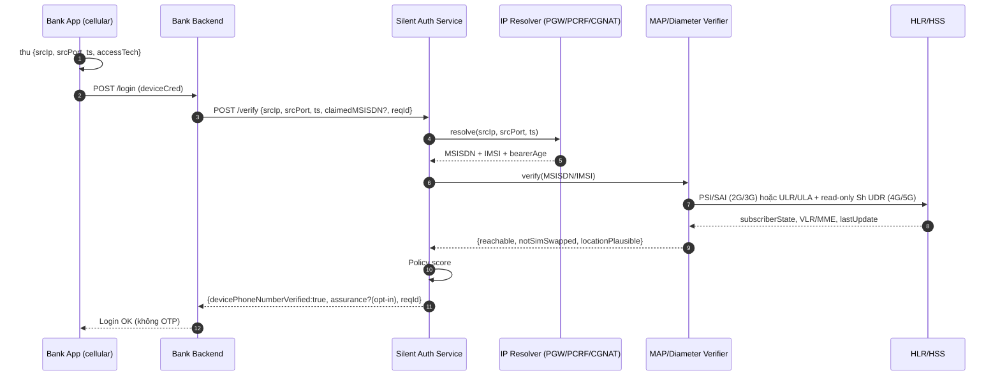
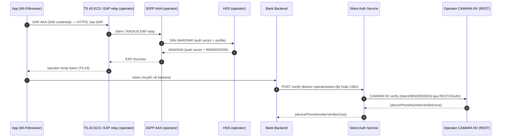
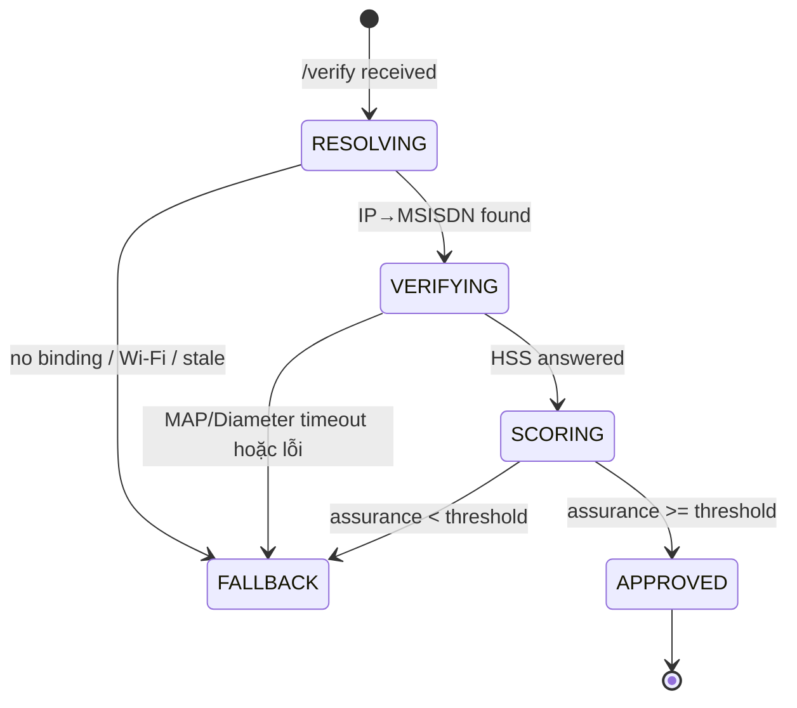

# Silent Authentication — Standard Flow (chuẩn hóa)

> Tài liệu này là bản **chuẩn hóa**, thay thế một bản ghi chatbot cũ (đã xoá) chứa
> nhiều nhận định Diameter/Stx sai. §11 liệt kê từng nhận định sai kèm nhận định
> đúng thay thế.
>
> Nguồn chuẩn (Source-of-Truth) về hợp đồng app-facing:
> `docs/research/camara-number-verification.md` và `docs/research/camara/nv-flow-analysis.md`.

- Ngày: 2026-09-01
- Phạm vi: Restlink Silent Authentication (Ethiopia) — SAS làm **adapter phía trên** nhà mạng.
- Đối tượng: bank backend + đội phát triển SAS.

---

## 1. Silent Authentication là gì

Silent Authentication = **chứng minh chiếc điện thoại đang có mặt trên mạng chính là
chủ sở hữu của MSISDN được khai báo**, mà **không cần nhập lại mật khẩu và không
cần SMS OTP** trên happy path.

App-facing surface (chuẩn toàn cầu): **CAMARA Number Verification (NV) v2.1.0**
trên SAS `/verify`. Hợp đồng này trả về **duy nhất một boolean**:

```json
{ "devicePhoneNumberVerified": true }
```

Non-goal: Silent Auth **không** thay thế firewall SS7/Diameter — nó bổ sung
(chiến lược A "thay OTP" trong `unified-identity-sms-security-architecture.md`).

---

## 2. Bất biến số 1 — MAP/Diameter KHÔNG map `IP → MSISDN`

Đây là điều định hình toàn bộ thiết kế. MAP và Diameter **không có** câu trả lời
cho "IP `A.B.C.D:port` hiện thuộc MSISDN nào".

| Câu hỏi | Ai trả lời |
|---------|-----------|
| MSISDN nào đang sở hữu IP cellular `A.B.C.D:port` ngay lúc này? | **PGW / GGSN session** (Gi/SGi accounting) hoặc **PCRF Gx/Sd** hoặc **CGNAT log** → tầng **Resolver** |
| MSISDN đó có còn sống / chưa bị SIM-swap không? | **MAP** (PSI/SAI, không ATI) hoặc **Diameter** (S6a ULR/ULA + read-only Sh UDR) → tầng **Verifier** |

Do đó dịch vụ luôn là **hai tầng**, không phải một:

```
IP:port:ts  ──[Resolver]──►  MSISDN/IMSI  ──[Verifier: MAP/Diameter]──►  assurance
```

CGNAT là lý do app **bắt buộc gửi IP + source port + timestamp**: nhiều thuê bao
chia chung một public IPv4; chỉ 5-tuple + thời điểm mới phân biệt được chính xác.

---

## 3. Hai phương pháp silent auth (bổ trợ nhau, không thay thế)

| Phương pháp | Root of trust | Cần cellular data? | Resolver | Verifier |
|-------------|---------------|--------------------|----------|----------|
| **IP-match** | PGW IP↔MSISDN + MAP/Diameter | **Có** | PGW/GGSN, PCRF Gx/Sd, CGNAT log | 2G/3G: MAP (PSI/SAI) · 4G/5G: S6a ULR/ULA + Sh UDR |
| **SIM / TS.43 EAP-AKA** | SIM credential | **Không** (Wi-Fi + browser OK) | — (token do 3GPP AAA cấp) | SWm/SWx (EAP-AKA) → HSS |

> **Sửa một nhận định phổ biến và sai:** *"silent auth luôn cần cellular"* là **sai
> cho TS.43**. Phương pháp SIM/TS.43 EAP-AKA chạy được trên Wi-Fi và trình duyệt
> vì gốc tin cậy là SIM (EAP-AKA), không phải binding IP của PGW.
>
> Ngược lại, phương pháp **IP-match bắt buộc cellular** — trên Wi-Fi-only không có
> binding PGW IP↔MSISDN nên buộc **FALLBACK**.

## 4. Actors

| Actor | Vai trò |
|-------|---------|
| Bank App (mobile) | Chạy trên **cellular data**, thu thập session tuple, gọi SAS |
| Bank Backend | Chủ quyết định login; gọi SAS server-to-server (mTLS) |
| **SAS** (Silent Auth Service) | Thành phần của Restlink: Resolver + Verifier + Policy |
| IP Resolver | Đọc PGW/GGSN session store / CGNAT log (thuộc nhà mạng) |
| MAP/Diameter Verifier | jSS7 (2G/3G) + corsac-diameter S6a (4G/5G) + SWx (TS.43, lab) |
| HLR / HSS | DB thuê bao của nhà mạng (chỉ trong mạng, không interconnect) |
| 3GPP AAA (TS.43) | Terminate EAP-AKA, cấp operator token tạm (Wi-Fi) |

> **Ràng buộc FS.11:** `AnyTimeInterrogation` (ATI) là **Category 1**, bị chặn trên
> interconnect. Do đó SAS chạy **bên trong nhà mạng** và chỉ truy vấn **HLR/HSS của
> chính mình**. Không có ATI xuyên nhà mạng.

---

## 5. Luồng chuẩn E2E — IP-match (cellular happy path)



Nếu `claimedMSISDN` được gửi, SAS khẳng định `resolved == claimed`. Nếu không gửi,
SAS **trả về** MSISDN đã verify (kiểu number-verification) để bank tự bind.
Chi tiết FSM + timeout: §7.

---

## 6. Luồng chuẩn E2E — TS.43 EAP-AKA (Wi-Fi happy path)

Không cần cellular: thiết bị xác thực bằng SIM qua EAP-AKA với 3GPP AAA của nhà
mạng (có thể qua một **TS.43 ECS / EAP relay** của operator phía trước AAA), nhận
một **operator token tạm** (single-use, ≤300 s) do SAS cấp sau khi AAA gọi
`POST /entitlement/issue`. Backend đổi token đó qua CIBA/JWT-Bearer rồi gọi `/verify`.

> **App không bao giờ nói EAP-AKA thẳng với AAA** — luôn có tầng edge/ECS relay
> (WLAN AN qua SWm, hoặc TS.43 ECS) đóng gói EAP ở giữa. **SAS cũng không gọi AAA
> qua SWx**: SWx chỉ tồn tại giữa 3GPP AAA ↔ HSS (nội bộ operator). Bước cuối của
> SAS là REST của operator — CAMARA NV (hoặc token-introspection của entitlement
> server) — operator tự exchange token↔IMSI/MSISDN nội bộ qua SWx, rồi trả
> `devicePhoneNumberVerified` qua HTTPS/OAuth2.



Trên codebase Restlink, nhánh này đi qua header `X-Sas-Operator-Token` (hoặc
`Authorization: Bearer operatortoken:<tk>`) trên `/verify`; binding token mang
**cả MSISDN và IMSI** (`IdentityAnchor.OperatorBinding`), và IMSI được luồn nguyên
vẹn vào `VerifyRequestEvent` → `VerifySbb`. Trong POC, Restlink/SAS tự đóng vai
Entitlement Server (`/entitlement/issue`) và dùng `swxverifier` RA (MAR/SAR) như
**chân HSS phía operator** để đối soát SIM-swap — ở production, chân này do operator
thực hiện qua REST (CAMARA NV / SIM Swap) hoặc đọc read-only (Sh/Nudr); SAS không
tự mở dialog SWx.

## 7. SAS FSM, assurance, timeout

FSM per-request. Một request = tối đa **một** dialog MAP/Diameter mỗi tầng.



**Fail-closed:** thiếu bất kỳ bằng chứng nào (no binding, timeout, reject, abort)
thì không bao giờ approved — luôn về FALLBACK, không soft-pass.

Assurance (phác thảo):

```
score =  w1 * ipBindingFresh(bearerAge)      // PGW binding age < N giây
       + w2 * subscriberReachable            // PSI (2G/3G) / ULR (4G/5G) báo attached
       + w3 * notSimSwapped(lastImsiChange)  // > swapCooldown
       + w4 * locationPlausible              // VLR/MME vs vùng kỳ vọng
APPROVE nếu score >= threshold VÀ (resolved == claimed khi claimed có mặt)
```

Giao dịch giá trị cao → nâng threshold hoặc ép step-up ngay cả khi HIGH.

Timeout (SAS là dialog-anchor, không để HSS treo app):

| Tầng | Budget | Khi hết hạn |
|------|--------|-------------|
| Resolver lookup | 300 ms | FALLBACK |
| MAP dialog (PSI/ATI) | 2 s (TC dialog timer) | `abort()` dialog, FALLBACK |
| Diameter (S6a ULR/ULA + Sh UDR) | 2 s | FALLBACK |
| Tổng SAS | 3 s | bank hiển thị login thường |

---

## 8. Tín hiệu nào dùng ở đâu

### Resolver (trả lời "IP:port này là MSISDN nào ngay lúc này")

| Nguồn | Interface | Ghi chú |
|-------|-----------|---------|
| PGW/GGSN session | Gi/SGi accounting | nguồn chuẩn IP↔MSISDN |
| PCRF | **Gx/Sd** (CCR-I binding probe) | phù hợp LTE; `sas.transport.resolver=sd` |
| CGNAT log | log NAT session | bắt buộc IP+port+ts |
| RADIUS accounting | RFC 2866 | `sas.transport.resolver=radius` |

> **Không có "Stx" hay "S6a" cho việc map IP→MSISDN.** Stx là interface PCRF↔IMS-AGW
> (policy, không phải identity query); S6a là **Verifier**, không phải resolver.

### Verifier (trả lời "MSISDN/IMSI này còn sống / chưa SIM-swap")

| Access | Bản tin | Purpose | FS category |
|--------|---------|---------|-------------|
| 2G/3G | **PSI** ProvideSubscriberInfo | subscriber state + location, intra-net | Cat 2.1 |
| 2G/3G | **ATI** AnyTimeInterrogation | any-time (intra-net ONLY) | Cat 1 trên interconnect |
| 2G/3G | **SAI** SendAuthenticationInfo | auth vectors / SIM-swap freshness | Cat 3.2 |
| 4G/5G | **ULR/ULA** (S6a) | attachment liveness + subscriber status (own HSS) | FS.19 |
| 4G/5G | **Sh UDR/SNR** (read-only) | read subscriber data → SIM-swap freshness | TS 29.328/29.329 |
| Wi-Fi (TS.43) | **MAR/MAA, SAR/SAA** (SWx) | EAP-AKA auth vector + profile | TS 33.402 |

---

## 9. CAMARA Number Verification v2.1.0 (northbound contract)

| Endpoint | Body | Response |
|----------|------|----------|
| `POST /number-verification/v2/verify` | `{phoneNumber}` **hoặc** `{hashedPhoneNumber}` (đúng một) | `{devicePhoneNumberVerified: bool}` |
| `GET /number-verification/v2/device-phone-number` | (token scope) | `{devicePhoneNumber: "+E164"}` |

Quy tắc không được regress:

- **OIDC 3-legged** (app + user) hoặc 2-legged `client_credentials` (server flow).
- Scope: `number-verification:verify` / `number-verification:device-phone-number:read`.
- **Single-use token** — một lần gọi API mỗi token (anti-replay).
- **Không refresh token** cho NV scopes; token ≤ **300 s**.
- `403 NUMBER_VERIFICATION.USER_NOT_AUTHENTICATED_BY_MOBILE_NETWORK` khi `amr` của
  token cho thấy SMS-OTP / user+password (không phải mobile-network auth).
- Response mặc định **byte-conformant** = chỉ boolean; assurance/score chỉ khi
  opt-in qua `X-Sas-Assurance-Detail: true` (không có `matchScore` — trường đó
  không tồn tại trong CAMARA NV).

Hai "track" tài liệu (theo phân tích r3.2):

- **Track 1 — CAMARA NV v2 northbound**: `/verify`, `/device-phone-number`, token OIDC.
- **Track 2 — TS.43 / Wi-Fi out-of-band**: `/entitlement/*`, `operatortoken:`, header
  `X-Sas-*` — rõ ràng là **phần mở rộng của Restlink** thực thi các vai trò phía nhà
  mạng mà CAMARA để ngỏ (Entitlement Server + network auth), **không** thuộc hợp đồng
  CAMARA.

---

## 10. Security checklist (không được regress)

- **Không interconnect ATI** — Cat 1; chỉ truy vấn HLR/HSS của chính mình.
- **Fail-closed** — thiếu bằng chứng không bao giờ approve.
- **Idempotency** — `reqId` dedup; một dialog mỗi tầng.
- **Dialog leak** — mỗi dialog MAP có TC timer; timeout ⇒ `abort()`.
- **Race** — binding đọc point-in-time (`ts`), không phải "mới nhất".
- **Replay** — bank→SAS mTLS; cửa sổ `ts` + `reqId`.
- **CGNAT ambiguity** — bắt buộc IP+port+ts; từ chối nếu resolver trả >1 MSISDN.
- **Bearer** — IP-match chỉ là claim cellular bearer; `accessTech` do thiết bị khai
  báo là **advisory** (không bao giờ nâng assurance); tuple `WIFI`/`FIXED` bị từ
  chối ở `/session-tuple` (`400 ACCESS_TECH_NOT_CELLULAR`).
- **Spoofed GT** (FS.11 §3.3.4) — verifier chỉ tin response HSS của chính mình.
- **Privacy** — MSISDN/IMSI **không bao giờ** trả về app di động, chỉ bank backend.

## 11. Sửa các nhận định sai (từ bản ghi chatbot cũ, đã xoá)

| Nhận định cũ (sai) | Nhận định đúng |
|-----|-----|
| "Dùng **Stx** (hoặc S6m/S6n/Sh) để ánh xạ MSISDN↔IMSI↔IP" | Không có interface Diameter nào map IP→MSISDN. **Resolver** dùng PGW/GGSN session, PCRF **Gx/Sd**, hoặc CGNAT log. |
| "**S6a** trích xuất IMSI/MSISDN tương ứng với thiết bị đang giữ Session Data" | **S6a là Verifier** (ULR/ULA liveness + read-only Sh UDR freshness; **không dùng AIR/IDR**) trả trạng thái thuê bao theo IMSI/MSISDN; nó **không** map IP. |
| "Stx tối ưu nhất cho 4G session lookup; Gx/Rx thay thế tốt cho Stx" | Gx (CCR-I binding probe) / **Sd** chính là Resolver thực tế; Stx là interface PCRF↔IMS-AGW, không dùng cho identity lookup. |
| "Chạy trong **vài miligiây** / độ trễ <**200 ms**" | Budget chuẩn: Resolver 300 ms, Verifier (MAP/S6a) 2 s, tổng SAS 3 s. |
| "Bỏ qua OAuth code/PKCE; redirect trình duyệt; **header injection** chống giả mạo tuyệt đối" | Không dùng header injection. Dùng OIDC (3-legged cho app, CIBA/JWT-Bearer cho TS.43) + mTLS + IP:port:ts. IP do nhà mạng attest, không "tuyệt đối". |
| "Response `{devicePhoneNumberVerified, matchScore}`" | CAMARA NV v2.1.0 chỉ trả `{devicePhoneNumberVerified: bool}`. Không có `matchScore`. |
| "Bắt buộc dùng Data; Wi-Fi thì chuyển sang cellular" | Đúng cho **IP-match**. Nhưng **TS.43 EAP-AKA** chạy trên **Wi-Fi + browser** không cần cellular. |
| "Luồng A dùng S6a/**Nzh**, luồng B dùng **STa/Rx**/**IPDR** để tra CGNAT" | Verifier LTE = **S6a ULR/ULA + Sh UDR**; CGNAT lookup = **CGNAT log** (tầng Resolver). TS.43 = **SWm/SWx** (operator). `Nzh`/`STa/Rx`/`IPDR` là chi tiết không đúng cho luồng này. |
| "Kiểm SIM swap qua S6a/Nzh trong cùng một vòng truy vấn" | SIM-swap freshness tới từ **SAI** (MAP) / **Sh UDR** (4G/5G, read-only) so `lastUpdate` vs thời điểm request — không qua Stx, không dùng AIR. |
| "App gọi EAP-AKA thẳng AAA; SAS đổi token qua SWx" | App → (TS.43 ECS / EAP relay) → AAA → HSS (SWx); SAS gọi **REST CAMARA NV** của operator để đổi token, không tự mở dialog SWx. |

---

## 12. Open items (không tự bịa đáp án)

- [ ] Resolver source theo từng nhà mạng (PGW RADIUS vs PCRF Sd vs CGNAT log).
- [x] **Diameter S6a/SWx verifier** — `ras/s6averifier` + `ras/swxverifier` trên
      fork AGPL địa phương của corsac-diameter; lab peer `sas-diameter-testapp`.
- [ ] Assurance weights + threshold theo risk class.
- [x] CAMARA NV **Java adapter** trên SAS `/verify` (`sas-host/`, xem `docs/research/camara/nv-flow-analysis.md` §F về mức độ conformance).
- [x] **P2 real MAP transport** — `Jss7MapVerifierBackend` (jSS7) PSI + SAI, không ATI.
- [x] **Cellular bearer login trong UE SDK** — `accessTech` + `X-Sas-Access-Tech` + `CellularRequirement` (xem `docs/design/cellular-bearer-login.md`).
- [x] Production hardening HTTP `/verify` (`application-prod.properties`; xem `docs/result_p1_reaudit.md`).
- [ ] Post-CGNAT `srcPort` discovery (thiết bị không đọc được port đã NAT — `sas-host/TODO.md` P-H8).
- [ ] Bind bearer declaration vào bằng chứng (Play Integrity / DeviceCheck) để `accessTech` hết là lời khai.
- [ ] TS.43 entitlement server feasibility (Wi-Fi path).
- [ ] Restlink pilot API contract cho bank Ethiopia.

---

## 13. Đọc tiếp

1. `docs/research/camara-number-verification.md` + `docs/research/camara/nv-flow-analysis.md` — hợp đồng `/verify`.
2. `docs/research/3gpp-ts33-402-eap-aka.md` — TS.43 EAP-AKA (SWm/SWx).
3. `docs/research/3gpp-ts29-272-s6a.md` — Diameter S6a (Verifier).
4. `docs/design/cellular-bearer-login.md` — UE SDK bearer contract.
5. `docs/test/demo-script-ue-camara-entitlement-diameter.md` — kịch bản demo đầu cuối.

---

## 14. Bố cục mã nguồn — từng module làm gì, liên kết ra sao, vai trò trong call flow

Đây là Maven multi-module. Ba module tạo nên SAS chạy được (parent
`et.restlink:sas-core`); hai app độc lập là các simulator phía nhà mạng mà SAS
nói chuyện khi test.

### 14.1 Build reactor vs simulator độc lập

```
sas-core (parent aggregator, et.restlink:sas-core)
 ├─ sas-api              library — hợp đồng CAMARA northbound + logic (không main)
 ├─ sas-entitlement      library — track TS.43 / Wi-Fi entitlement (→ sas-api)
 └─ sas-host             app Quarkus chạy được — composition + runtime container
                         (→ sas-api + sas-entitlement)

độc lập (build riêng, KHÔNG nằm trong reactor):
 ├─ sas-diameter-testapp simulator — HSS + 3GPP AAA + PCRF(Gx) qua Diameter (corsac)
 └─ sas-jss7-testapp     simulator — HLR qua SS7 MAP (jSS7), peer PSI/SAI cho 2G/3G
```

### 14.2 Từng module

| Module | Loại | Phụ thuộc | Trách nhiệm |
|--------|------|-----------|-------------|
| **sas-api** | library | jainslee-api, quarkus-rest | bề mặt CAMARA `/verify` + `/session-tuple` + OIDC/CIBA, validate request, assurance policy, value models, và SPI + bản in-memory của resolver backend. Thuần hợp đồng — không gắn transport, không container, không RA. |
| **sas-entitlement** | library | sas-api | Entitlement Server phía nhà mạng cho track TS.43 / Wi-Fi: `/entitlement/issue`, `/entitlement/exchange`, `/entitlement/status`, operator token single-use, kiểm attestation. Token của nó nạp vào nhánh `/verify` `operatortoken:` của sas-api. |
| **sas-host** | app Quarkus chạy được | sas-api, sas-entitlement, micro-jainslee, jSS7, corsac Diameter | lắp mọi thứ vào container micro-jainslee: `SasBootstrap` (seam duy nhất), `VerifySbb`, `VerificationFsm`, và các Resource Adaptor Resolver / MAP / S6a / SWx (+ backend transport thật), kèm admin dashboard, CDR, tenant và persistence. |
| **sas-diameter-testapp** | simulator độc lập | corsac diameter | đóng vai HSS + 3GPP AAA + PCRF(Gx) của nhà mạng trên S6a / SWx / Gx để chạy loop local. |
| **sas-jss7-testapp** | simulator độc lập | jSS7 map | đóng vai HLR của nhà mạng qua SS7 MAP (PSI/SAI) cho verify 2G/3G. |

### 14.3 Seam container (H24)

Toàn bộ behavior runtime của SAS nằm ở **sas-host** bên trong container micro-jainslee.
`sas-api` và `sas-entitlement` là library thuần: chúng định nghĩa bề mặt HTTP và
việc validate, nhưng không bao giờ nắm activity state, timer hay transport tín hiệu.
`com.microjainslee.core.*` chỉ được chạm tới từ đúng một seam:
`sas-host/.../bootstrap/SasBootstrap.java`. Các Resource Adaptor dưới
`sas-host/.../ras/{resolver,mapverifier,s6averifier,swxverifier}` là nơi duy nhất
được phép nắm I/O (transport), theo hợp đồng wrapper + delegate + backend
(H24 trong `harness/gates.yaml`).

### 14.4 Liên kết và vai trò theo từng call flow

**IP-match (cellular) — happy path:**

```
UE SDK   ──POST /session-tuple──► sas-api SessionTupleResource        (gate bearer / accessTech)
Bank BE  ──POST /number-verification/v2/verify──► sas-api VerifyResource
   VerifyResource → SasVerifyEngine → VerifyRequestEvent
   ──► sas-host VerifySbb (bên trong container)
         RESOLVING → Resolver RA   (backend InMemory / CgnatLog / PcrfSd / Radius)
         VERIFYING → S6a Verifier RA (corsac) ──SCTP──► sas-diameter-testapp (S6a: ULR/ULA; SIM-swap = Sh UDR, mở)
                     MAP Verifier RA  (jSS7)   ──SCTP──► sas-jss7-testapp      (PSI/SAI, 2G/3G)
         SCORING  → VerificationFsm (assurance có trọng số, fail-closed)
   ◄── { devicePhoneNumberVerified: bool }
```

**TS.43 EAP-AKA (Wi-Fi) — happy path:**

```
Device   ──EAP-AKA (qua TS.43 ECS)──► Operator 3GPP AAA ──SWx──► HSS → operator token
Bank BE  ──POST /entitlement/issue──► sas-entitlement EntitlementResource   (cấp token single-use)
Bank BE  ──POST /number-verification/v2/verify (X-Sas-Operator-Token)──► sas-api VerifyResource
   ├─ identity anchor: IdentityAnchor.OperatorBinding {msisdn, imsi, eapMethod}
   └─► (POC) sas-host SWx Verifier RA (corsac) ──SCTP──► sas-diameter-testapp (SWx: MAR/SAR)
        (production) thay bằng REST CAMARA NV / SIM Swap + read-only Sh UDR/SNR của operator — SAS không tự mở SWx
   ◄── { devicePhoneNumberVerified: bool }
```

**Test call flow:** hai simulator là peer lab có thể điều khiển. Lái trạng thái của
chúng qua các endpoint điều khiển (`/api/subscriber`, `/api/binding`, `/api/reset`,
`/api/messages`) để diễn các kịch bản fail-closed (detached `5421`, zero vectors,
Gx binding lạ `5030`, token replay). `harness/run_hardness.py` và
`harness/preflight_prod.py` là các gate doc/artifact riêng, không cần simulator sống.