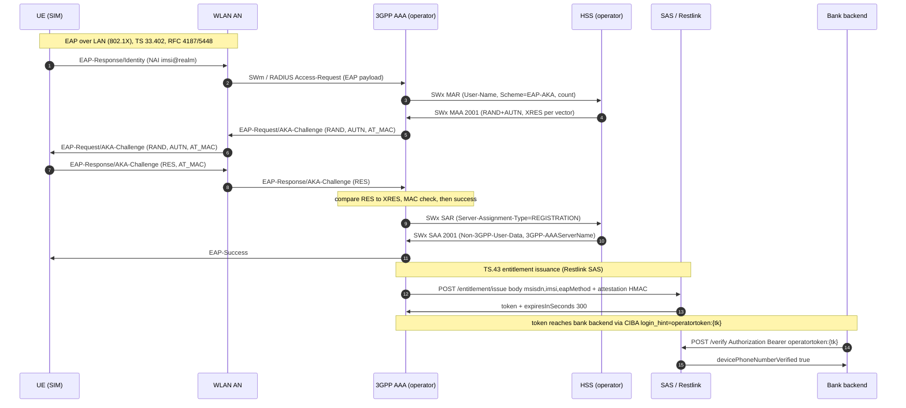

# TS.43 EAP-AKA → SWx → token — wire protocol (message-by-message)

Exact message walk for the **Wi-Fi / non-cellular** silent-auth path: the device proves
SIM possession with **EAP-AKA / EAP-AKA'** against the operator **3GPP AAA**, the AAA
fetches EAP-AKA auth vectors from the **HSS over SWx**, and on success the SAS mints a
**single-use temporary entitlement token** that the bank backend later exchanges.

This document pins the *wire* level of that chain so the lab POC
(`sas-diameter-testapp` + `sas-entitlement`) and the eventual operator integration agree
on every message. Production ownership rules are repeated at the end: **EAP-AKA must
terminate at the operator AAA**; Restlink/SAS only consumes the outcome and issues tokens.

- **Specs:** 3GPP TS 33.402 (EAP-AKA'), 3GPP TS 29.273 (SWm / SWx), RFC 4187 / RFC 5448,
  GSMA TS.43 (Service Entitlement Configuration), CAMARA NumberVerification v2.1.0.
- **Code anchors:** `sas-diameter-testapp/.../diameter/SwxHandler.java` (MAR/MAA + SAR/SAA),
  `sas-entitlement/.../EntitlementResource.java` + `EntitlementTokenService.java`,
  `sas-api/.../VerifyResource.java`, `sas-host/.../sbbs/VerifySbb.java`.

---

## 1. Actors and ownership

| Actor | Owned by | Role on this path |
|-------|----------|-------------------|
| UE (device + SIM) | end user | originates EAP-AKA, proves SIM possession |
| WLAN AN / AP | operator (or venue) | carries EAP over LAN (SWm / RADIUS at the edge) |
| **3GPP AAA Server** | **operator** | terminates EAP-AKA, queries HSS over SWx, asserts auth outcome |
| HSS | operator | mints/serves EAP-AKA auth vectors + non-3GPP profile |
| **SAS / Restlink** | Restlink | TS.43 entitlement *stand-in* + CAMARA `/verify`; mints/exchanges the token |
| Bank backend | bank | calls `/verify`, receives the boolean |

SWm (WLAN ↔ AAA) and SWx (AAA ↔ HSS) are **operator** interfaces. Restlink's SAS is the
**entitlement + verify** surface *above* the AAA — it never terminates EAP-AKA itself.
For the **verify** leg the SAS in production consults the **operator REST API (CAMARA
NumberVerification / SIM Swap)** and reads SIM-swap freshness via **read-only Sh
UDR/SNR**; it does **not** open a SWx dialog itself. The lab `swxverifier` RA
(`MAR`/`SAR`) only *stands in* for that operator leg inside `sas-host` so the POC can
run without the operator AAA/HSS online.

---

## 2. End-to-end overview

```
  UE(SIM) ──EAP-AKA──► WLAN AN ──SWm──► 3GPP AAA ──SWx(MAR/MAA, SAR/SAA)──► HSS
                                                 │  (on success)
                                                 ▼
                                    SAS POST /entitlement/issue  ──► {token}
                                                 │
                              bank backend ── POST /verify (Bearer operatortoken:{tk}) ──► boolean
```



---

## 3. EAP-AKA message-by-message (RFC 4187 / RFC 5448)

The EAP exchange itself runs between UE and AAA, tunnelled at the access edge. The
message skeleton below is the one hidden behind the SWm/RADIUS carriage in §2.

| # | Direction | EAP / AKA packet | What it carries |
|---|-----------|------------------|-----------------|
| 1 | AAA → UE | `EAP-Request/Identity` | request for a network identity |
| 2 | UE → AAA | `EAP-Response/Identity` | NAI, e.g. `655010000000001@restlink.et` (or fast re-auth pseudonym) |
| 3 | AAA → UE | `EAP-Request/AKA-Challenge` | `AT_RAND` (RAND), `AT_AUTN` (AUTN), `AT_MAC` |
| 4 | UE → AAA | `EAP-Response/AKA-Challenge` | `AT_RES` (RES), `AT_MAC` |
| 5 | AAA → UE | `EAP-Success` (or failure) | final outcome |

The UE derives `RES` / `IK` / `CK` from the SIM key `K` + `RAND`; the AAA compares the
presented `RES` against the `XRES` it obtained from the HSS. **EAP-AKA'** (RFC 5448,
used for non-3GPP access per TS 33.402) binds the access network name so the same key is
never reused across networks. The lab (`sas-diameter-testapp`) models shape, not
cryptography: it fabricates random 32-byte blobs for the authenticate/authorize fields.

---

## 4. SWx message-by-message (TS 29.273 §6)

SWx runs between the **3GPP AAA** and the **HSS**. SwxHandler implements the server
(HSS) side.

### 4.1 MAR → MAA (Multimedia-Auth) — fetch EAP-AKA vectors

| Direction | Command | Key AVPs (as implemented) |
|-----------|---------|---------------------------|
| AAA → HSS | **MAR** | `User-Name` (IMSI or MSISDN), `SIP-Number-Auth-Items` (count), `SIP-Authentication-Scheme` = `EAP-AKA` |
| HSS → AAA | **MAA** | `Result-Code`, repeated `SIP-Auth-Data-Item` |

Each `SIP-Auth-Data-Item` in a successful MAA carries:

- `SIP-Authentication-Scheme` = `EAP-AKA`
- `SIP-Authenticate` — the AKA challenge material the AAA passes onward (`RAND‖AUTN`)
- `SIP-Authorization` — the expected response (`XRES`), plus derived `CK'`/`IK'` for AKA'
- `SIP-Item-Number` — 1..n

Result-code policy (fail-closed on the SAS side), `SwxHandler`:

| Scenario | Result-code |
|----------|-------------|
| known + attached | `2001` SUCCESS (with `SIP-Auth-Data-Item`s) |
| `authVectorsAvailable = 0` | `2001` SUCCESS but **empty** item set (SAS fails closed) |
| detached UE | `5421` USER_NO_NON_3GPP_SUBSCRIPTION |
| unknown `User-Name` | `5001` USER_UNKNOWN |
| handler exception | `3002` UNABLE_TO_DELIVER (fail-safe) |

A non-empty MAA also stamps the subscriber's `lastEapAuthSuccess` in the simulator.

### 4.2 SAR → SAA (Server-Assignment) — register the AAA, fetch non-3GPP profile

| Direction | Command | Key AVPs (as implemented) |
|-----------|---------|---------------------------|
| AAA → HSS | **SAR** | `User-Name`, `Server-Assignment-Type` (e.g. `REGISTRATION`) |
| HSS → AAA | **SAA** | `Result-Code`, `Non-3GPP-User-Data` (Subscription-Id `END_USER_E164` = MSISDN), `3GPP-AAAServerName` = `aaa.restlink.et` |

### 4.3 PPR → PPA (Push-Profile) — profile push acknowledgement

`Push-Profile-Request` answered with a `Push-Profile-Answer` (ack, or `5001` if unknown).

---

## 5. Entitlement issuance to the token (post-EAP-AKA)

On a successful EAP-AKA the **3GPP AAA integration** calls the SAS entitlement surface —
this is where Restlink's code takes over.

### 5.1 `POST /entitlement/issue` (`EntitlementResource`)

Request:

```
POST /entitlement/issue
X-Api-Key: <key>                         # machine auth when sas.security.enforce-api-keys=true
X-Sas-Attestation-Ts: <epoch-ms>         # required when issue-attestation-required=true
X-Sas-Attestation-Mac: <hex-hmac>        # required when issue-attestation-required=true
Content-Type: application/json

{ "msisdn": "+251911111111", "imsi": "655010000000001", "eapMethod": "EAP-AKA" }
```

- `eapMethod` must canonicalise to **`EAP-AKA`** or **`EAP-AKA'`** (ASCII apostrophe),
  else `400 INVALID_REQUEST` — never mint a token anchored to an unverified scheme.
- **Attestation MAC** (audit gap B1, `AttestationVerifier`): proof the caller is the
  operator AAA that just completed EAP-AKA, not merely an API-key holder:

  ```
  mac = hex( HMAC-SHA256( secret, msisdn + "|" + imsi + "|" + eapMethod + "|" + ts ) )
  ```

  where absent fields serialize as empty strings and `ts` is the decimal epoch-ms.
  `ts` must be within ±60 s (single-use, replay-guarded); mismatch →
  `401 ATTESTATION_INVALID`, stale → `401 ATTESTATION_EXPIRED`, reuse →
  `401 ATTESTATION_REPLAY`, required-but-unconfigured → `503 ATTESTATION_MISCONFIGURED`.

### 5.2 Token format (`EntitlementTokenService`)

Response:

```
{ "token": "<tk>", "expiresInSeconds": 300 }
```

Signed token (used whenever `sas.entitlement.hmac-secret` is configured):

```
<tk> = base64url(payload-json) "." base64url( HMAC-SHA256(payload-bytes, secret) )
```

`payload-json` fields: `msisdn`, `imsi`, `eapMethod`, `iat` (epoch seconds),
`exp` = `iat + ttl`, `jti` (random id). TTL is clamped to the CAMARA single-use ceiling
of **300 s**; `require-signed=true` (default) makes a blank secret refuse to issue.

---

## 6. Bank redeem of the token

Two equivalent consumption points (both single-use):

1. **Direct swap** `POST /entitlement/exchange` `{ "token": "<tk>" }` (X-Api-Key) →
   `{ "msisdn", "imsi", "eapMethod", "valid": true }`.
2. **CAMARA `/verify` Wi-Fi path** (`VerifyResource`): the bank backend presents the
   token as an identity anchor:

```
POST /verify        (or POST /number-verification/v2/verify)
X-Api-Key: <key>
Authorization: Bearer operatortoken:<tk>
Content-Type: application/json

{}
```

On this path the token binding **is** the claimed MSISDN (`accessTech=WIFI`), the body
phone claims are ignored, and `VerifySbb` routes to the **operator-side verifier** (no
IP resolver). In the lab that verifier is the `swxverifier` RA (`MAR`/`SAR`); in
production it is **operator REST (CAMARA NV / SIM Swap)** + **read-only Sh UDR/SNR**.
A valid exchange answers `{ "devicePhoneNumberVerified": true }`; invalid / expired /
replayed tokens answer `401 UNAUTHENTICATED`.

---

## 7. Fail-closed rules and timeouts

Every stage is single-use and bounded; missing evidence never approves.

| Stage | Budget | On expiry |
|-------|--------|-----------|
| SWx MAR/MAA vector fetch | 2 s (Diameter) | abort dialog, FALLBACK |
| EAP-AKA challenge/response | session-scoped | EAP failure |
| `/entitlement/issue` attestation | ±60 s window | `ATTESTATION_EXPIRED` |
| token TTL | ≤ 300 s (one-time) | `401 INVALID_TOKEN` |
| `/verify` Wi-Fi verify leg (lab SWx / prod CAMARA NV + Sh) | 2 s | `WIFI_NOT_READY` / `VERIFY_TIMEOUT` |

Hard invariants (do not regress):

- **Own HSS only** — SWx targets the operator HSS; no interconnect AAA (FS.11 Category 1).
- **EAP-AKA terminates at the operator AAA**, never in SAS.
- **Fail-closed** — empty MAA vector set, missing entitlement, sync-failure, stale AV ⇒ FALLBACK.
- **Single-use** — token and attestation are both consume-once; the token is never refreshable.
- **Privacy** — IMSI/MSISDN stay server-side; the device/app sees a boolean outcome only.
- **SIM-swap** — a claimed IMSI mismatch (lab: on the SWx verify; production: operator
  CAMARA SIM Swap / read-only Sh UDR age) → `SIM_SWAP_SUSPECT` (fail closed).

---

## 8. Production boundary vs the lab

| Concern | Lab (`sas-diameter-testapp`) | Production |
|---------|------------------------------|------------|
| EAP-AKA termination | simulated (no crypto) | operator 3GPP AAA (RFC 5448) |
| SWx | `SwxHandler` fabricates AV shape | operator 3GPP AAA ↔ own HSS (SAS verifies via CAMARA NV / SIM Swap REST + Sh UDR) |
| SWm / RADIUS | out of scope | operator AAA ↔ WLAN AN |
| entitlement issue | `EapAkaDemoPeer` → SAS `/issue` | operator AAA integration → SAS `/issue` |

The `EapAkaDemoPeer` (see `sas-diameter-testapp/README.md`) is the *POC glue* that stands
in for the operator AAA on the entitlement leg: it simulates an EAP-AKA success, calls
`/entitlement/issue`, and drives the bank `/verify` redeem — so the full
EAP-AKA → SWx → token → verify loop can be exercised end-to-end in the lab.

For the operator-facing proposal, see
[`ts43-entitlement-integration-contract.md`](ts43-entitlement-integration-contract.md).