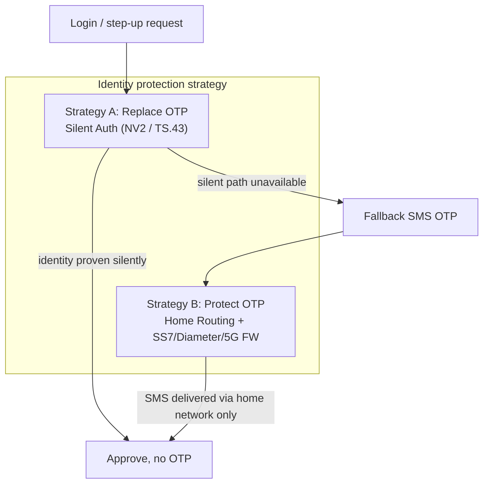
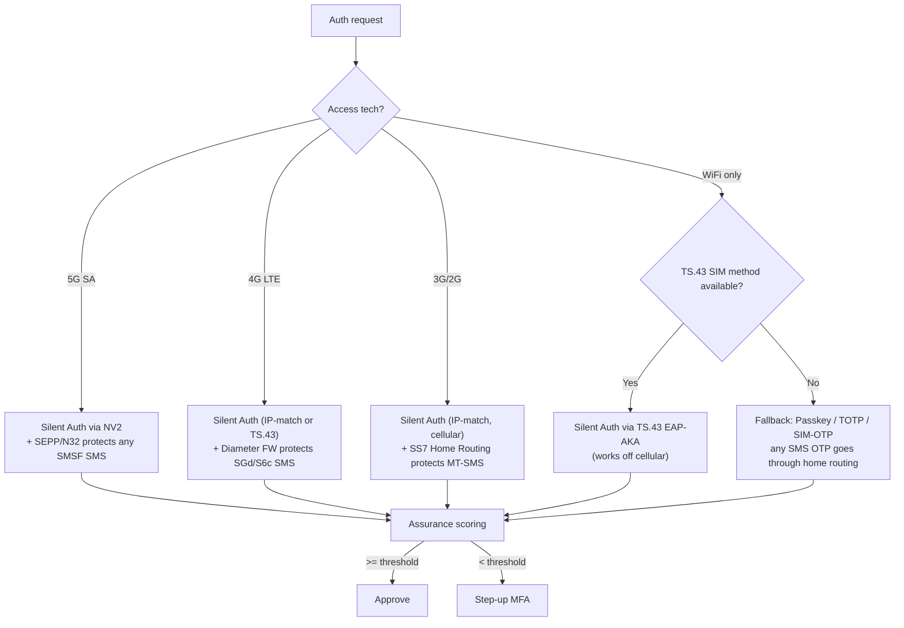
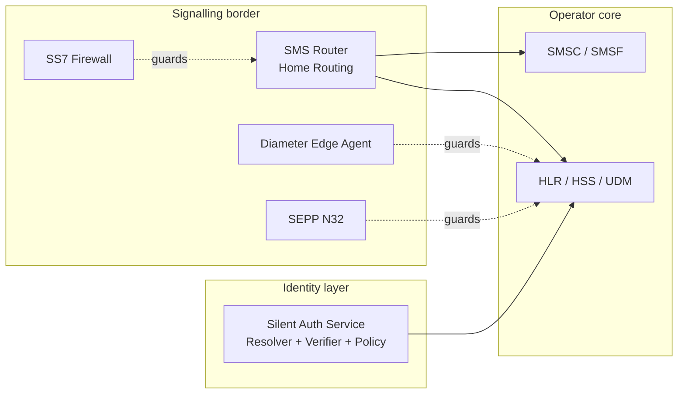

# Unified Identity & SMS Security Architecture

Two strategies that protect the same asset — the customer's phone-number identity —
from opposite sides. This is the umbrella that ties them together.

- Research date: 2026-07-20
- Related: [`silent-auth-flow.md`](silent-auth-flow.md),
  [`../research/sms-channel-protection.md`](../research/sms-channel-protection.md),
  [`../research/gsma-fs-index.md`](../research/gsma-fs-index.md)

---

## 1. Two complementary strategies

| | Strategy A — Replace OTP | Strategy B — Protect OTP |
|--|--------------------------|--------------------------|
| Goal | Remove SMS from the auth path | Keep the remaining SMS OTP uninterceptable |
| Mechanism | Silent Auth (CAMARA NV2 / TS.43 EAP-AKA / IP-match) | SMS Home Routing + SS7/Diameter/5G firewall |
| Layer | Application / identity | Signalling / interconnect |
| Defeats | Phishing, premium-number abuse, delivery failure | SS7 SRI-SM intercept, MT-spoofing, Diameter/5G redirect |
| Owner | Silent Auth Service (SAS) | SMS Router + Signalling FW (SS7 FW / DEA / SEPP) |

They are **not** alternatives. Silent auth removes OTP for most sessions; the residual
SMS traffic (Wi-Fi-only where NV1 fails, MVNO, roaming, 2G, unsupported carriers) still
rides the signalling network and **must** be firewalled. Every OTP you cannot eliminate
is an OTP you must protect.

---

## 2. Decision flow by access technology

The right control depends on how the subscriber is currently attached. TS.43 (SIM
credential, EAP-AKA) matters here: unlike the IP-matching method it works on **Wi-Fi**
too, shrinking the fallback-to-OTP surface.

Key correction to the original `silent-auth-flow.md` assumption ("requires active
cellular data"): that holds for the **network / IP-matching method** only. The **SIM
method (TS.43 EAP-AKA)** extends silent auth across Wi-Fi and browsers because the root
of trust is the SIM credential, not the bearer IP. Both share the same SIM root of trust.

---

## 3. Threat -> mitigation matrix

| Threat | Attack path | Strategy A (replace) | Strategy B (protect) | GSMA ref |
|--------|-------------|----------------------|----------------------|----------|
| SIM swap | Number ported to attacker SIM | SIM-swap signal + TS.43 SIM binding fails for wrong SIM | n/a | FF.09 |
| SS7 SMS intercept | `SRI-SM` reveals IMSI/MSC -> MT-FSM to attacker | No SMS sent | SMS Home Routing (Correlation ID) | FS.07, FS.11 |
| MT-spoofing | Fake SMSC address in MT-FSM | No SMS sent | MAP-vs-SCCP SMSC correlation, drop | FS.11 |
| Double MAP evade | 2nd MAP component hidden in TCAP Begin | n/a | Block TCAP Begin with multiple MAP components | FS.11 (CVD-2018-0015) |
| Diameter SMS redirect | S6c `SRR` + S6a `ULR` reroute serving node | Silent auth avoids SMS | DEA edge filter, topology hiding | FS.19, FS.21 |
| Diameter DoS on SMS | S6a `NOR/PUR/DSR` disable SMS service | Silent auth path independent | DEA rate/flag validation | FS.19 |
| 5G interconnect | N32 message injection / IE tampering | NV2 at app layer | SEPP + N32-c/f, PRINS policies | FS.36, TS 33.501 |
| Phishing / real-time proxy | Victim relays OTP to attacker | No code to phish | n/a (code eliminated) | Meta SA white paper |
| Premium-number / AIT abuse | Trigger OTP to premium MSISDN | No SMS billed | SMS FW rate/destination policy | SG.22 |

Strategy A closes the columns SMS firewalls cannot (phishing, AIT); Strategy B closes
the columns silent auth cannot (protecting the OTP that still has to be sent). Together
they cover the full ATO surface against the phone-number identity.

---

## 4. Component view

- SAS (see `silent-auth-flow.md`) queries the **own** HLR/HSS intra-network (ATI is FS.11
  Category 1 on interconnect).
- SMS Router + SS7 FW / DEA / SEPP guard the interconnect border so the residual OTP is
  delivered only via the home network.
- Both consume the same subscriber source of truth (HLR/HSS/UDM) and should share
  identity policy + rate limits so an attacker cannot abuse the legacy path when the
  packet/IP path is blocked (and vice-versa).

---

## 5. Rollout sequencing (recommended)

1. **Protect first** — deploy/confirm SMS Home Routing + SS7 FW (biggest immediate risk
   reduction; the OTP you send today is exposed today).
2. **Add Diameter/5G controls** — DEA per FS.19, SEPP/N32 per FS.36 as traffic migrates.
3. **Introduce silent auth** — NV2 / TS.43 to start removing OTP for supported sessions.
4. **Shift traffic** — route more logins to silent auth; SMS OTP shrinks to a firewalled
   fallback; high-value flows step up to passkey.

This order means every stage stands on its own: you are never depending on an unprotected
SMS channel while silent auth coverage ramps.

---

## 6. Open items

- [ ] Confirm which SMS Router / SS7 FW product (or jSS7-based build) anchors Strategy B.
- [ ] TS.43 entitlement server feasibility for the Wi-Fi silent-auth path.
- [ ] Shared identity-policy/rate-limit store between SAS and the signalling FW.
- [ ] Map each threat row to a concrete test case (see `sms-channel-protection.md`).
