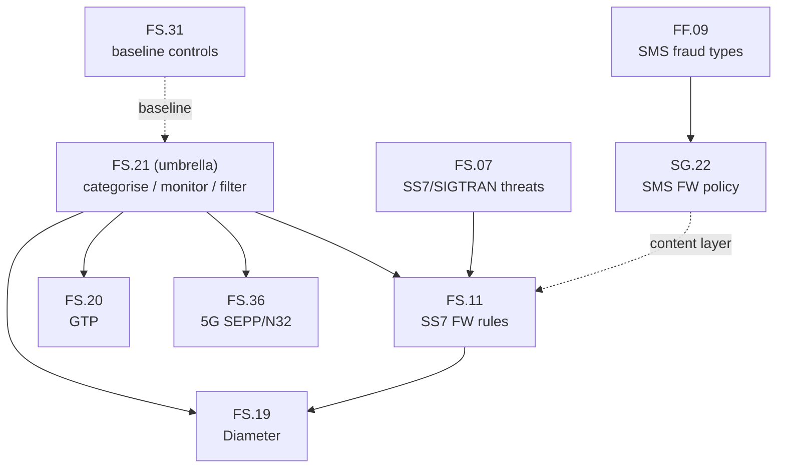

# GSMA FASG Document Index (signalling & SMS security)

Quick-reference map of the GSMA Fraud & Security Group (FASG) documents relevant to this
project. Compiled 2026-07-20 from the GSMA Cybersecurity Knowledge Base / Interworking
Security library.

Most are **members-only**; FS.11 v4.0 is publicly circulated. This index summarises scope
and relevance so we know which PRD backs each control — not a substitute for the source.

---

## 1. Document table

| PRD | Title | Scope | Access | Relevance here |
|-----|-------|-------|--------|----------------|
| **FS.07** | SS7 and SIGTRAN Network Security | Stack-layer SS7/SIGTRAN threats, attack methods, countermeasures | Members | Foundation for SS7 SMS-intercept threat model |
| **FS.11** | SS7 Interconnect Security Monitoring & Firewall Guidelines | Monitor SS7 MAP/CAMEL, packet categorisation (Cat 1/2/3), firewall rules | v4.0 public, v6.0 members | Core of SS7 SMS protection (SRI-SM, MT-spoofing, Double MAP) |
| **FS.19** | Diameter Interconnect Security | LTE/5G Diameter attacks + countermeasures; Diameter<->SS7 MAP interworking; must be read with FS.07 & FS.11 | Members | Diameter SMS redirect (S6c/S6a/SGd) defense |
| **FS.20** | GTP Security | Attacks over GRX/IPX/Internet via GTP-C/U; mitigations | Members | User-plane / bearer context (secondary to SMS) |
| **FS.21** | Interconnect Signalling Security Recommendations | Umbrella: risk-based categorise -> monitor -> filter across SS7/Diameter/GTP/5G | Members | Policy consistency across all protocol FWs |
| **FS.31** | Baseline Security Controls | Control catalogue incl. roaming/interconnect | Members | Baseline checklist for the border |
| **FS.36** | 5G Interconnect Security | SEPP/N32 boundary, 5G core message categorisation, IE classification, migration risks | Members | 5G SMS (SMSF) + N32 protection |
| **SG.22** | SMS Firewall Best Practices and Policies | High-level SMS firewall policy + corrective actions | Members | SMS content/policy layer (AIT, spam, premium abuse) |
| **FF.09** | SMS Fraud | Types of SMS, normal vs fraud flows | Members | SMS fraud taxonomy incl. SIM swap context |

Adjacent (identity side, not FASG signalling): **CAMARA** Number Verification / NV2, SIM
Swap, Scam Signal, KYC Match; **GSMA TS.43** Service Entitlement Configuration (EAP-AKA
SIM-based silent auth, works on Wi-Fi); **GSMA Open Gateway**.

---

## 2. How they relate

- **FS.21** is the policy umbrella; **FS.11 / FS.19 / FS.20 / FS.36** implement it per
  protocol (SS7 / Diameter / GTP / 5G).
- **FS.07** underpins FS.11 (threat analysis before firewall rules).
- **FS.19** explicitly cross-references **FS.07 + FS.11** (Diameter<->MAP interworking).
- **SG.22 + FF.09** cover the SMS content/fraud layer that sits above the signalling FW.
- **FS.31** is the baseline controls catalogue the whole programme maps back to.

---

## 3. FS.11 SS7 MAP categorisation (the part we rely on)

| Category | Meaning | Examples | Handling |
|----------|---------|----------|----------|
| Cat 1 | Unauthorised on interconnect | ATI, SendIMSI, unknown opcode | Block |
| Cat 2 | Operator-only; check IMSI vs SCCP | 2.1 needs answer (PSI, PRN, PSL); 2.2 no answer (ISD, DSD) | Filter on identity match |
| Cat 3 | Inter-operator; needs inter-packet logic | 3.1 SGSN/VLR check (MO-FSM, USSD, RegisterSS, IDP); 3.2 time/location (UL, **SAI**); 3.3 IPSM-GW (SMS-specific) | Location/time correlation |

Direct consequences used elsewhere in this repo:
- **ATI = Cat 1** -> silent-auth Verifier must query the **own** HLR intra-network, never
  over interconnect (see `../design/silent-auth-flow.md`).
- **SRI-SM / MT-FSM** handling and **SMS Home Routing** derive from FS.11 §3 + Annex B
  (see `sms-channel-protection.md`).

---

## 4. Source artefacts pulled during research (2026-07-20)

Full-text copies fetched for citation (external, not committed):
- FS.11 v4.0 (public PDF) — SS7 monitoring & firewall, Annex A/B.
- GSMA Diameter Vulnerabilities Exposure Report 2018 — S6a/S6c SMS intercept evidence.
- ENISA "Signalling Security in Telecom SS7/Diameter/5G".
- FCC CSRIC report — Diameter edge/DEA guidance.
- 3GPP TS 29.337 (T4), references to TS 23.040 §8.1.4 (SMS Router) and TS 33.501 (5G).
- Meta + Telco "Promise of Silent Authentication APIs" white paper (2026).

Access the members-only PRDs via the GSMA Cybersecurity Knowledge Base for authoritative
rule tables before any implementation.
