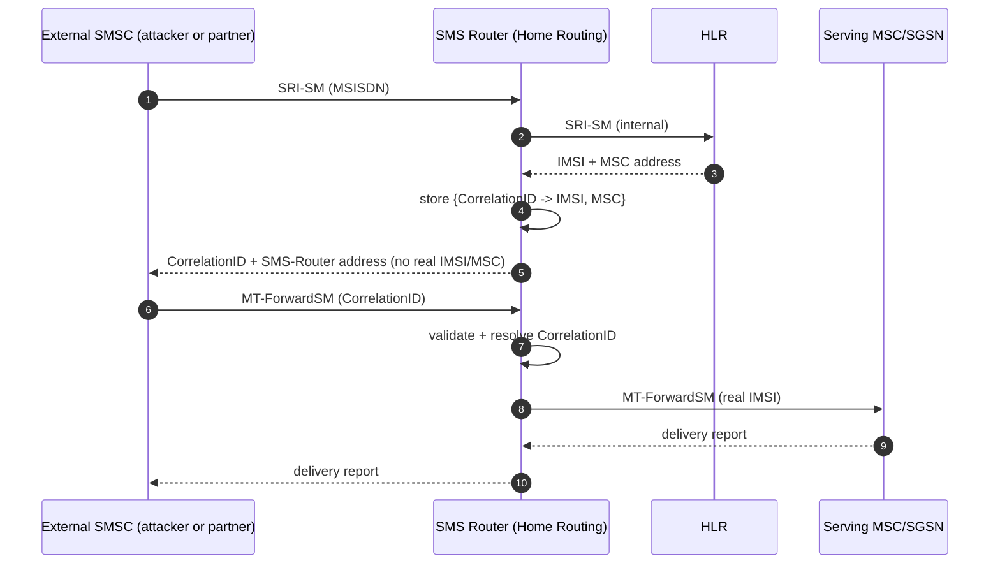

# SMS Channel Protection — SS7 / Diameter / 5G

How to keep the customer's SMS (especially OTP) from being intercepted, redirected, or
spoofed across the interconnect. Strategy B of
[`../design/unified-identity-sms-security-architecture.md`](../design/unified-identity-sms-security-architecture.md).

Research date: 2026-07-20. Sources: 3GPP TS 23.040 / TS 29.337 / TS 33.501, GSMA
FS.07/FS.11/FS.19/FS.21/FS.36/SG.22/FF.09, ENISA Interconnect Security, FCC CSRIC,
Positive Technologies Diameter 2018, HITB 2019 (Puzankov, Double MAP).

---

## 1. Why the SMS channel is exposed

SS7 and Diameter were built for a trusted operator club; neither authenticates the peer
by default. An attacker with interconnect access (leased GT, compromised femtocell,
roaming hub) can ask the network where a subscriber is and then have messages delivered
to themselves. In SS7 tests, **9 of 10 SMS were interceptable**; 4G is only safer when
the device happens to fall back to 3G or uses IMS SIP for SMS. So SMS OTP must be treated
as interceptable unless the signalling border is actively defended.

---

## 2. SS7 / MAP protection (2G / 3G)

### 2.1 SMS Home Routing (primary control) — 3GPP TS 23.040 §8.1.4

Normal MT-SMS delivery is two steps: `SendRoutingInfoForSM` (SRI-SM) to the HLR returns
the target **IMSI + serving MSC/SGSN**, then the SMSC sends `MT-ForwardSM` to that node.
The leak is step 1: SRI-SM hands out IMSI and location to whoever asks.

Home Routing inserts an **SMS Router** in front of the HLR that answers SRI-SM on behalf
of the HLR and returns:

- a **Correlation ID** instead of the real IMSI, and
- the **SMS Router's own address** instead of the real MSC/SGSN.

This forces the originating SMSC to send MT-ForwardSM back to the router, which restores
the real IMSI/MSC (kept in a short-lived store keyed by Correlation ID) and delivers
internally. Net effect: **IMSI and subscriber location never leave the home network**,
and topology is hidden.

Hardening notes:
- Use an **LMSI-based correlation key** with unpredictable projection over MSISDN ranges
  (patent US2015/0024740) so a forged MT-FSM with a guessed Correlation ID fails to
  correlate and is dropped as fake.
- If `SM-Delivery-Not-Intended` is set in SRI-SM (pure probing, no delivery), the router
  can skip creating a Correlation ID entirely — deny the reconnaissance.

### 2.2 SRI-SM filtering (FS.11)

- Allow SRI-SM only from **legitimate SMSCs / roaming partners** (CgPA allow-list).
- `SendRoutingInfoForSM` from interconnect is otherwise Category 2/3 material subject to
  IMSI-vs-SCCP and location-correlation checks; unexpected sources -> drop.
- Track SRI-SM volume + response codes per peer to spot enumeration sweeps.

### 2.3 MT-spoofing correlation (FS.11)

MT-spoofing = the SMSC address in `MT-ForwardSM` does not reflect the true origin
(fraudulent tariff / phishing). Detection:

- Compare SMSC address at **MAP layer vs SCCP layer** in SRI-SM and in MT-FSM.
- **Correlate** each SRI-SM from a suspect SMSC with its subsequent MT-FSM and compare
  the SMSC addresses at both layers.
- On mismatch / unsolicited MT-FSM (no preceding SRI-SM) -> configurable temporary or
  permanent discard error back to the originator.

### 2.4 Double MAP (CVD-2018-0015, FS.11 CR)

Attack hides an illegitimate MAP component after a legitimate-looking one inside the same
TCAP Begin; a firewall that inspects only the first component passes it. Countermeasures:

- **Block TCAP Begin carrying multiple MAP components** — the only legal pair observed is
  `BeginSubscriberActivity + ProcessUnstructuredSS-Data`.
- Inspect **local** opcodes (attackers use global opcodes the STP/FW ignores).
- Pair the SS7 FW with an IDS so a hostile source is blocked promptly.

---

## 3. Diameter protection (4G / LTE)

SMS interception migrates to Diameter where operators use SMS-over-Diameter (SGd) or when
attackers manipulate S6a/S6c.

| Interface | Message | Abuse | Countermeasure |
|-----------|---------|-------|----------------|
| S6c | `SRR` (Send-Routing-Info-for-SM) | Query serving MME + IMSI of target | DEA: allow only from trusted GTs; topology hiding |
| S6a | `ULR` (Update-Location) | Spoof MME to redirect the subscriber | DEA: origin validation, IMSI-vs-realm, velocity check |
| S6a | `NOR` (Notify) | Disable SMS if SGd/GGd used | DEA: flag/value validation, drop illegitimate |
| S6a | `PUR` (Purge-UE) | Purge subscriber from serving MME -> unreachable | DEA: reject PUR spoofing current MME |
| S6a | `DSR` (Delete-Subscriber-Data) | Delete profile -> disconnect | DEA: block external DSR with dangerous flags |
| SGd | MT SMS over Diameter | Deliver SMS via forged serving node | Correlate with S6c; SMSF/IP-SM-GW policy |
| T4 | Device Trigger (TS 29.337) | Intra-PLMN only | Reject external T4; SMS-SC validates it serves the UE |

Core Diameter controls (FS.19 / FS.21, FCC CSRIC):
- Deploy a **Diameter Edge Agent (DEA)** / signalling FW at the network edge — filter
  before traffic reaches the core.
- **S6a is the first priority** (exposes PII + network specifics).
- Whitelist allowable commands per interface; blacklist the rest.
- **Topology hiding** on the DEA (hide internal MME/HSS identities).
- Filter at every layer: transport, application/command, SMS layer.
- Firewalling alone can't protect inbound roamers (spoofing, unauthenticated Location
  Update) — combine with integrity/confidentiality where available.

---

## 4. 5G protection (SA)

5G changes transport (HTTP/2 + JSON over service-based interfaces) but keeps the principle
"validate at an inspectable border".

- **SEPP** (Security Edge Protection Proxy) sits at each PLMN perimeter; **N32** is the
  inter-PLMN interface.
  - **N32-c**: SEPPs mutually authenticate and negotiate protection + modification
    policies.
  - **N32-f**: carries signalling, protected by **TLS** (direct roaming) or **PRINS**
    (mediated roaming — application-layer integrity/confidentiality that still lets
    authorised IPX intermediaries modify permitted IEs).
- SEPP does **message filtering, policing, and topology hiding** on the inter-PLMN
  control plane.
- SMS in 5G rides **SMSF** (SMS over NAS) / IP-SM-GW; apply message categorisation and IE
  type classification per **FS.36** and **3GPP TS 33.501**.
- Migration risk: multi-generation networks enforce FS.11 (SS7) + FS.19 (Diameter) +
  FS.36 (5G) **simultaneously** for the same roaming relationships — keep policy
  consistent via FS.21. An attacker will pick the weakest generation, so an unprotected
  2G MT-SMS path undermines the 5G controls.

---

## 5. Monitoring & policy (SG.22, FS.21)

- Categorise -> monitor -> filter (FS.21): don't blind-block; watch first so legitimate
  roaming isn't broken, then tighten.
- Per-peer metrics: SRI-SM volume, refusal reasons, SRI-SM without matching MT-FSM,
  destination-MSISDN rate (AIT / premium abuse), unsolicited MT-FSM.
- Feed signalling events to SIEM/SOAR for automated GT blocking.
- SG.22 (SMS Firewall Best Practices) governs the SMS-content/policy layer above the
  signalling checks.

---

## 6. Appendix — mapping to jSS7 (coral-valley)

Reference only; no code changes in this deliverable. Path prefix:
`worktrees/jSS7/coral-valley/jSS7/map/map-impl/src/main/java/org/restcomm/protocols/ss7/map/service/sms/`

| jSS7 class | Relevance to SMS protection |
|------------|-----------------------------|
| `SendRoutingInfoForSMRequestImpl` | SRI-SM request; already carries `imsi` (`_TAG_imsi=12`) and `correlationID` (`_TAG_correlationID=15`) fields + `smDeliveryNotIntended`, `smsfSupportIndicator` — the anchor for Home Routing / probe-denial |
| `SendRoutingInfoForSMResponseImpl` | SRI-SM response; where a router would substitute Correlation ID + router address for real IMSI/MSC |
| `CorrelationIDImpl` | The MT Correlation ID primitive used by Home Routing |
| `LocationInfoWithLMSIImpl` | Location + LMSI; LMSI is the hardened correlation-key candidate |
| `MtForwardShortMessageRequestImpl` | MT-FSM; the message a router must receive back and validate against stored correlation |
| `MoForwardShortMessageRequestImpl` | MO-FSM (`sm_RP_DA`, `sm_RP_OA`); MO-side origin checks |
| `InformServiceCentreRequestImpl` | InformSC; part of MT delivery signalling to scrutinise |
| `MAPServiceSmsImpl` / `MAPDialogSmsImpl` | SMS service + dialog entry points where FW/router logic would hook |

TCAP-level (Double MAP) checks would live above MAP, at the TCAP dialog layer
(`org.restcomm.protocols.ss7.tcap`), inspecting components in a `TCBegin`.

These are integration points **if** Strategy B is later built on jSS7 rather than a COTS
SMS Router / SS7 FW (open item in the unified architecture doc).
