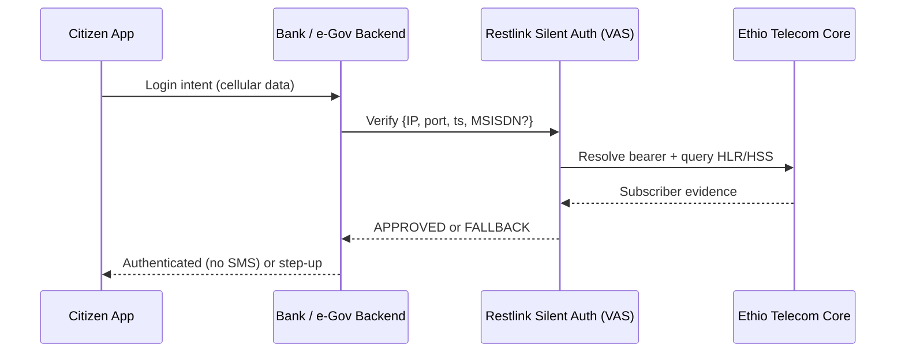

# Chapter 1 — Executive Summary

**Proposal:** Network-Side Silent Authentication for Ethiopian Government, Banking, and Digital Public Services  
**Submitted by:** Restlink (Value-Added Services Partner)  
**Network operator context:** Ethio Telecom  
**Document classification:** Confidential — Government & Financial Sector  
**Version:** 1.0 — July 2026

---

## 1.1 Purpose of This Proposal

The Government of Ethiopia, Ethio Telecom, and the national banking sector are converging on a single digital identity substrate: the mobile phone number. Citizens use MSISDN-bound accounts to access e-Government portals, file taxes, register civil events, receive social payments, and authenticate to mobile banking applications. In nearly every case today, the proof of possession is a **one-time password (OTP) delivered by SMS**.

SMS OTP is familiar, inexpensive to deploy, and interoperable across handsets. It is also **structurally vulnerable** to signalling-layer interception, SIM-swap fraud, artificial inflation of traffic (AIT), and real-time phishing relays. These are not hypothetical weaknesses in mature markets; independent security research has demonstrated that **nine of ten SMS messages were interceptable** in controlled SS7 penetration tests (Positive Technologies, 2017–2018). Where OTP remains the primary control, account takeover (ATO) risk scales with digital service adoption.

This proposal recommends a **network-side Silent Authentication Service (SAS)** deployed as a **Value-Added Service (VAS) adapter** on Ethio Telecom infrastructure, orchestrated by Restlink for government and bank backends. Silent authentication verifies that the device currently attached to the cellular network owns the claimed MSISDN **without sending an SMS**, by correlating the live data bearer (IP + port + timestamp) with intra-network HLR/HSS queries under GSMA interconnect security guidelines (**FS.11** for SS7 MAP; **FS.19** for Diameter S6a). The application-facing contract aligns with the **CAMARA Number Verification (NV)** API family and GSMA Open Gateway norms, enabling Ethiopian institutions to adopt a globally recognised pattern while keeping subscriber data and signalling inside the home operator.

Restlink **does not operate a competing SMSC**, **does not terminate interconnect SMS**, and **does not displace Ethio Telecom SMS revenue**. Silent auth reduces OTP volume for successful sessions; residual fallback OTP continues to bill through the operator SMSC unchanged. Restlink bills integrators (banks, ministries, payment agencies) for verified authentication API calls—a new revenue stream that complements, rather than cannibalises, existing telco economics.

---

## 1.2 The Problem in One Paragraph

Ethiopia's digital transformation agenda—Digital Ethiopia 2025, the Fayda national digital ID programme, expansion of e-tax and civil-registry services, and rapid mobile-money and agency-banking growth—has increased reliance on phone-number identity. Each new digital touchpoint that sends an SMS OTP expands the attack surface visible to SS7/Diameter adversaries, SIM-swap insiders, and automated OTP-trigger farms. The cost of fraud is borne by citizens (lost savings, identity theft), by banks (chargebacks, reputational harm, regulatory scrutiny), and by the state (benefit leakage, tax-collection integrity, trust in e-Gov). Replacing SMS where the network can prove possession directly addresses the **weakest link** in the current architecture without forcing citizens through heavier friction on every login.

---

## 1.3 Recommended Solution Overview

Silent Authentication is a **two-stage, fail-closed** verification pipeline:

| Stage | Question answered | Network element |
|-------|-------------------|-----------------|
| **Resolver** | Which MSISDN/IMSI owns cellular IP `A.B.C.D:port` at time *t*? | PGW/GGSN session binding, PCRF, or CGNAT log (operator-hosted) |
| **Verifier** | Is that subscriber live, reachable, and not subject to a fresh SIM swap? | HLR/HSS via MAP (PSI/SAI) or Diameter (S6a ULR/ULA + read-only Sh UDR)—**intra-network only** |

The bank or e-Gov backend calls Restlink's SAS (`POST /verify` or CAMARA NV equivalent). Restlink resolves and verifies server-to-server; **MSISDN and IMSI are never exposed to the mobile application**. On success, the integrator receives `{match: true, assurance: HIGH}` and may approve login without OTP. On any missing evidence—Wi-Fi-only access, stale bearer binding, MAP timeout, recent IMSI change—the service returns **FALLBACK** and the integrator steps up to passkey, TOTP, or operator-billed SMS OTP.

This design preserves **MAP dialog state machine** integrity (one dialog per stage, bounded TC timers, explicit abort on timeout), **fail-closed** policy (no partial approvals), and **GSMA FS.11 Category 1** constraint: `AnyTimeInterrogation` and equivalent sensitive queries remain **inside the PLMN**, never on interconnect.

---

## 1.4 Strategic Alignment

### 1.4.1 National digital identity and e-Government

Ethiopia's Fayda (National ID) programme and Ministry of Innovation and Technology (MInT) e-service roadmap aim to bind legal identity to usable digital credentials. Mobile numbers are already the **de facto second factor** for millions of citizens who lack alternative hardware tokens. Silent auth strengthens that binding by anchoring proof in **live network attachment** rather than a interceptable SMS channel, while remaining compatible with Fayda onboarding flows (CAMARA **KYC Match** can complement NV where policy requires attribute verification).

### 1.4.2 Financial sector stability

The National Bank of Ethiopia (NBE) and participating commercial banks (Commercial Bank of Ethiopia, Awash, Dashen, Bank of Abyssinia, Cooperative Bank of Oromia, and others rolling out app channels) require strong customer authentication for electronic transactions. Silent auth reduces OTP fatigue—a documented driver of abandonment and support cost—while mitigating SIM-swap ATO, which GSMA documents under **FF.09 (SMS Fraud)** and operator SIM-swap detection guidance. High-value transfers can retain elevated assurance thresholds or mandatory passkey step-up without changing the underlying SAS.

### 1.4.3 Ethio Telecom commercial interests

Ethio Telecom retains:

- **All SMS termination and OTP billing** on fallback paths  
- **Data and signalling revenue** as citizens use cellular bearers for silent verification  
- **Optionality** for revenue share on authentication API traffic via VAS partnership  

Restlink occupies the **adapter layer** between integrator backends and operator network truth—analogous to other VAS partnerships (content, mobile financial services gateways)—without requiring core network replacement or SMSC competition.

---

## 1.5 Dual-Strategy Security Architecture

Silent auth alone does not eliminate every SMS. Wi-Fi-only sessions, unsupported devices, roaming edge cases, and deliberate policy step-up will still send OTP. Therefore the programme adopts **two complementary strategies** (detailed in technical annexes):

| Strategy | Objective | Primary controls |
|----------|-----------|------------------|
| **A — Replace OTP** | Remove SMS from the authentication path where possible | Restlink SAS, CAMARA NV / GSMA TS.43 SIM method |
| **B — Protect OTP** | Harden residual SMS against signalling abuse | SMS Home Routing, SS7 firewall per **FS.11**, Diameter DEA per **FS.19**, 5G SEPP/N32 per **FS.36**, SMS policy per **SG.22** |

Strategy A defeats phishing and AIT (no code to relay or inflate). Strategy B defeats SS7 `SRI-SM` leakage and MT-spoofing for the OTP that must still be delivered. **Rollout sequencing:** protect residual SMS first, then ramp silent auth coverage—so no stage depends on an exposed channel.

---

## 1.6 Expected Outcomes and KPIs

The pilot and national rollout target measurable outcomes aligned with public-sector and prudential oversight:

| KPI category | Indicator | Pilot target (12 months) | Notes |
|--------------|-----------|--------------------------|-------|
| **Security** | ATO incidents attributed to SMS/SIM swap on integrated apps | ≥ 40% reduction vs. baseline | Measured per integrator fraud desk |
| **UX** | Login completion rate (cellular session) | +15–25 pp vs. OTP-only | e-Gov and bank app analytics |
| **Cost** | SMS OTP messages per 1,000 logins | −50% to −70% | Fallback remains operator-billed |
| **Performance** | SAS p95 latency (APPROVED path) | ≤ 3 seconds | Resolver 300 ms + MAP/Diameter 2 s budget |
| **Coverage** | Sessions eligible for silent path | ≥ 55% urban 4G (estimated) | Expands with TS.43 SIM method for Wi-Fi |
| **Compliance** | Intra-network signalling only | 100% PSI/Sh UDR sourced from home HLR/HSS | FS.11 Cat 1 audit |

*Coverage percentages marked estimated pending Ethio Telecom bearer analytics.*

---

## 1.7 Scope of Pilot Programme

**Phase 1 (months 1–6):** Laboratory and limited production pilot with one tier-1 bank and one e-Gov portal (e.g., tax filing or social-registry lookup), Ethio Telecom PGW resolver integration, MAP verifier on jSS7 stack, CAMARA NV API façade, mTLS bank↔Restlink↔operator trust domain.

**Phase 2 (months 7–12):** Expand to additional banks, Telebirr/wallet login step-up, assurance tiers by transaction risk, optional TS.43 EAP-AKA entitlement server for Wi-Fi-capable silent auth, joint review of SMS Home Routing posture for fallback OTP.

**Out of scope for Restlink:** Operating SMSC, issuing SIMs, modifying Ethio Telecom interconnect agreements, or storing citizen PII beyond transient verification audit logs agreed with regulators.

---

## 1.8 Governance, Privacy, and Regulatory Considerations

- **Data minimisation:** SAS returns match/assurance to the integrator; IMSI stays inside the operator trust zone.  
- **Lawful basis:** Processing under integrator contract and Ethiopian personal-data and financial-regulation frameworks; explicit citizen notice in bank/e-Gov terms.  
- **Audit:** Signed requests (`reqId`, timestamp window), immutable verification logs for NBE and INSA-aligned security reviews.  
- **Standards alignment:** CAMARA NV, GSMA Open Gateway, FS.11/FS.19/FS.21 interconnect security recommendations, NBE cybersecurity expectations for payment service providers.

---

## 1.9 Investment and Partnership Ask

This proposal requests:

1. **Ethio Telecom** — VAS hosting agreement, PGW/PCRF resolver read access, intra-network MAP/Diameter reachability to HLR/HSS, optional API revenue-share framework.  
2. **Government** — Pilot mandate for selected e-Gov use cases; alignment with Fayda and Digital Ethiopia identity policies; INSA review of signalling security roadmap (Strategy B).  
3. **Banking sector** — Two pilot integrators committing to app SDK integration and fraud baseline sharing.  
4. **Restlink** — SAS build, CAMARA adapter, integrator onboarding, 24×7 operations in Addis Ababa.

Capital expenditure is concentrated in Restlink platform engineering and operator-side resolver connectivity; integrators face primarily API integration and app release cost—orders of magnitude below core network replacement.

---

## 1.10 Conclusion

Ethiopia has an opportunity to **leapfrog OTP-only authentication** by deploying network-side silent verification at the same moment e-Gov and banking digital channels scale nationally. The approach is standards-backed (CAMARA, GSMA FS.11), operator-respectful (no SMSC competition, fallback OTP unchanged), and citizen-positive (fewer codes, lower intercept risk). Restlink proposes to deliver this capability as a **trusted VAS adapter on Ethio Telecom**, enabling government and banks to authenticate citizens on the network they already trust—the live cellular attachment—rather than on a message that adversaries have repeatedly shown they can steal.

**Next step:** Authorise a tri-party pilot MoU (MInT or sector regulator, Ethio Telecom, Restlink) with agreed KPIs in Section 1.6 and technical deep-dive in Chapters 2–3.

---

*References: GSMA FS.11 v4.0 (SS7 interconnect security); GSMA FS.19 (Diameter); CAMARA Number Verification API; Positive Technologies SS7/SMS research (2017–2018); Restlink technical design `silent-auth-standard-flow.md` (2026).*
