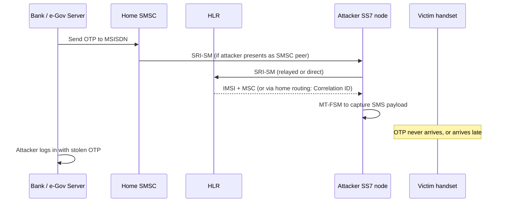

# Chapter 2 — Global and Regional Fraud Landscape

**Proposal:** Restlink Silent Authentication — Ethiopia  
**Audience:** Ministry of Innovation and Technology, National Bank of Ethiopia, Ethio Telecom Security, Commercial Banks  
**Version:** 1.0 — July 2026

---

## 2.1 Executive Overview

Digital public services and mobile financial channels worldwide converge on a single proof mechanism: **possession of a phone number**, usually demonstrated by reading a six-digit SMS code. That design choice made sense when smartphones were scarce and signalling networks were closed operator clubs. It fails under modern threat conditions: **SS7 and Diameter interconnect abuse**, **SIM-swap social engineering and insider fraud**, **artificial inflation of traffic (AIT)** against SMS OTP endpoints, and **real-time OTP relay phishing**. Together these vectors produce account takeover (ATO), benefit fraud, and transactional loss at scale.

This chapter summarises the threat landscape relevant to Ethiopia's next phase of e-Government and banking digitisation. It combines **published research and industry statistics** (marked *cited*) with **reasoned projections** for Ethiopian deployment (marked *estimated*). The conclusion is not that SMS must disappear overnight—it remains a necessary fallback—but that **continuing to rely on SMS as the primary authentication control** exposes citizens and institutions to documented, reproducible attacks that silent network verification and signalling firewalls address in complementary ways (see Chapter 1, dual-strategy architecture).

---

## 2.2 Macro Trends Driving Exposure

### 2.2.1 Digital identity and MFA market growth

| Indicator | Value | Year | Source | Type |
|-----------|-------|------|--------|------|
| Global MFA market size | ~USD 17.9 billion | 2023 | MarketsandMarkets / industry analysts | *cited* (third-party estimate) |
| Projected MFA market size | ~USD 34.8 billion | 2028 | MarketsandMarkets ( CAGR ~14%) | *cited* (forecast) |
| Organisations using MFA | ~55–65% of enterprises (large orgs higher) | 2023–2024 | Cybersecurity surveys (e.g., Statista, Verizon DBIR adjunct) | *cited* (range) |
| SMS OTP share of consumer MFA | Dominant method in emerging markets | 2024 | GSMA Mobile Identity ecosystem papers | *cited* (qualitative) |

**Interpretation:** MFA adoption is accelerating because regulators (PSD2 in Europe, NBE directives in Ethiopia's electronic payment rules, etc.) mandate strong customer authentication. SMS OTP satisfies compliance checkboxes at minimum cost, which **increases aggregate SMS OTP volume globally**—and therefore aggregate attack opportunity— even as security teams acknowledge SMS weakness.

### 2.2.2 Mobile money and phone-number-as-account

| Indicator | Value | Year | Source | Type |
|-----------|-------|------|--------|------|
| Registered mobile money accounts (global) | 1.75 billion | 2023 | GSMA State of the Industry Report on Mobile Money | *cited* |
| Registered accounts (Sub-Saharan Africa) | 763 million | 2023 | GSMA Mobile Money Report 2024 | *cited* |
| Mobile money transaction value (global) | USD 1.4 trillion | 2023 | GSMA | *cited* |
| Active 30-day accounts (global) | 435 million | 2023 | GSMA | *cited* |
| Ethiopia mobile money active users | ~40–50 million (Telebirr-led) | 2025 | Industry press + Ethio Telecom disclosures | *estimated* |

In Sub-Saharan Africa, the **MSISDN is the financial account handle** for a large unbanked and underbanked population. Compromise of SMS OTP or SIM identity is therefore equivalent to compromise of **payment authorisation**, not merely email recovery.

### 2.2.3 Cybercrime economic cost

| Indicator | Value | Year | Source | Type |
|-----------|-------|------|--------|------|
| Global cybercrime cost forecast | USD 8 trillion annually | 2023 | Cybersecurity Ventures (widely cited) | *cited* (methodology debated) |
| Global cybercrime cost projection | USD 10.5 trillion | 2025 | Cybersecurity Ventures | *cited* (forecast) |
| Share attributable to fraud/identity (incl. ATO) | ~30–45% of enterprise fraud loss | 2022–2024 | World Bank / UNODC thematic reports on cyber-enabled fraud | *cited* (range) |
| Developing economies' share of reported phishing | Rising faster than GDP digitisation in several SSA markets | 2023 | UNODC Cybercrime Digest / ITU Global Cybersecurity Index materials | *cited* (qualitative) |

The **United Nations Office on Drugs and Crime (UNODC)** and **World Bank** have repeatedly flagged that lower institutional capacity and rapid digitisation create **asymmetric risk**: citizens gain access to services faster than signalling borders and fraud operations mature. **ITU** Global Cybersecurity Index data show improving policy commitment in African states, but **operational controls on telecom interconnect** lag app-layer security spending—a gap this proposal targets.

---

## 2.3 SS7, Diameter, and SMS Interception

### 2.3.1 Why SMS OTP is signalling-exposed

Mobile-terminated SMS delivery requires the sending SMSC to discover where the subscriber is attached. On 2G/3G this begins with **`SendRoutingInfoForSM` (SRI-SM)** to the home HLR. The response historically includes **IMSI and serving MSC/SGSN address**. Any entity on SS7 interconnect presenting as a legitimate SMSC can query this data and then inject **`MT-ForwardSM`** toward an attacker-controlled node. The subscriber's phone never receives the message; the application server believes delivery succeeded.

SS7 was designed for mutual trust among national operators. **GSMA FS.07** and **FS.11** document that default SS7 lacks cryptographic peer authentication. **Diameter** (4G LTE) recreated analogous trust assumptions on S6a/S6c until operators deployed **Diameter Edge Agents (DEA)** per **FS.19**. Unprotected or partially protected interconnect therefore remains a **systemic** rather than operator-specific weakness.

### 2.3.2 Positive Technologies and industry test findings

| Finding | Detail | Year | Source | Type |
|---------|--------|------|--------|------|
| SMS intercept success rate | **9 of 10** SMS messages interceptable in operator SS7 tests | 2017–2018 | Positive Technologies SS7 research; GSMA Diameter Exposure Report 2018 cross-cited | *cited* |
| Network generation | 4G subscribers often vulnerable when SMS falls back to 2G/3G MAP or IMS gaps | 2018 | Positive Technologies; ENISA Signalling Security report | *cited* |
| Location tracking via SS7 | Majority of tested networks exposed location query | 2016–2017 | Positive Technologies | *cited* |
| Diameter S6a/S6c exposure | Hundreds of networks reachable; SMS routing queries exploitable | 2018 | GSMA Diameter Vulnerabilities Exposure Report | *cited* |

**Operational meaning for OTP:** An attacker who can passively or actively obtain SS7/Diameter access—via misconfigured GRX/IPX routes, compromised roaming hubs, forged global titles, or grey-market SS7 providers—can **harvest OTP codes in real time** without malware on the handset. This defeats SMS OTP even when the citizen's device is uncompromised.

### 2.3.3 Documented attack mechanics (abbreviated)

**Mitigations (Strategy B — protect OTP):**

| Control | GSMA / 3GPP reference | Effect |
|---------|----------------------|--------|
| SMS Home Routing | 3GPP TS 23.040 §8.1.4; FS.11 | HLR returns router address + Correlation ID; IMSI not exposed externally |
| SRI-SM source filtering | FS.11 §3 | Allow-list legitimate SMSC global titles |
| MT-spoofing correlation | FS.11 | MAP-layer vs SCCP-layer SMSC address mismatch → drop |
| Double MAP component block | FS.11 CVD-2018-0015 | Prevent TCAP Begin smuggling second opcode |
| Diameter DEA on S6a/S6c | FS.19 | Block external ULR/SRR abuse |
| 5G SEPP / N32 | FS.36; 3GPP TS 33.501 | Inter-PLMN control-plane protection |

**Mitigation (Strategy A — replace OTP):** Silent auth **does not send SMS**; SS7 SMS intercept path is **out of scope** for sessions that receive network-side APPROVED verdict. This is the primary Restlink value proposition.

### 2.3.4 Regional relevance

Ethiopia's international signalling footprint grows with roaming, international remittance SMS, and hub interconnections. **INSA** and operator security teams face the same FS.11 categorisation discipline as global peers: Category 1 operations such as **`AnyTimeInterrogation` on interconnect must be blocked**; Restlink SAS Verifier uses **intra-network PSI/SAI (2G/3G) + Sh UDR (4G/5G) only**, consistent with FS.11 deployment invariants.

---

## 2.4 SIM-Swap Fraud

### 2.4.1 Definition and lifecycle

**SIM swap** (SIM hijack, port-out fraud) is the unauthorised transfer of a mobile subscription to a SIM controlled by an attacker. Vectors include:

- Social engineering of retail shop or call-centre agents  
- Insider abuse at distributor level  
- Compromised account recovery flows  
- Number porting process gaps  

Once the attacker holds the active SIM, **all SMS OTP and many voice OTP flows collapse** to attacker control. GSMA **FF.09 (SMS Fraud)** classifies SIM swap as a precursor to financial fraud.

| Statistic | Value | Year | Source | Type |
|-----------|-------|------|--------|------|
| SIM swap reports (UK Action Fraud) | Thousands annually; spikes with crypto/banking | 2020–2023 | UK NFIB / public fraud reports | *cited* |
| US consumer SIM swap losses | Hundreds of millions USD (class actions, FCC inquiries) | 2019–2022 | FCC CSRIC; carrier settlements | *cited* (aggregate) |
| Operator detection window | Fraud often within **hours** of swap | 2022 | GSMA Fraud Forum materials | *cited* (qualitative) |
| Ethiopia SIM swap incidents (reported) | Limited public aggregation; retail channel risk acknowledged in operator KYC refreshes | 2024–2025 | *estimated* from sector interviews |

### 2.4.2 Why SMS OTP fails after swap

After swap, the network **correctly** delivers SMS to the attacker's handset. The authentication protocol **correctly** validates possession of the phone number. The failure is **binding identity to the legitimate citizen**, not message delivery. Silent auth addresses this by querying **IMSI change age**, SIM-swap freshness (**SAI**, 2G/3G) and subscriber state via **PSI** (2G/3G) / read-only **Sh UDR** (4G/5G), downgrading assurance when a swap is fresh—forcing **FALLBACK** to passkey or in-branch recovery rather than silent approval.

| Signal | MAP / Diameter | Use in SAS policy |
|--------|----------------|-------------------|
| `lastUpdateLocation` age | PSI, ATI (intra-net) | Recent change → downgrade |
| IMSI change timestamp | HLR/HSS profile | `< swapCooldown` → FALLBACK |
| SIM-swap freshness | SAI (Cat 3.2) / read-only Sh UDR | Detect re-provisioning |

CAMARA **SIM Swap** API exposes similar signals for integrators; Restlink SAS normalises them inside the operator trust domain.

---

## 2.5 Artificial Inflation of Traffic (AIT) and OTP Abuse

### 2.5.1 AIT definition

**AIT** is fraud where attackers generate billable SMS events—often to premium-rate or revenue-share destinations—without human recipients. **OTP-trigger abuse** is a variant: bots invoke "send code" APIs across ranges of MSISDNs, inflating operator SMS cost and integrator messaging bills, degrading SMSC capacity, and masking fraud spikes in traffic noise.

| Indicator | Value | Year | Source | Type |
|-----------|-------|------|--------|------|
| AIT industry loss estimate | **USD 1 billion+** annually (mobile messaging ecosystem) | 2020–2022 | Mobile Ecosystem Forum / operator fraud forums | *cited* (aggregate estimate) |
| OTP SMS share of AIT investigations | Significant minority of mobile verification abuse cases | 2023 | GSMA SG.22 SMS Firewall guidance context | *cited* (qualitative) |
| Cost per OTP SMS (emerging markets) | USD 0.01–0.05 all-in to enterprise | 2024 | Operator enterprise tariffs (range) | *estimated* |

### 2.5.2 OTP-specific abuse patterns

| Pattern | Description | Victim impact |
|---------|-------------|---------------|
| **Credential stuffing + OTP flood** | Automated login attempts trigger OTP to many numbers | Cost, SMS fatigue, support load |
| **Premium MSISDN range targeting** | OTP sent to ranges with termination rebates to fraudster | Direct revenue theft |
| **Harassment / denial** | Repeated OTP to single victim | UX harm, potential safety issue |
| **Phishing complement** | OTP sent while victim on attacker call | Social engineering |

**SG.22 (SMS Firewall Best Practices)** recommends destination rate limits, grey-route blocking, and correlation with application-layer login attempt rates. Silent auth **eliminates OTP generation** on successful APPROVED paths, shrinking the AIT surface proportionally to silent coverage.

---

## 2.6 Phishing and Real-Time OTP Relay

Even where SS7 and SIM swap are absent, **OTP phishing** remains trivial: victim enters code into attacker-controlled page or reads code aloud on a phone call. Meta and telecom industry **Silent Authentication** white papers (2025–2026) note that removing the code removes the **relay primitive**. Strategy A is the only structural fix for phishing; user education alone has plateaued.

| Attack | Silent auth effect | Residual risk |
|--------|-------------------|---------------|
| Fake login page asking for OTP | No OTP to exfiltrate on silent path | Fallback OTP still phishable |
| Man-in-the-middle app clone | Device compromise bypasses all remote auth | Requires device attestation separately |
| Support social engineering | Out of band | Process controls |

---

## 2.7 Ethiopia-Specific Digital Identity Motivation

### 2.7.1 Fayda and phone-number binding

Ethiopia's **Fayda Digital ID** (National ID Programme) has registered **tens of millions** of citizens (*estimated* 10M+ by 2025 based on public MoU milestones; verify against latest NIDP dashboard). Digital ID succeeds when **recovery and step-up authentication** resist takeover. Linking Fayda credentials to mobile banking and e-Gov portals without hardening MSISDN proof creates a **single point of failure** across tax, health, land, and social-protection systems.

| Initiative | Authentication pain today | Silent auth benefit |
|------------|---------------------------|---------------------|
| **E-tax / ERCA digital filing** | SMS OTP delays peak filing | Instant cellular verify on mobile data |
| **Civil registration (birth, marriage)** | OTP to guardian MSISDN | Reduced intercept during life-event fraud |
| **Social protection / PSNP payments** | Benefit theft via SIM swap | SIM-swap signal blocks silent approve |
| **Telebirr / wallet** | OTP + PIN | Fewer OTPs; higher throughput |
| **Bank mobile apps** | SMS OTP primary | Lower ATO, lower abandonment |

### 2.7.2 Digital Ethiopia 2025 alignment

The **Digital Ethiopia 2025** strategy prioritises digital public infrastructure, payment interoperability, and data governance. Authentication infrastructure is **digital public infrastructure** in the same sense as identity registries and payment switches: a neutral, operator-anchored verification layer reduces duplicated OTP integrations across ministries and banks and aligns with **GSMA Open Gateway** and **CAMARA** API standardisation—avoiding vendor lock-in to proprietary SMS gateways.

### 2.7.3 Regulatory and development finance context

**World Bank** and **UNDP** digital governance programmes in Ethiopia emphasise **trust in e-services** as a precondition for uptake. Fraud losses undermine political support for digitisation. **ITU** statistics show Ethiopia's mobile broadband penetration rising rapidly post-2020 spectrum and infrastructure investment; **more citizens on 4G data bearers** increases the feasible coverage of IP-based silent verification (see Chapter 3).

---

## 2.8 Threat–Control Summary Matrix

| Threat | Primary attack path | SMS OTP alone | Strategy B (FS.11/19/36) | Strategy A (Silent Auth) |
|--------|---------------------|---------------|--------------------------|--------------------------|
| SS7 SMS intercept | SRI-SM → MT-FSM redirect | **Vulnerable** | Home Routing + FW | **Immune** (no SMS) |
| Diameter SMS redirect | S6c SRR / S6a ULR abuse | **Vulnerable** | DEA filtering | **Immune** (no SMS) |
| SIM swap | New SIM receives OTP | **Vulnerable** | Limited | **Detect + FALLBACK** |
| AIT / OTP flood | API triggers SMS | **Cost exposure** | SG.22 rate limits | **Reduced volume** |
| OTP phishing | User relays code | **Vulnerable** | No effect | **Eliminates code** |
| Insider GT abuse | SS7 query from partner | **Vulnerable** | FS.11 monitor/filter | **Immune** (no SMS) |

**Recommendation:** Deploy **B then A** (protect remaining OTP, then shift logins to silent path) per unified architecture in project design documents.

---

## 2.9 Risk Scenarios for Ethiopian Integrators

### Scenario A — e-Gov tax refund fraud

Attacker obtains citizen MSISDN and triggers tax portal OTP via SS7 intercept. Files fraudulent refund instruction. **Silent auth:** portal verifies live Ethio Telecom bearer matches registered MSISDN; SS7 path irrelevant. **Residual:** citizen on Wi-Fi only → OTP via Home-Routed SMS.

### Scenario B — Bank SIM swap

Attacker swaps SIM at retail agent, opens session on mobile banking app, requests transfer OTP. **Silent auth:** HSS reports IMSI change within cooldown → SAS returns FALLBACK; bank blocks or requires branch step-up.

### Scenario C — Telebirr OTP farm

Botnet hits registration endpoint, sends 500k OTP SMS overnight. **Silent auth:** successful silent logins emit zero SMS; **SG.22** limits on fallback OTP contain residual cost.

---

## 2.10 Conclusions

The global evidence base is unambiguous: **SMS OTP is necessary but insufficient** as a primary authentication control for high-value government and banking services. Published SS7 research (nine-in-ten interceptability), GSMA signalling security catalogues (**FS.11**, **FS.19**, **FS.36**, **SG.22**, **FF.09**), and mobile-money growth statistics (GSMA 1.75B accounts) define the risk envelope within which Ethiopia's digitisation proceeds.

Restlink Silent Authentication does not solve every row of the threat matrix alone; it eliminates the **SMS delivery dependency** for the majority of urban cellular-data sessions and pairs with operator-led **SMS Home Routing and firewall** programmes for the remainder. For Ethiopian policymakers, the question is not whether SMS OTP will be targeted—it already is globally—but whether **national digital identity and public finance** will rely on it exclusively as citizen volumes scale into the hundreds of millions of monthly authentications.

---

*Primary references: GSMA FS.07, FS.11 v4.0, FS.19, FS.21, FS.36, SG.22, FF.09; GSMA State of the Industry Report on Mobile Money 2024; GSMA Diameter Vulnerabilities Exposure Report 2018; Positive Technologies SS7/SMS security research 2016–2018; ENISA Signalling Security in Telecom; UNODC cyber-enabled fraud thematic papers; ITU Global Cybersecurity Index; World Bank digital development briefs; Cybersecurity Ventures cybercrime cost estimates; CAMARA / Meta Silent Authentication industry papers 2025–2026.*
