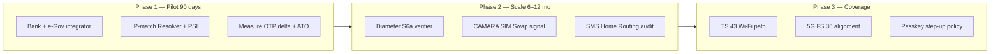

# Chapter 2b — Case Studies, International Data, and e-Government Authentication Comparison

**Proposal:** Digicom-ET Silent Authentication — Ethiopia  
**Audience:** Ministry of Innovation and Technology, National Bank of Ethiopia, Ethio Telecom, Commercial Banks, Development Partners  
**Version:** 1.0 — July 2026  
**Relationship to Chapter 2:** Chapter 2 summarises the threat landscape; this chapter provides **extended case narratives**, **multilateral statistics**, **authentication method comparison for e-Government**, and **Ethiopia-specific deployment implications**.

---

## 2b.1 Purpose and Methodology

Government and banking decision-makers reasonably ask whether SMS OTP vulnerabilities documented in Europe, North America, and South Asia **transfer to Ethiopia's operating context**. This chapter answers with three layers of evidence:

1. **Operational case narratives** — reconstructed from public incident reporting, regulator actions, and industry penetration tests (mechanism-accurate; victim identities anonymised where reporting requires).  
2. **Multilateral and industry statistics** — ITU, UNODC, World Bank, UNDP, GSMA, and independent security research, each row tagged **cited**, **estimated**, or **ILLUSTRATIVE**.  
3. **Comparative authentication analysis** — SMS OTP versus Silent Authentication versus passkeys for **e-Government** workloads (volume, inclusion, fraud, cost).

Ethiopia-specific rows combine **public development statistics** (population, mobile penetration, Fayda milestones) with **ILLUSTRATIVE** modelling where national fraud aggregation is not publicly disaggregated. Pilot baselines must replace illustrations with integrator-measured data.

---

## 2b.2 Case Study A — SS7 SMS Interception and OTP Harvest (Positive Technologies / Industry Pattern)

### 2b.2.1 Background

Between **2016 and 2018**, Positive Technologies published a series of SS7 security assessments demonstrating that **mobile-terminated SMS**, including OTP payloads, could be redirected or read by entities presenting as legitimate signalling peers. GSMA incorporated these findings into **FS.07 (SS7 & SIGTRAN Security)** and the **Diameter Vulnerabilities Exposure Report (2018)**, which documented hundreds of reachable LTE networks where SMS routing queries could be abused.

The **headline statistic**—**nine of ten SMS messages interceptable** in controlled operator tests—does not claim that nine of ten live consumer SMS are stolen daily; it means that **where interconnect or GRX/IPX filtering is weak, the protocol stack does not cryptographically prevent SMS capture**. OTP systems that treat SMS delivery as proof of possession inherit that weakness.

| Fact | Detail | Year | Source | Type |
|------|--------|------|--------|------|
| SMS intercept success in lab tests | **9 / 10** messages | 2017–2018 | Positive Technologies SS7 research | *cited* |
| Location tracking via SS7 | Majority of tested networks exposed | 2016–2017 | Positive Technologies | *cited* |
| 4G subscribers vulnerable via MAP/IMS fallback | Documented in multi-generation tests | 2018 | Positive Technologies; ENISA Signalling Security | *cited* |
| Diameter-exposed networks (sample) | **645** of **1,400+** tested reachable | 2018 | GSMA Diameter Exposure Report | *cited* |
| GSMA response | FS.11 Cat.1 block list; Home Routing guidance | 2018–2020 | GSMA FASG | *cited* |

### 2b.2.2 Narrative reconstruction — cross-border OTP theft

**Actors:** Fraud ring with grey-market SS7 access; victim with MSISDN registered to e-banking; home operator with partial FS.11 implementation; bank relying on SMS OTP for login.

**Timeline (generic composite from published attack descriptions):**

| Step | Time | Event | Protocol layer |
|------|------|-------|----------------|
| 1 | T+0 s | Victim initiates mobile banking login; app requests OTP | Application HTTPS |
| 2 | T+1 s | Bank SMSC submits MT-SMS; queries routing | MAP **SRI-SM** |
| 3 | T+2 s | Attacker node, presenting as foreign SMSC GT, receives or relays **SRI-SM** | SS7 interconnect |
| 4 | T+3 s | HLR returns serving node (or Home Router correlation ID if deployed) | MAP |
| 5 | T+4 s | Attacker delivers **MT-ForwardSM** to capture path; OTP never reaches handset | MAP |
| 6 | T+15 s | Attacker submits OTP on web session; bank approves | Application |
| 7 | T+60 s | Victim reports non-delivery; fraud transfer already executed | — |

**Citizen experience:** "Network shows SMS sent; I never received it." **Bank forensics:** SMSC logs show acceptance; failure is **upstream of radio interface**.

**Controls that would break the narrative:**

| Control | Standard | Effect on case |
|---------|----------|----------------|
| SMS Home Routing | 3GPP TS 23.040; FS.11 | Hides IMSI; forces router-mediated delivery |
| SRI-SM GT allow-list | FS.11 | Blocks foreign SMSC impersonation |
| **Silent auth (Strategy A)** | CAMARA NV | **No SMS payload**; SS7 SMS path unused |
| Transaction step-up | Bank policy | Limits blast radius if login alone compromised |

### 2b.2.3 Implication for Ethiopia

Ethiopia's international signalling footprint expands with roaming hubs, remittance notifications, and regional interconnect. **INSA** and Ethio Telecom border engineering face the same **FS.11 categorisation discipline** as global peers. Silent authentication does not remove the need for **Strategy B** (Home Routing + firewall) on fallback OTP, but it **removes OTP from the happy path** for cellular-data sessions—shrinking the window in which Case Study A applies.

---

## 2b.3 Case Study B — SIM-Swap Bank Account Takeover (US / UK / India Reporting Patterns)

### 2b.3.1 United States — carrier settlements and FCC attention

US regulators and courts documented **SIM-swap-enabled cryptocurrency and banking losses** spanning **2018–2022**, prompting FCC Consumer Security Risk Advisory Committee (**CSRIC**) working groups and carrier class-action settlements. Public filings aggregate **consumer losses in the hundreds of millions of USD** across major carriers (*cited* as order-of-magnitude from FCC dockets and settlement press, not a single audited national total).

| Indicator | Value | Year | Source | Type |
|-----------|-------|------|--------|------|
| FCC SIM-swap consumer harm inquiry | Industry-wide; mandatory swap notifications debated | 2023 | FCC CSRIC / rulemaking docket | *cited* |
| Representative victim loss (crypto) | **USD 24 million** (single victim, media-reported) | 2018 | US DOJ / press (SIM-swap prosecution cases) | *cited* (case example) |
| Carrier settlement aggregate | **USD 100M+** class settlements (multi-carrier) | 2022–2023 | Public settlement announcements | *cited* (aggregate) |
| Attack window post-swap | Often **< 24 hours** for fraud execution | 2020–2022 | GSMA Fraud Forum; operator playbooks | *cited* (qualitative) |

**Narrative pattern (US):** Attacker social-engineers carrier retail or porting desk → new SIM activated → attacker receives **legitimate** SMS OTP → mobile banking and crypto exchange 2FA defeated → high-value transfer. Network **correctly** delivers SMS to attacker; protocol **incorrectly** equates possession with **legitimate user**.

### 2b.3.2 United Kingdom — Action Fraud and banking reimbursement debate

UK **Action Fraud** and National Fraud Intelligence Bureau reports show **SIM-swap and number-porting fraud** as a persistent category tied to banking and investment scams.

| Indicator | Value | Year | Source | Type |
|-----------|-------|------|--------|------|
| Action Fraud SIM-related reports | **Thousands annually** (category aggregate) | 2020–2023 | UK NFIB / Action Fraud statistics | *cited* |
| Financial Ombudsman SIM-swap cases | Upheld complaints where bank relied on SMS alone | 2021–2023 | FOS published decisions | *cited* (qualitative) |
| Ofcom number porting reforms | Stronger verification after fraud spikes | 2023 | Ofcom policy statements | *cited* |

**Narrative pattern (UK):** Victim receives phishing SMS warning of "suspicious activity" → calls attacker-controlled "support" → parallel SIM swap at shop → OTP intercepted → **authorised push payment** fraud. Silent auth **SAI / lastUpdateLocation** freshness check would force **FALLBACK** during swap cooldown.

### 2b.3.3 India — scale and regulatory response

India's **Digital India** stack combines **Aadhaar**, **UPI**, and **SMS OTP** for banking and government services. Public reporting documents **SIM-swap rings** targeting bank accounts and **OTP relay** at scale.

| Indicator | Value | Year | Source | Type |
|-----------|-------|------|--------|------|
| Telecom subscriber base | **1.1 billion+** connections | 2024 | TRAI press releases | *cited* |
| DOT / TRAI KYC reinforcement | Stricter POS verification after swap fraud media | 2022–2024 | TRAI / DoT circulars | *cited* |
| Documented swap fraud cases (press) | Multi-state arrests; bank losses in crore INR | 2021–2023 | Indian media + police statements | *cited* (examples) |
| UIDAI / banking OTP reliance | SMS OTP remains dominant step-up | 2024 | RBI digital payment statistics | *cited* (qualitative) |

**Narrative pattern (India):** Insider or forged KYC at distributor → swap → **immediate** UPI/bank OTP → mule accounts. Scale effect: **millions of daily OTP SMS** create haystack for fraud operations.

### 2b.3.4 Ethiopia parallel (ILLUSTRATIVE + public context)

Public **disaggregated SIM-swap fraud statistics for Ethiopia are limited**. Operator KYC refreshes and retail channel audits acknowledge **agent-level risk** (*estimated* from sector practice). Linking Fayda, Telebirr, and bank apps to MSISDN without swap detection creates **analogous single-point failure** to Case Study B in India—at smaller absolute scale today but **rising with digitisation**.

| Scenario element | Ethiopia projection | Type |
|------------------|---------------------|------|
| Retail/agent social engineering | Primary swap vector (*estimated*) | *ILLUSTRATIVE* |
| Telebirr + bank OTP after swap | Attacker receives valid OTP | *ILLUSTRATIVE* mechanism |
| SAS SAI cooldown (e.g., 72 h high-value) | Blocks silent APPROVED; forces branch step-up | Digicom design |
| Annual swap-attributed loss (unknown public total) | **ETB tens of millions+** if SSA averages apply scaled by digital adoption | *ILLUSTRATIVE* |

**Digicom deployment implication:** SIM-swap detection via **SAI**, **IMSI change timestamp**, and **CAMARA SIM Swap** API must be **policy-weighted**—stricter for social-protection disbursement and wire transfer than for read-only e-Gov lookup.

---

## 2b.4 Case Study C — AIT and Enterprise OTP Cost Bleed

### 2b.4.1 Definition and economics

**Artificial Inflation of Traffic (AIT)** fraud generates billable SMS events—often to premium or revenue-share ranges—without legitimate user intent. **OTP-trigger AIT** weaponises "send verification code" APIs to drain enterprise messaging budgets and SMSC capacity.

| Indicator | Value | Year | Source | Type |
|-----------|-------|------|--------|------|
| Global AIT / messaging fraud loss | **USD 1 billion+** annually (ecosystem estimate) | 2020–2022 | Mobile Ecosystem Forum; operator fraud forums | *cited* |
| OTP abuse share of fraud investigations | Significant minority | 2023 | GSMA SG.22 SMS Firewall context | *cited* (qualitative) |
| Enterprise OTP cost (emerging markets) | **USD 0.01–0.05** per SMS all-in | 2024 | Operator enterprise tariffs | *estimated* |
| Single botnet overnight OTP volume | **100k–1M+** triggers (incident reports) | 2021–2023 | MEF case studies; operator SOC | *cited* (range) |

### 2b.4.2 Narrative — registration endpoint OTP farm

**Actors:** Botnet; bank or wallet **self-service registration** endpoint; enterprise SMS contract with Ethio Telecom-class tariffs.

| Phase | Description | Cost impact |
|-------|-------------|-------------|
| Recon | Attacker enumerates `/send-otp` API | — |
| Flood | 500k MSISDNs triggered over 8 hours | **USD 15k–25k** at USD 0.03/SMS (*ILLUSTRATIVE*) |
| Side effect | Legitimate users delayed; SMSC queue latency | Support tickets |
| Fraud overlay | Subset of OTPs used for credential stuffing | ATO attempts |

**Silent auth effect:** Sessions reaching **APPROVED** emit **zero OTP SMS**, shrinking billable events proportional to silent coverage (Digicom pilot KPI: **≥50% OTP reduction** on integrated flows—*ILLUSTRATIVE* target).

**Residual control:** **SG.22** rate limits on fallback OTP; application-layer CAPTCHA and velocity limits (integrator responsibility).

---

## 2b.5 United Nations, ITU, UNODC, World Bank, and UNDP — Digital Identity and Cybercrime Data

### 2b.5.1 ITU — connectivity, cybersecurity index, and development link

The **International Telecommunication Union (ITU)** publishes global connectivity and cybersecurity maturity statistics used by development programmes to prioritise investment.

| Indicator | Value | Year | Source | Type |
|-----------|-------|------|--------|------|
| Global mobile-cellular subscriptions | **~8.6 billion** (world) | 2023 | ITU Facts and Figures | *cited* |
| Individuals using the Internet (world) | **67%** | 2023 | ITU Facts and Figures | *cited* |
| Africa Internet users | **~40%** population | 2023 | ITU Facts and Figures | *cited* |
| ITU Global Cybersecurity Index (GCI) — Ethiopia | **Mid-tier** African score; policy improving | 2020 (4th ed.; 5th ed. ongoing) | ITU GCI | *cited* |
| Mobile broadband subscriptions (Africa growth) | Fastest-growing region 2019–2023 | 2023 | ITU | *cited* |

**Interpretation for authentication:** Rising **mobile broadband** penetration increases the fraction of citizens with **active cellular data bearers**—the Resolver input for IP-based silent auth. ITU data support **phased coverage**: urban 4G first (Digicom estimate **~60%** session eligibility Addis Ababa—*ILLUSTRATIVE*), rural FALLBACK-heavy.

### 2b.5.2 UNODC — cyber-enabled fraud and organised crime

**UNODC** World Cybercrime Reports and thematic digests emphasise that **lower institutional capacity** plus **rapid digitisation** produces asymmetric fraud risk—particularly **social engineering**, **OTP relay**, and **cross-border scam centres**.

| Indicator | Value | Year | Source | Type |
|-----------|-------|------|--------|------|
| Global cyber-enabled fraud as organised crime priority | Top-tier revenue source for transnational groups | 2024 | UNODC World Cybercrime Report 2024 | *cited* (qualitative) |
| Southeast Asia scam compound operations | **USD billions** illicit revenue (report estimate) | 2023 | UNODC Southeast Asia TOC Assessment | *cited* |
| Share of fraud involving identity / impersonation | **Majority** of consumer-facing schemes | 2023–2024 | UNODC thematic briefs | *cited* (qualitative) |
| Developing economies' phishing growth | Outpaces GDP digitisation in several SSA markets | 2023 | UNODC / ITU joint materials | *cited* (qualitative) |

**Ethiopia relevance:** UNODC framing supports **investing in authentication infrastructure** as crime prevention—not optional UX—especially where **phone number equals wallet and benefit account**.

### 2b.5.3 World Bank — digital development and cyber risk

| Indicator | Value | Year | Source | Type |
|-----------|-------|------|--------|------|
| Global cybercrime cost (widely cited estimate) | **USD 8 trillion** annually | 2023 | Cybersecurity Ventures (WB-adjacent citations) | *cited* |
| Projected cybercrime cost | **USD 10.5 trillion** | 2025 | Cybersecurity Ventures forecast | *cited* |
| Digital public infrastructure ROI | High when trust + inclusion bundled | 2022–2024 | World Bank DPI notes | *cited* (qualitative) |
| Ethiopia population | **~126 million** | 2024 | World Bank WDI | *cited* |
| Ethiopia GDP (nominal) | **~USD 126 billion** | 2024 | World Bank WDI | *cited* |
| ID4D / digital ID programme support | Fayda / NIDP technical assistance | 2021–2025 | World Bank Ethiopia portfolio | *cited* |

**World Bank digital governance programmes** in Ethiopia emphasise **trust in e-services** as precondition for uptake. Authentication layer failures undermine **ID4D** investment returns—silent auth positioned as **DPI-adjacent** neutral verification.

### 2b.5.4 UNDP — inclusion and e-Government trust

| Indicator | Value | Year | Source | Type |
|-----------|-------|------|--------|------|
| UNDP Digital Readiness Assessment (Ethiopia) | Connectivity gaps; need for localised digital services | 2022–2023 | UNDP Ethiopia | *cited* (qualitative) |
| E-Government Development Index (Ethiopia) | Below global average; improving | 2024 | UN E-Government Survey | *cited* |
| Digital inclusion priority | Mobile-first citizen access | 2023 | UNDP SDG digital pathways | *cited* (qualitative) |

**Inclusion tension:** Solutions requiring **smartphones only** exclude feature-phone citizens. Silent auth **IP-matching** requires data bearer; **TS.43 SIM method** (Phase 3) widens Wi-Fi coverage. Until then, **SMS OTP fallback** must remain **accessible**—protected by Strategy B, not eliminated recklessly.

### 2b.5.5 GSMA — mobile money and identity ecosystem (cross-cited with Chapter 2)

| Indicator | Value | Year | Source | Type |
|-----------|-------|------|--------|------|
| Registered mobile money accounts (global) | **1.75 billion** | 2023 | GSMA State of the Industry Report on Mobile Money | *cited* |
| Sub-Saharan Africa registered accounts | **763 million** | 2023 | GSMA Mobile Money Report 2024 | *cited* |
| Global mobile money transaction value | **USD 1.4 trillion** | 2023 | GSMA | *cited* |
| Active 30-day accounts (global) | **435 million** | 2023 | GSMA | *cited* |
| MFA market size | **USD 17.9B → 34.8B** (2023–2028 forecast) | 2023 | MarketsandMarkets (industry) | *cited* |

---

## 2b.6 Authentication Method Comparison for e-Government

Ethiopian e-Government must serve **Fayda-linked identity**, **Telebirr wallet users**, **rural feature phones**, and **urban smartphone banking**. No single method dominates all rows; policy should define **tiered assurance**.

### 2b.6.1 Qualitative comparison matrix

| Criterion | SMS OTP | Silent Auth (Digicom SAS) | Passkey (FIDO2 / platform) |
|-----------|---------|---------------------------|------------------------------|
| **Proof mechanism** | Possession of SMS inbox | Live cellular attachment + HLR state | Cryptographic key on device |
| **SS7 / SMS intercept resistance** | **Poor** | **Strong** (no SMS on happy path) | **Strong** (no SMS) |
| **SIM-swap resistance** | **Poor** (attacker receives SMS) | **Moderate** (SAI cooldown; FALLBACK) | **Strong** if key not exported |
| **Phishing / OTP relay resistance** | **Poor** | **Strong** on silent path | **Strong** |
| **AIT / SMS cost exposure** | **High** | **Low** on APPROVED path | **None** |
| **Feature phone support** | **Yes** | **No** on IP-match; **Phase 3** TS.43 partial | **No** |
| **Wi-Fi-only household** | **Yes** (SMS) | **FALLBACK** unless TS.43 | **Yes** if device supports |
| **Citizen UX friction** | Medium (wait, type code) | **Low** (background verify) | Low after enrolment |
| **Enrolment friction** | **Low** | **Low** (no citizen action) | **High** (device upgrade, education) |
| **Operator dependency** | SMSC only | **Ethio Telecom core** (PGW+HLR) | None |
| **Regulatory familiarity (NBE / MInT)** | **High** | Emerging (CAMARA global) | Low in Ethiopia 2026 |
| **Time to deploy nationally** | Already deployed | **Months** (pilot → scale) | **Years** (device fleet) |

### 2b.6.2 e-Government workload fit by portal type

| Portal / transaction | Recommended primary | Step-up | Rationale |
|----------------------|---------------------|---------|-----------|
| e-Tax return filing (mobile) | Silent Auth | Passkey for refund destination change | Volume + SS7 risk |
| Civil registry certificate request | Silent Auth | In-person for high-value doc fraud | Life-event fraud |
| PSNP benefit status lookup | Silent Auth | OTP fallback rural | Inclusion |
| PSNP **payment** disbursement | Silent Auth + SIM-swap signal | Branch / Fayda biometric | High impact |
| Health appointment booking | SMS OTP or Silent | — | Lower fraud value |
| Ministerial admin (officials) | Passkey + Silent | Hardware token | Insider risk |
| Public info browse (no PII) | None / session cookie | — | Cost |

### 2b.6.3 Quantitative scenario — monthly authentication volume (*ILLUSTRATIVE*)

Assume **integrated e-Gov + 5 banks** post-pilot scale:

| Parameter | Value | Type |
|-----------|-------|------|
| Monthly login attempts | **30 million** | *ILLUSTRATIVE* |
| Silent APPROVED rate | **55%** | *ILLUSTRATIVE* |
| OTP SMS avoided | **16.5 million** / month | Derived |
| SMS cost saved @ USD 0.03 | **USD 495k** / month | *ILLUSTRATIVE* |
| Residual OTP messages | **13.5 million** / month | Derived |
| SAS API revenue @ USD 0.008/call | **USD 132k** / month to Digicom | *ILLUSTRATIVE* commercial |
| Fraud loss avoided (swap+SS7 OTP) | **USD 50k–200k** / month equivalent | *ILLUSTRATIVE* |

These figures are **order-of-magnitude placeholders** for steering discussion; replace with **ERCA + CBE + Telebirr** actuals during pilot charter.

### 2b.6.4 Assurance level mapping (e-Gov policy draft)

| Assurance | Methods allowed | Example use |
|-----------|-----------------|-------------|
| **A1 — Low** | Session + CAPTCHA | Public information |
| **A2 — Medium** | Silent Auth APPROVED | Routine authenticated browse |
| **A3 — Medium-high** | Silent Auth + device binding | Tax filing submit |
| **A4 — High** | Silent Auth + passkey or Fayda step-up | Benefit payment, large transfer |
| **A5 — Highest** | In-person / branch biometric | Account recovery, legal identity dispute |

Digicom SAS delivers **A2–A3** evidence; integrators map to national policy.

---

## 2b.7 Ethiopia Digital Transformation Context — Public Statistics

### 2b.7.1 Demography and connectivity

| Indicator | Value | Year | Source | Type |
|-----------|-------|------|--------|------|
| Population | **~126 million** | 2024 | World Bank | *cited* |
| Median age | **~19 years** | 2024 | World Bank WDI | *cited* |
| Mobile subscriptions (Ethio Telecom) | **~72–75 million** | 2024 | Ethio Telecom / ITU | *cited* (range) |
| Mobile penetration | **~60%+** (SIMs/population) | 2024 | Derived from ITU/operator | *estimated* |
| 4G LTE coverage | Majority urban; expanding rural | 2024–2025 | Ethio Telecom disclosures | *cited* (qualitative) |
| Internet penetration | **~39%** individuals (Africa avg ~40%) | 2023 | ITU | *cited* |

Young, mobile-first demography increases **authentication volume growth rate** faster than fixed-line or passkey-ready device replacement.

### 2b.7.2 Fayda (National Digital ID)

| Indicator | Value | Year | Source | Type |
|-----------|-------|------|--------|------|
| Fayda registrations | **10 million+** floor | 2025 | NIDP public milestones | *estimated* / *cited* floor |
| Legal mandate trajectory | Expansion to financial and government services | 2024–2026 | NIDP / government press | *cited* (qualitative) |
| World Bank ID4D support | Technical and financing engagement | 2021–2025 | World Bank | *cited* |

**Identity binding risk:** Fayda establishes **legal person**; mobile MSISDN establishes **reachability**. Without silent auth or equivalent, **SMS OTP is the weak join** between them.

### 2b.7.3 Telebirr and mobile money

| Indicator | Value | Year | Source | Type |
|-----------|-------|------|--------|------|
| Telebirr registered users | **Tens of millions** | 2024–2025 | Ethio Telecom milestones | *cited* |
| Active users (30-day) | **~40–45 million** | 2025 | Industry estimate from disclosures | *estimated* |
| Transaction role | Dominant domestic wallet | 2024 | GSMA country context | *cited* (qualitative) |

Telebirr scale places Ethiopia in the **GSMA mobile-money fraud risk class** alongside Case Study B jurisdictions—**MSISDN compromise equals payment compromise**.

### 2b.7.4 Digital Ethiopia 2025 and e-Government

| Pillar | Authentication implication |
|--------|---------------------------|
| Digital public infrastructure | Shared verification API reduces per-ministry OTP integration |
| Payment interoperability | Common MSISDN proof benefits banks + Telebirr + e-Gov |
| Data governance | Operator-hosted Resolver minimises PII egress |
| Inclusion | Mandatory OTP fallback for non-data sessions |

| Programme | Current auth | Silent auth priority |
|-----------|--------------|---------------------|
| ERCA e-tax | SMS OTP | **High** |
| Single e-Gov gateway (MInT) | SMS OTP | **High** |
| Civil registration digital | SMS OTP | **High** |
| PSNP / social protection | OTP + agent | **Critical** for disbursement |
| Commercial bank apps | SMS OTP | **High** (NBE) |

---

## 2b.8 Threat–Control–Evidence Summary Table

| Threat (case study) | Primary evidence source | SMS OTP alone | Strategy B | Strategy A (Digicom) |
|---------------------|-------------------------|---------------|------------|----------------------|
| SS7 OTP intercept (Case A) | Positive Technologies; GSMA 2018 | Fail | Home Routing + FW | **Pass** (no SMS) |
| SIM-swap ATO (Case B) | FCC; Action Fraud; TRAI context | Fail | Limited | **Detect → FALLBACK** |
| AIT OTP farm (Case C) | MEF; SG.22 | Cost + noise | Rate limits | **Volume cut** |
| OTP phishing relay | UNODC identity fraud | Fail | No effect | **Pass** on silent path |
| Rural inclusion gap | ITU; UNDP | **Pass** | Protect OTP | **FALLBACK required** |
| Passkey-ready elite users | FIDO Alliance | N/A | N/A | Complement with passkey step-up |

---

## 2b.9 Implications for Digicom Silent Auth Deployment in Ethiopia

### 2b.9.1 Strategic implications

| # | Implication | Action |
|---|-------------|--------|
| 1 | **SMS OTP weakness is global and mechanistic**, not "Western-only" | Adopt dual Strategy A+B in national DPI planning |
| 2 | **Ethiopia's mobile-money and Fayda curves mirror high-risk jurisdictions** | Prioritise SIM-swap policy in SAS scoring |
| 3 | **UN/ITU/World Bank programmes prioritise trust** | Position SAS as crime-prevention + inclusion (fallback) |
| 4 | **Passkeys are long-term complement, not 2026 replacement** | Silent auth bridges 5–10 year device fleet |
| 5 | **Operator partnership is non-negotiable** | Digicom remains adapter; Ethio Telecom retains SMSC revenue |

### 2b.9.2 Pilot design implications (derived from case studies)

| Pilot element | Specification | Case study driver |
|---------------|---------------|-------------------|
| Integrators | ≥1 bank + ≥1 ministry portal | Cases B, C |
| Metrics | OTP count, ATO tickets, login completion, p95 latency | Cases A, B, C |
| SIM-swap cooldown | Configurable 24–72 h for high assurance | Case B |
| Fallback SMS | Home Routing readiness checklist | Case A |
| Excluded from success criteria | "Zero OTP forever" | UNDP inclusion |
| Security review | FS.11 Cat.1 intra-network attestation | Case A |

### 2b.9.3 Commercial implications (*ILLUSTRATIVE*)

| Stakeholder | Benefit quantification approach |
|-------------|--------------------------------|
| **Banks** | Baseline OTP spend × silent rate; fraud loss × reduction factor |
| **Government** | Citizen completion rate uplift; benefit leakage reduction |
| **Ethio Telecom** | Preserved fallback SMS + optional API share + data traffic |
| **Digicom** | Per-verify fee on APPROVED + integration services |

Use **`assets/roi_illustrative.json`** for chart generation—all labelled *ILLUSTRATIVE* in DOCX export.

### 2b.9.4 Sequencing recommendation

Case studies support **Phase 1** immediately: Ethiopian fraud patterns already match **Cases B and C** qualitatively; **Case A** risk grows with interconnect. Delaying silent auth while expanding Fayda + Telebirr **concentrates** identity value behind SMS OTP—a control globally demonstrated as insufficient.

---

## 2b.10 Conclusions

International evidence—from **Positive Technologies' nine-in-ten SMS interceptability** findings, **US and UK SIM-swap enforcement actions**, **Indian scale OTP dependence**, **AIT billion-dollar messaging fraud estimates**, and **UNODC / ITU / World Bank digital trust frameworks**—converges on one policy conclusion: **phone-number-based services require possession proofs stronger than cleartext SMS OTP where impact is high**.

For Ethiopian e-Government and banking, **Digicom-ET Silent Authentication** on **Ethio Telecom** infrastructure offers:

- **Structural elimination** of SS7 SMS intercept and OTP phishing on the silent happy path (Case A, relay).  
- **SIM-swap downgrade** via SAI and location freshness rather than blind OTP approval (Case B).  
- **AIT and cost reduction** proportional to silent coverage (Case C).  
- **Inclusion preservation** through **fail-closed FALLBACK** to operator SMS OTP, protected by Strategy B.

Passkeys remain the long-term **A4–A5 assurance** tier for officials and high-value transactions. Silent auth is the **scalable 2026–2028 layer** that matches Ethiopia's **mobile-first, Fayda-accelerating, Telebirr-scale** reality.

---

*Primary references: Positive Technologies SS7/SMS research 2016–2018; GSMA Diameter Vulnerabilities Exposure Report 2018; GSMA FS.07, FS.11, SG.22, FF.09; GSMA State of the Industry Report on Mobile Money 2024; ITU Facts and Figures 2023; ITU Global Cybersecurity Index; UNODC World Cybercrime Report 2024; UN E-Government Survey 2024; World Bank World Development Indicators 2024; UNDP Ethiopia digital assessments; FCC CSRIC SIM-swap proceedings; UK Action Fraud statistics; TRAI subscriber reports; ENISA Signalling Security; Mobile Ecosystem Forum AIT materials; Cybersecurity Ventures cybercrime cost estimates; CAMARA / GSMA Open Gateway documentation; Digicom-ET `fraud_stats.json` and `roi_illustrative.json` (ILLUSTRATIVE modelling).*

*Previous chapter: [Chapter 2 — Global Fraud Landscape](02_fraud_landscape.md) · Next chapter: [Chapter 3 — Ethiopia Market Context](03_ethiopia_market.md)*
