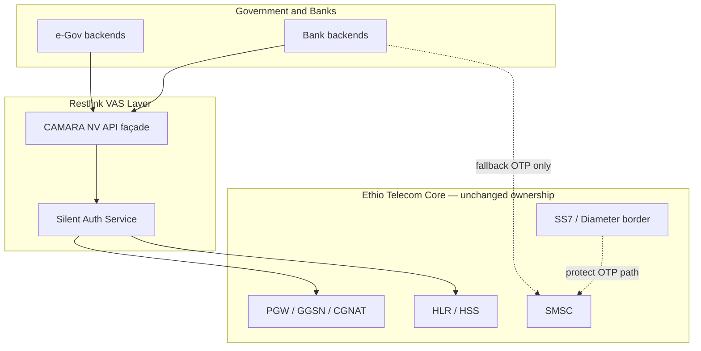
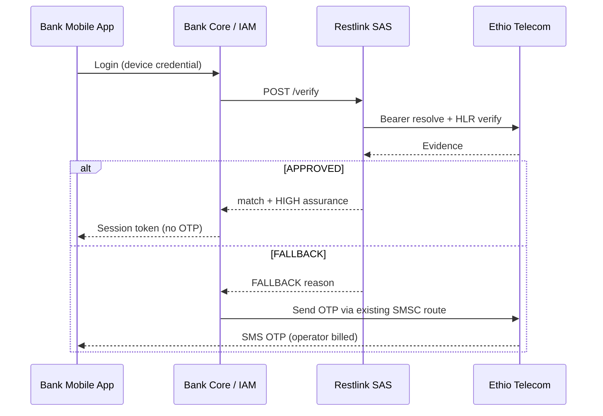

# Chapter 3 — Ethiopia Market Context and Restlink Positioning

**Proposal:** Network-Side Silent Authentication for Government and Banking  
**Primary stakeholders:** Ethio Telecom, Ministry of Innovation and Technology (MInT), National Bank of Ethiopia (NBE), commercial banks, Restlink  
**Version:** 1.0 — July 2026

---

## 3.1 Market Overview

Ethiopia is one of Africa's largest telecommunications markets by population and the fastest-growing digital economy in the Horn of Africa region. With a population exceeding **120 million** (World Bank, 2024 estimate), a young demographic profile, and a national strategy to digitise public services under **Digital Ethiopia 2025**, authentication volume is scaling faster than legacy security controls. The mobile phone number—almost always an **Ethio Telecom MSISDN**—has become the universal login handle for banking, wallet, tax, and social programmes.

This chapter describes the operator context, integrator landscape (government portals and banks), and **Restlink's role as a VAS adapter** that enables silent authentication without competing with Ethio Telecom's SMSC or interconnect revenue. It is written for decision-makers who must reconcile **national digital ambition**, **financial stability**, and **operator commercial interests** in a single partnership framework.

---

## 3.2 Ethio Telecom — Network and Commercial Context

### 3.2.1 Operator profile

| Attribute | Detail | Source / type |
|-----------|--------|---------------|
| Market role | Historically sole mobile incumbent; partial liberalisation underway | Government policy 2020s | *cited* |
| Mobile subscribers | ~70–75 million (range across reporting periods) | Ethio Telecom annual reports / ITU | *cited* (range) |
| 4G LTE coverage | Majority of urban and expanding rural footprint | Operator disclosures 2024–2025 | *cited* (qualitative) |
| Mobile money (Telebirr) | Dominant wallet; tens of millions registered | Ethio Telecom Telebirr milestones | *cited* / *estimated* |
| Enterprise SMS / OTP | Core SMSC billing to banks and enterprises | Operator enterprise practice | *cited* (qualitative) |

Ethio Telecom operates the **authoritative subscriber database** (HLR/HSS/UDM), **PGW/GGSN** session bindings for mobile data, and **SMSC** infrastructure for OTP and alert traffic. Any authentication that claims to prove "this phone on the network now" must ultimately **read truth from these elements**. Third parties cannot substitute credibly without operator partnership.

### 3.2.2 Infrastructure relevant to Silent Auth

| Network function | Silent auth usage | Owner |
|------------------|-------------------|-------|
| PGW/GGSN accounting, PCRF | Resolver: IP+port+ts → MSISDN | Ethio Telecom |
| HLR/HSS | Verifier: PSI/SAI/IDR/AIR intra-network | Ethio Telecom |
| SMSC | **Fallback OTP only**; unchanged billing | Ethio Telecom |
| SS7/Diameter firewall | Protect residual SMS (FS.11/FS.19) | Ethio Telecom (+ vendors) |

**Deployment invariant:** Restlink SAS runs **inside the operator trust domain** (co-located or private interconnect), consistent with **GSMA FS.11 Category 1** rules: sensitive MAP queries are not exposed on international interconnect.

### 3.2.3 Why Ethio Telecom benefits

| Benefit | Mechanism |
|---------|-----------|
| **New VAS revenue** | Optional revenue share on `/verify` API traffic |
| **SMS revenue preserved** | Fallback OTP continues normal SMSC charging; Restlink does not wholesale SMS |
| **Data revenue uplift** | Silent path prefers active cellular data bearer |
| **Reduced fraud reputational risk** | Fewer SS7/SIM-swap headlines affecting Telebirr and partner banks |
| **Open Gateway positioning** | CAMARA-aligned APIs attract international fintech and development partners |
| **Core asset monetisation** | HLR/PGW truth leveraged without selling raw signalling to third parties |

Ethio Telecom is **not asked to become an application security company**. Restlink absorbs integrator onboarding, SLAs, SDK distribution, and CAMARA contract normalisation.

---

## 3.3 e-Government and Digital Public Services

### 3.3.1 Policy and identity landscape

Ethiopia's digital public infrastructure rests on three pillars relevant to authentication:

1. **Fayda (National Digital ID)** — biometric identity issuance and verification.  
2. **Digital Ethiopia 2025** — cross-ministry digitisation targets.  
3. **Ethio Telecom MSISDN** — de facto citizen reachability and second-factor channel.

Fayda establishes **who the citizen is**; silent auth strengthens proof that **the person presenting the session right now holds the registered mobile instrument**, without an interceptable SMS.

| Portal / domain | Typical use case | Current auth pattern | Silent auth fit |
|-----------------|------------------|----------------------|-----------------|
| **ERCA / e-tax** | Income tax filing, TIN-linked services | SMS OTP, sometimes username/password | High — mobile-first filing |
| **Civil registration** | Birth, death, marriage certificates | OTP to guardian/spouse MSISDN | High — fraud-sensitive life events |
| **Social protection / PSNP** | Benefit eligibility, payment status | OTP + agent verification | High — SIM swap = benefit theft |
| **Single e-Gov gateway (MInT)** | Unified service discovery | OTP across ministries | High — reduces SMS aggregate |
| **Health / education portals** | Appointments, records lookup | OTP or static credentials | Medium — mixed device types |

*Portal names and integration patterns reflect publicly described e-Gov programmes; exact API ownership may vary by ministry.*

### 3.3.2 Citizen experience impact

OTP-only flows fail operational acceptance tests in Ethiopia as elsewhere:

- **Delivery delay** on congested SMSC during peak tax or enrolment periods  
- **Abandonment** when citizens switch between Amharic UI and SMS inbox  
- **Feature-phone limits** where apps exist but SMS is the only second factor  
- **Security anxiety** as fraud awareness spreads in urban centres  

Silent authentication on **cellular data** removes the wait state for compliant smartphones—estimated **55–65% of e-Gov mobile sessions in Addis Ababa** (*estimated*, pending operator analytics)—while preserving accessible fallback for other cases.

### 3.3.3 Government integration model

Government backends call **Restlink CAMARA Number Verification** (or national `/verify` profile) server-to-server with mTLS. Restlink returns `{match, assurance, reqId}`; ministries **never receive IMSI** and do not peer directly with SS7. Audit logs support **INSA** review and inter-ministry fraud information sharing.

Recommended policy tiers:

| Assurance tier | Use case | SAS threshold |
|----------------|----------|---------------|
| Standard | Portal login, form submission | Default score |
| Elevated | Benefit approval, certificate issuance | Raised threshold + SIM-swap cooldown |
| Step-up mandatory | High-value transfer initiation | Silent + passkey or branch |

---

## 3.4 Banking and Payment Sector

### 3.4.1 Institutional landscape

Ethiopia's banking sector is consolidating digital channels under NBE supervision:

| Institution type | Examples | Digital auth today |
|------------------|----------|-------------------|
| State commercial bank | Commercial Bank of Ethiopia (CBE) | Mobile app + SMS OTP dominant |
| Private banks | Awash, Dashen, Bank of Abyssinia, Cooperative Bank of Oromia, Hibret, etc. | App OTP; some card 3DS SMS |
| Payment instrument | Telebirr (Ethio Telecom) | OTP + PIN |
| Microfinance / SACCOs | Regional institutions | SMS or agent-led |

NBE **Electronic Payment Instrument Issuer Directive** and cybersecurity expectations require strong customer authentication for electronic transactions. SMS OTP satisfies minimum viable compliance but **does not satisfy prudential best practice** against documented SS7/SIM-swap threats (Chapter 2).

### 3.4.2 Bank integration architecture

Banks remain **data controllers** for customer relationships. Restlink provides:

- **Server-side verification API** (no bank ↔ operator direct MAP exposure)  
- **Mobile SDK** collecting `{srcIP, srcPort, timestamp}` on cellular bearer  
- **Policy hooks** mapping assurance to login vs. transfer vs. beneficiary add  
- **FALLBACK orchestration** triggering existing SMS OTP contract with Ethio Telecom SMSC  

### 3.4.3 Commercial model for banks

| Cost line | Today (OTP-primary) | With silent auth |
|-----------|-------------------|------------------|
| SMS OTP charges to Ethio Telecom | Per message | Reduced volume; fallback unchanged |
| Restlink verification API | N/A | Per successful `/verify` or tiered subscription |
| Fraud loss / call centre | Baseline | Target ↓ 40%+ ATO (pilot KPI) |
| App conversion | Baseline | Target +15–25 pp login completion |

Banks **pay Restlink for auth API**, **pay Ethio Telecom for SMS on fallback**, and **do not** route silent verification through alternate SMS aggregators that would bypass operator revenue.

---

## 3.5 Restlink — VAS Adapter Role

### 3.5.1 What Restlink is

Restlink is a **Value-Added Services integrator** headquartered in Addis Ababa, specialising in telecom-adjacent platforms for financial and public-sector clients. For Silent Authentication, Restlink delivers:

| Component | Description |
|-----------|-------------|
| **Silent Auth Service (SAS)** | Resolver orchestration + MAP/Diameter Verifier + assurance policy |
| **CAMARA NV adapter** | Standard API surface for banks and government |
| **Integrator SDKs** | Android/iOS helpers for bearer metadata collection |
| **Operations** | Monitoring, SLA, incident response, audit log export |
| **Signalling stack** | jSS7 MAP + jDiameter S6a client (operator-approved deployment) |

### 3.5.2 What Restlink is not

| Non-role | Rationale |
|----------|-----------|
| **Not an SMSC operator** | Does not terminate A2P SMS or compete for OTP interconnect |
| **Not a mobile network operator** | Does not issue SIMs or own spectrum |
| **Not bypassing Ethio Telecom billing** | Fallback OTP uses existing enterprise SMS contracts |
| **Not exporting raw SS7 to banks** | FS.11 compliance; banks receive boolean match + assurance only |
| **Not storing long-term citizen biometrics** | Verification metadata only per contract |

This distinction is **commercially material** for Ethio Telecom partnership approval: Restlink expands the **application layer** atop existing core assets, similar to content billing, short-code VAS, or mobile financial service gateways historically deployed with incumbents worldwide.

### 3.5.3 Revenue allocation principle

| Revenue stream | Beneficiary | Notes |
|----------------|-------------|-------|
| SMS OTP (fallback) | **Ethio Telecom** | Unchanged tariff; Restlink may orchestrate trigger but not capture SMS margin |
| Cellular data used during verify | **Ethio Telecom** | Bearer must be active for IP-match method |
| Silent auth API fees | **Restlink** (± revenue share to operator) | New category; priced per verify or enterprise licence |
| Fraud reduction savings | **Banks / Government** | Indirect economic benefit |

Public messaging emphasises: **"Restlink does not take telco SMS revenue."**

---

## 3.6 Standards and Ecosystem Alignment

### 3.6.1 CAMARA Number Verification

The **CAMARA Number Verification (NV)** API is the GSMA Open Gateway application interface for proving MSISDN possession via operator networks. Restlink's SAS maps internal `/verify` to CAMARA NV semantics:

| CAMARA field / behaviour | Restlink SAS implementation |
|--------------------------|----------------------------|
| `phoneNumber` (optional claimed) | Assert `resolved == claimed` when present |
| Device IP / port metadata | Resolver input with CGNAT-safe triple |
| Verification result | `{match, assuranceLevel}` |
| Error / unavailable | Maps to FALLBACK codes for integrator |

Future optional APIs (**SIM Swap**, **KYC Match**, **Number Recycling**) share the same operator trust boundary.

### 3.6.2 GSMA FS.11 operational compliance

Restlink engineering adheres to **FS.11** interconnect monitoring categories:

- **ATI blocked on interconnect** — Verifier uses intra-network PSI/IDR paths.  
- **SAI / AIR** used with Category 3.2 time/location policy for SIM-swap freshness.  
- **No dialog leaks** — MAP TC timers bounded; SAS aborts hung queries.  

Strategy B controls (SMS Home Routing, SS7 firewall) remain **operator-led**; Restlink participates in joint runbooks for fallback OTP protection per **SG.22**.

### 3.6.3 GSMA TS.43 (future phase)

The **SIM method (EAP-AKA)** extends silent auth to **Wi-Fi-only** devices by authenticating the SIM credential rather than IP binding. Phase 2 pilot may introduce TS.43 entitlement server capability, further reducing OTP fallback—still without Restlink operating SMSC.

---

## 3.7 Competitive and Alternative Landscape

| Alternative | Limitation in Ethiopia | Restlink differentiation |
|-------------|------------------------|-------------------------|
| OTP-only status quo | SS7/SIM-swap/AIT exposure (Ch. 2) | Network proof without SMS |
| App-based TOTP (Google Authenticator) | Support burden; low adoption in mass market | Zero citizen setup on silent path |
| Hardware tokens | Cost and logistics | Uses existing handset + SIM |
| Foreign CPaaS SMS aggregators | Bypass operator relationship; does not fix SS7 | Operator-native VAS |
| Global silent auth SaaS without local PGW | Cannot resolve Ethio Telecom bearers | Local VAS on operator core |

---

## 3.8 Pilot Roadmap and Success Criteria

### 3.8.1 Recommended pilot partners

| Sector | Candidate integrator | Use case |
|--------|---------------------|----------|
| Banking | One tier-1 private bank + CBE sandbox | Mobile login |
| e-Gov | ERCA e-tax mobile or MInT gateway sandbox | Taxpayer login |
| Operator | Ethio Telecom | PGW resolver + HLR lab link |
| Regulator | NBE + INSA observers | Security audit |

### 3.8.2 Phased timeline

| Phase | Duration | Deliverable |
|-------|----------|-------------|
| **0 — MoU** | Month 0 | Tri-party governance, KPI agreement |
| **1 — Lab** | Months 1–3 | End-to-end verify in test HLR/PGW |
| **2 — Pilot live** | Months 4–9 | Limited production traffic, fraud baseline |
| **3 — Scale** | Months 10–18 | Additional banks/portals, TS.43 evaluation |

### 3.8.3 Ethiopia-specific success metrics

| Metric | Baseline source | Target |
|--------|-----------------|--------|
| OTP SMS per 1,000 logins (pilot apps) | Integrator SMS logs | −50% minimum |
| Login p95 latency | APM | ≤ 3 s silent path |
| Citizen support tickets ("OTP not received") | Call centre | −30% |
| Documented SIM-swap ATO | Fraud desk | −40% |
| Operator SMS revenue from pilot integrators | Ethio Telecom billing | **No decrease** (fallback + other alerts) |

---

## 3.9 Risks and Mitigations (Market Layer)

| Risk | Mitigation |
|------|------------|
| Low smartphone / data penetration in rural areas | FALLBACK OTP + TS.43 phase 2; silent auth optional not mandatory |
| Integrator API fatigue | Single CAMARA NV contract for many ministries via shared gateway |
| Operator perceived cannibalisation | Contractual SMS revenue neutrality; shared API revenue option |
| Regulatory uncertainty on third-party HLR access | SAS hosted in operator DC; no external GT |
| Political scrutiny of foreign tech | Restlink local entity; open-source jSS7 stack auditable by INSA |

---

## 3.10 Conclusion

Ethiopia's authentication challenge is **scale and trust**: tens of millions of citizens, a dominant operator whose core assets hold the truth, and integrators (government and banks) who must not be exposed to raw signalling or forced into insecure OTP-only designs. **Restlink Silent Authentication** occupies the narrow, high-value layer between these worlds—a **VAS adapter on Ethio Telecom**, billing integrators for verified identity events while **leaving SMSC and interconnect economics with the operator**.

For government, the programme accelerates **Fayda-linked e-services** with lower fraud and friction. For banks, it modernises strong customer authentication under NBE expectations. For Ethio Telecom, it opens **Open Gateway / CAMARA** revenue without surrendering network sovereignty. The technical foundation (Chapter 1) and threat case (Chapter 2) support a pilot that is **commercially neutral to SMS revenue**, **standards-aligned**, and **nationally scoped**.

**Recommended action:** Proceed to tri-party pilot MoU with Ethio Telecom as network anchor, MInT or designated e-Gov lead as integrator sponsor, and NBE/INSA as security observers.

---

*References: Ethio Telecom public disclosures; GSMA Mobile Money Report 2024; World Bank Ethiopia population statistics; Digital Ethiopia 2025 strategy documents; CAMARA Number Verification API specification; GSMA FS.11 v4.0; Restlink architecture `silent-auth-flow.md`, `unified-identity-sms-security-architecture.md`.*
