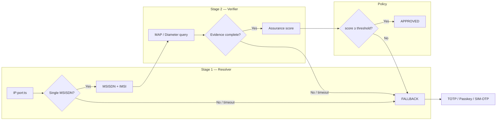

# Chapter 4 — Solution Overview

**Digicom-ET Silent Authentication for Government & Banking**  
*Technical proposal — Ethio Telecom VAS adapter*

---

## 4.1 Purpose and design principle

Silent Authentication (Silent Auth) replaces SMS one-time passwords for mobile login by proving that the device currently attached to the cellular network owns the claimed MSISDN. The proof is derived from **live network state**, not from a code the user types or receives. Digicom-ET delivers this capability as a **Value-Added Service (VAS) adapter** between bank and government application backends and Ethio Telecom's core network assets. The operator remains the source of truth for subscriber identity; Digicom orchestrates resolution, verification, and policy without cannibalising SMS wholesale revenue.

The central architectural constraint that governs every design decision is this:

> **MAP and Diameter signalling cannot map a subscriber IP address to an MSISDN.**

These protocols operate at the mobility and authentication layer. They answer questions about *who a subscriber is* and *whether they are reachable*, given an MSISDN or IMSI. They do not maintain, and cannot query, the Gi/SGi bearer binding between a public IPv4 address and a data session. That binding lives in the Packet Gateway (PGW/GGSN), Policy and Charging Rules Function (PCRF), or Carrier-Grade NAT (CGNAT) log infrastructure.

Consequently, Silent Auth is implemented as a **two-stage pipeline**, not a single MAP invocation:

```
IP:port:timestamp  ──[Resolver]──►  MSISDN / IMSI  ──[Verifier: MAP / Diameter]──►  assurance
```

This chapter describes the two stages, the CGNAT disambiguation requirement, the fail-closed policy model, and how the solution aligns with GSMA FS.11 deployment constraints for Ethio Telecom.

---

## 4.2 System actors and trust boundaries

| Actor | Role | Trust boundary |
|-------|------|----------------|
| **Bank / e-Gov App** (mobile) | Runs on cellular data; collects `{srcIP, srcPort, ts, claimedMSISDN?, deviceCred}` | Untrusted client; never receives MSISDN/IMSI from SAS |
| **Bank / Agency Backend** | Owns login decision; calls Digicom SAS server-to-server over mTLS | Trusted integration partner |
| **Digicom SAS** (Silent Auth Service) | Resolver + Verifier + Policy engine | Operator-hosted or co-located; dialog anchor |
| **IP Resolver** | Reads PGW/GGSN session store, PCRF Gx/Sd, or CGNAT log | Operator-internal data plane |
| **MAP / Diameter Verifier** | jSS7 (2G/3G) + jDiameter S6a (4G/5G) | Operator signalling plane |
| **HLR / HSS / UDM** | Subscriber database | Operator core; intra-network queries only |

Digicom-ET occupies the **identity layer** (Strategy A in the unified architecture). Residual SMS OTP traffic on the fallback path is protected separately by SMS Home Routing and SS7/Diameter/5G firewalls (Strategy B). The two strategies are complementary, not alternatives.

---

## 4.3 Stage 1 — IP Resolver

### 4.3.1 Function

The Resolver answers one question: *which MSISDN (and IMSI) owns cellular IP `A.B.C.D` at source port `P` at time `T`?*

| Input field | Purpose |
|-------------|---------|
| `srcIP` | Public IPv4 address observed by the app (cellular bearer egress) |
| `srcPort` | Ephemeral TCP/UDP source port on the device |
| `ts` | Client-side timestamp of the observation (ISO 8601, skew-tolerant window) |
| `reqId` | Idempotency key; deduplicates bank retries |

| Output field | Purpose |
|--------------|---------|
| `msisdn` | Resolved subscriber number |
| `imsi` | Resolved subscriber identity |
| `bearerAge` | Age of the PGW session binding in seconds |
| `apn` | Access Point Name (optional; policy input) |

### 4.3.2 Data sources (operator-selectable)

| Source | Interface | Notes |
|--------|-----------|-------|
| PGW / GGSN session store | Gi/SGi accounting, RADIUS, or internal API | Primary for LTE/3G data sessions |
| PCRF | Gx (policy) / Sd (usage monitoring) | Correlates bearer to subscriber |
| CGNAT log | NAT binding table export | Required when many subscribers share one public IPv4 |

The Resolver interface is an open item for the Ethio Telecom pilot; the SAS contract is source-agnostic as long as the binding query is **point-in-time** (keyed on `ts`), not "latest session for IP."

### 4.3.3 Resolver outcomes

| Outcome | Condition | SAS action |
|---------|-----------|------------|
| **FOUND** | Exactly one MSISDN matches `{IP, port, ts}` | Proceed to Verifier |
| **AMBIGUOUS** | More than one MSISDN matches | **FALLBACK** — reject; do not guess |
| **NOT_FOUND** | No binding at `ts` | **FALLBACK** — Wi-Fi-only, stale session, or off-network |
| **TIMEOUT** | Lookup exceeds 300 ms budget | **FALLBACK** |

---

## 4.4 Stage 2 — MAP / Diameter Verifier

### 4.4.1 Function

Given a resolved `MSISDN` / `IMSI`, the Verifier answers: *is this subscriber live, reachable, and not recently SIM-swapped?*

| Access technology | Primary messages | GSMA / 3GPP reference |
|-------------------|------------------|----------------------|
| 2G / 3G | **PSI** (ProvideSubscriberInfo), **ATI** (AnyTimeInterrogation), **SAI** (SendAuthenticationInfo) | FS.11 MAP categories |
| 4G / 5G | **IDR/IDA**, **AIR/AIA** (Diameter S6a) | FS.19 |

| Verifier output | Meaning |
|-----------------|---------|
| `reachable` | Subscriber attached to VLR (2G/3G) or MME/AMF (4G/5G) |
| `notSimSwapped` | `lastUpdateLocation` / IMSI-change age exceeds cooldown threshold |
| `locationPlausible` | Serving node consistent with expected region (policy-dependent) |

### 4.4.2 Why MAP cannot substitute for the Resolver

The following table clarifies the division of responsibility. Attempting to collapse both stages into a single MAP call is architecturally impossible and would violate FS.11 if ATI were attempted over interconnect.

| Question | Protocol layer | Who answers |
|----------|---------------|-------------|
| Which MSISDN owns IP `A.B.C.D:port` at time `T`? | User plane / PGW / CGNAT | **Resolver** |
| Is MSISDN `+251…` currently attached and authentic? | Control plane / MAP / Diameter | **Verifier** |
| Can MAP `SendRoutingInfoForSM` reveal IMSI from MSISDN? | MAP SMS routing | Yes, but requires known MSISDN — not IP |
| Can Diameter S6a `ULR` map IP to MSISDN? | Mobility management | No — ULR carries IMSI, not IP |

MAP messages such as ATI, PSI, and SAI are **subscriber interrogations**: they require a known MSISDN or IMSI as input. The IP-to-subscriber binding is established at PDP/PDN session creation in the PGW and is visible only through bearer-management or NAT infrastructure.

---

## 4.5 CGNAT and the IP + port + timestamp requirement

Ethiopia, like most mobile markets, deploys **Carrier-Grade NAT** on IPv4 data bearers. Under CGNAT, hundreds or thousands of subscribers may simultaneously present the same public IPv4 address. The NAT device maintains a binding table:

```
(publicIP, publicPort, protocol) ↔ (privateIP, privatePort, msisdn/imsi, sessionStart)
```

Without the source port, the Resolver cannot disambiguate which subscriber owns a given public IP. Without the timestamp, the Resolver cannot select the correct binding at the moment of the auth request — a stale binding from a prior session would produce a false match.

| Field | CGNAT role |
|-------|------------|
| `srcIP` | Identifies the NAT pool exit address |
| `srcPort` | Disambiguates subscribers behind the same public IP |
| `ts` | Selects the binding active at request time (anti-replay, anti-stale) |

**Design rule:** if the Resolver returns more than one MSISDN for the supplied triple, SAS **must** reject with FALLBACK. Ambiguity is treated as missing evidence, not as a best-effort guess.

The bank mobile SDK collects `{srcIP, srcPort, ts}` from the active cellular interface before calling the backend. Wi-Fi-only devices cannot supply a valid PGW binding and are routed to fallback MFA (TOTP, Passkey, or SIM-OTP).

---

## 4.6 Fail-closed policy model

Silent Auth adopts a **fail-closed** assurance model: any stage that cannot produce cryptographically or operationally verifiable evidence results in **FALLBACK**, never a soft approval.

| Principle | Implementation |
|-----------|----------------|
| No partial approvals | RESOLVING, VERIFYING, and SCORING each have binary pass/fail gates |
| Missing evidence ≠ low confidence approve | Absence of HSS response, ambiguous IP binding, or stale bearer → FALLBACK |
| No interconnect ATI | FS.11 Category 1; Verifier queries **own** HLR/HSS only |
| Privacy | MSISDN/IMSI returned to bank backend only; never to the mobile app |
| Idempotency | `reqId` deduplicates retries; one MAP/Diameter dialog per stage per request |
| Anti-replay | mTLS on bank→SAS; `ts` + `reqId` accepted within a bounded window |
| Dialog hygiene | Every MAP dialog has a bounded TC timer; timeout ⇒ `abort()` — no dialog leak |



When `claimedMSISDN` is supplied by the bank, SAS additionally asserts `resolved == claimed`. When omitted (Number Verification style), SAS returns the verified MSISDN for the backend to bind. In both cases, a mismatch or insufficient assurance triggers FALLBACK — the bank presents conventional login or SMS OTP.

---

## 4.7 Assurance scoring (Policy engine)

After both stages succeed, the Policy engine computes a weighted assurance score:

```
score =  w1 × ipBindingFresh(bearerAge)       // PGW binding age < N seconds
       + w2 × subscriberReachable             // PSI / IDR says attached
       + w3 × notSimSwapped(lastImsiChange)   // age > swapCooldown
       + w4 × locationPlausible               // VLR / MME vs expected region
```

| Factor | Source | Typical weight driver |
|--------|--------|----------------------|
| `ipBindingFresh` | Resolver `bearerAge` | High for login; critical for money transfer |
| `subscriberReachable` | PSI / ATI / IDR response | Mandatory for APPROVED |
| `notSimSwapped` | SAI / `lastUpdateLocation` age | Downgrade or FALLBACK if swap < cooldown |
| `locationPlausible` | VLR / MME address vs policy | Optional geo-fence for e-Gov services |

Thresholds are tunable per transaction risk class (e-Gov portal login vs. high-value bank transfer). Even on HIGH assurance, banks may force step-up MFA for configured high-value flows.

---

## 4.8 Deployment model on Ethio Telecom

Digicom-ET deploys as a **thin VAS adapter** co-located with or reachable from the operator core:

| Component | Placement | Rationale |
|-----------|-----------|-----------|
| SAS API gateway | DMZ / API edge | mTLS termination for bank backends |
| Resolver connector | Operator data centre | Low-latency PGW/PCRF/CGNAT access |
| MAP Verifier (jSS7) | SS7 SIGTRAN edge | Intra-network HLR queries; FS.11 Cat.1 compliance |
| Diameter Verifier (jDiameter S6a) | Diameter edge | 4G/5G HSS queries per FS.19 |

The Verifier **never** sends ATI over SS7 interconnect. FS.11 classifies ATI as **Category 1** (unauthorised on interconnect). This is a deployment invariant: Digicom SAS runs inside the operator network and queries Ethio Telecom's own HLR/HSS.

---

## 4.9 API surface and standards alignment

The external contract is CAMARA-aligned HTTPS:

| Endpoint | Semantics | Internal mapping |
|----------|-----------|------------------|
| `POST /verify` | Number Verification — match or discover MSISDN | Resolver → Verifier → Policy |
| Response `{match, assurance, reqId}` | HIGH / MEDIUM / LOW / FALLBACK | Derived from score and stage outcomes |

Signalling remains operator-internal. Banks integrate via the Digicom SDK (device credential + session tuple) and a server-to-server `/verify` call. Phase 3 extends coverage to Wi-Fi via GSMA TS.43 EAP-AKA (SIM credential method), which shares the same SIM root of trust but does not depend on bearer IP.

---

## 4.10 Summary

| Design element | Decision |
|----------------|----------|
| Architecture | Two-stage: Resolver (IP→MSISDN) + Verifier (MAP/Diameter) |
| Why two stages | MAP/Diameter cannot answer IP→MSISDN; PGW/CGNAT cannot answer reachability/SIM-swap |
| CGNAT handling | Require IP + port + timestamp; reject ambiguous bindings |
| Assurance model | Fail-closed; no partial approvals |
| FS.11 compliance | ATI intra-HLR only; SAS inside operator |
| Fallback | TOTP / Passkey / SIM-OTP when cellular path unavailable |
| Latency target | ≤ 3 s total SAS budget; Resolver 300 ms; MAP/Diameter 2 s |

The following chapters detail the message-level flows (Chapter 5) and the per-request finite-state machine with timeout and dialog-abort strategy (Chapter 6).
