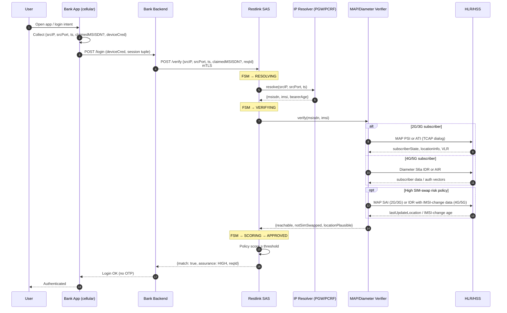
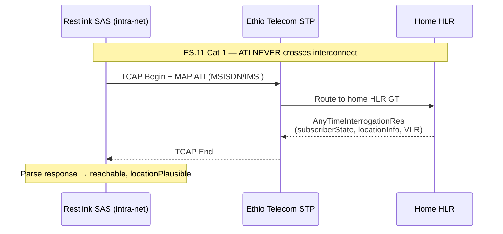
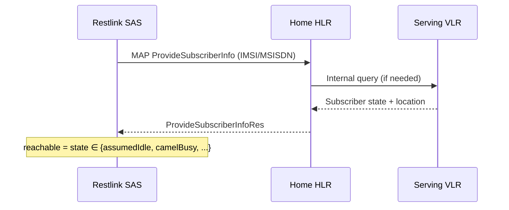
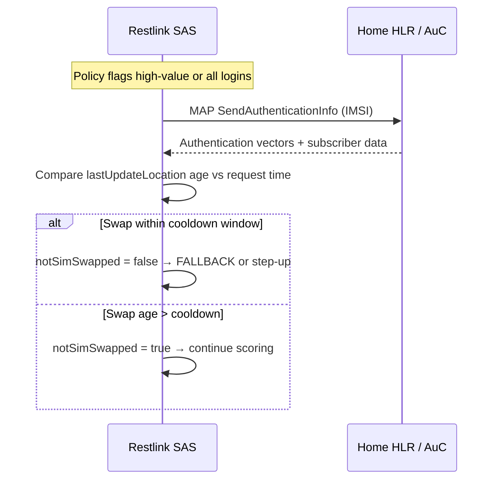
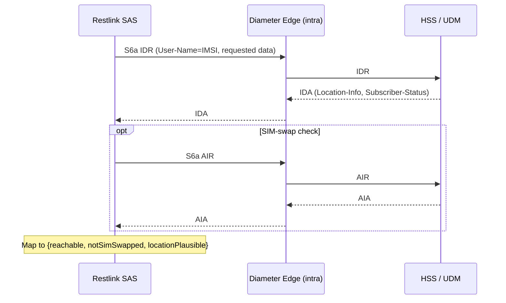
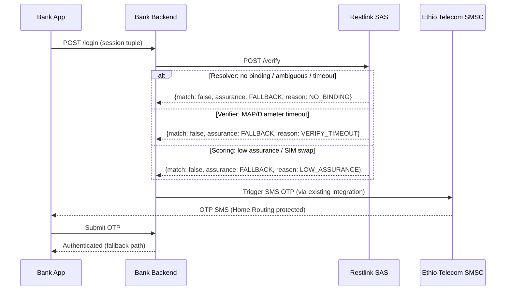
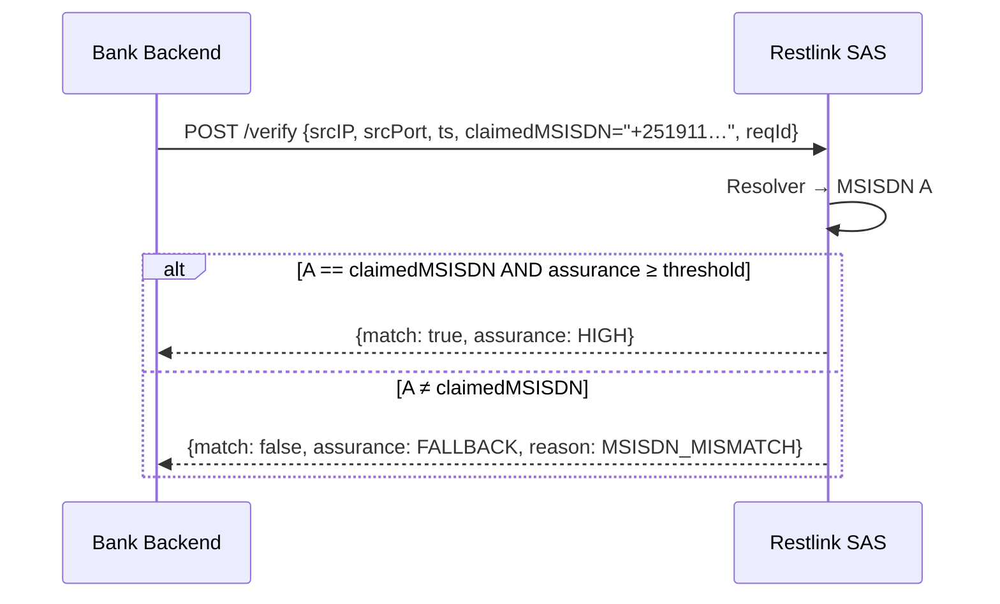

# Chapter 5 — Message Flows

**Restlink Silent Authentication for Government & Banking**  
*MAP, Diameter, and end-to-end signalling sequences*

---

## 5.1 Scope

This chapter documents the message-level behaviour of Restlink Silent Auth from the bank application through Restlink SAS to Ethio Telecom core network elements. It covers:

1. End-to-end happy-path sequence (application to HLR/HSS and return)
2. Deep dive on MAP **AnyTimeInterrogation (ATI)** and FS.11 Category 1 constraints
3. **ProvideSubscriberInfo (PSI)** — FS.11 Category 2.1
4. **SendAuthenticationInfo (SAI)** — FS.11 Category 3.2 (SIM-swap detection)
5. Diameter S6a **IDR/IDA** and **AIR/AIA** for 4G/5G
6. Consolidated message reference tables

All MAP queries are intra-network. No Category 1 message crosses SS7 interconnect.

---

## 5.2 End-to-end sequence (happy path)

The following sequence assumes a bank app on active Ethio Telecom cellular data, a valid PGW session binding, and a reachable subscriber with no recent SIM swap.



### 5.2.1 Application-layer messages

| Step | From | To | Message | Payload (key fields) |
|------|------|----|---------|---------------------|
| 1 | App | Bank BE | `POST /login` | `deviceCred`, `srcIP`, `srcPort`, `ts`, `claimedMSISDN?` |
| 2 | Bank BE | Restlink SAS | `POST /verify` | `{srcIP, srcPort, ts, claimedMSISDN?, reqId}` over mTLS |
| 3 | Restlink SAS | Bank BE | `/verify` response | `{match, assurance, msisdn?, reqId, fallbackReason?}` |
| 4 | Bank BE | App | Login result | Session token or FALLBACK instruction |

**Privacy rule:** MSISDN and IMSI are returned to the bank backend only. The mobile app receives a boolean login outcome or a fallback prompt — never the resolved subscriber identifiers.

### 5.2.2 Resolver messages (Stage 1)

| Step | From | To | Operation | Notes |
|------|------|----|-----------|-------|
| R1 | SAS | IP Resolver | `resolve(ip, port, ts)` | Internal API; budget 300 ms |
| R2 | IP Resolver | PGW/PCRF/CGNAT | Session lookup | Source-specific (RADIUS, Gx/Sd, NAT log) |
| R3 | IP Resolver | SAS | `{msisdn, imsi, bearerAge, apn?}` | Single match required |

### 5.2.3 Verifier messages (Stage 2)

Selected per access technology and policy. See Sections 5.3–5.6 for per-message detail.

---

## 5.3 MAP AnyTimeInterrogation (ATI) — deep dive

### 5.3.1 Purpose

ATI interrogates the home HLR for comprehensive subscriber information at any time, regardless of whether the subscriber is engaged in a call or data session. For Silent Auth, ATI provides:

| ATI response element | Silent Auth use |
|---------------------|-----------------|
| `subscriberState` | Attached / detached / notReachable |
| `locationInformation` | VLR / SGSN address |
| `msisdn` | Confirmation of resolved identity |
| `imsi` | Cross-check against Resolver output |

### 5.3.2 Protocol stack

```
Bank BE ──HTTPS──► Restlink SAS ──SIGTRAN──► STP/HLR
                         │
                         └── TCAP Begin (Dialog)
                               └── MAP AnyTimeInterrogation (Invoke)
                                     └── AnyTimeInterrogationRes (ReturnResult)
```

Restlink SAS opens a **TCAP dialog** via jSS7 `MAPProviderImpl` → `MAPServiceMobility`, sends `AnyTimeInterrogationRequestImpl`, and awaits `AnyTimeInterrogationResponse` before releasing the dialog.

### 5.3.3 ATI request structure (jSS7)

| ASN.1 component | jSS7 class / field | Content |
|-----------------|-------------------|---------|
| `subscriberIdentity` | `SubscriberIdentityImpl` | IMSI or MSISDN |
| `requestedInfo` | `RequestedInfo` | Bit flags: location, subscriber state, IMEI, etc. |
| `gsmSCF-Address` | `ISDNAddressStringImpl` | SAS global title (operator-assigned) |
| `extensionContainer` | `MAPExtensionContainerImpl` | Optional extensions |

Implementation reference: `org.restcomm.protocols.ss7.map.service.mobility.subscriberInformation.AnyTimeInterrogationRequestImpl` (coral-valley jSS7).

### 5.3.4 FS.11 Category 1 — intra-HLR only

GSMA FS.11 classifies ATI as **Category 1: Unauthorised on interconnect — BLOCK**.

| FS.11 category | Meaning | ATI implication |
|----------------|---------|-----------------|
| **Cat 1** | Must not traverse SS7 interconnect | ATI blocked at international/national peer borders |
| Deployment rule | Verifier inside operator network | Restlink SAS queries **Ethio Telecom HLR only** |
| Attack prevented | External ATI to harvest location/IMSI | No cross-operator subscriber interrogation |

**This is a deployment invariant, not an optional optimisation.** An interconnect-facing ATI would violate FS.11, expose the operator to location-tracking attacks, and fail compliance review. Restlink SAS is co-located with or directly connected to the home HLR via intra-network SIGTRAN.



### 5.3.5 When to prefer ATI vs PSI

| Criterion | ATI | PSI |
|-----------|-----|-----|
| FS.11 category | Cat 1 (intra-net only) | Cat 2.1 (operator traffic) |
| Information breadth | Wide (any-time, multiple info types) | Focused (subscriber state + location) |
| Typical use | Legacy HLR deployments; comprehensive snapshot | **Preferred** primary verifier for reachability |
| Interconnect risk | High if mis-deployed | Lower; designed for operator queries |

**Recommendation:** use PSI as the primary 2G/3G verifier; reserve ATI for HLR deployments where PSI is unavailable or supplementary data is required. Both require intra-network deployment.

---

## 5.4 MAP ProvideSubscriberInfo (PSI) — FS.11 Category 2.1

### 5.4.1 Purpose

PSI requests subscriber state and location information from the HLR/VLR. It is classified as **FS.11 Category 2.1** — operator traffic that requires an answer and IMSI↔SCCP identity matching at the firewall.

| PSI response element | Silent Auth use |
|---------------------|-----------------|
| `subscriberState` | `assumedIdle`, `camelBusy`, `netDetNotReachable`, etc. |
| `locationInformation` | Current VLR number |
| `psSubscriberState` | PS domain attachment (3G) |

### 5.4.2 Message flow



### 5.4.3 jSS7 implementation

| Class | Package path |
|-------|-------------|
| `ProvideSubscriberInfoRequestImpl` | `map/service/mobility/subscriberInformation/` |
| Dialog | `MAPDialogMobilityImpl` via `MAPServiceMobilityImpl` |

PSI is the **default 2G/3G verifier message** for reachability checks in the Ethio Telecom pilot (Phase 1).

---

## 5.5 MAP SendAuthenticationInfo (SAI) — FS.11 Category 3.2

### 5.5.1 Purpose

SAI requests authentication vectors from the HLR/AuC. For Silent Auth, SAI is **not** used to authenticate the user directly; it provides **SIM-swap freshness signals**:

| Signal | Derivation | Threshold |
|--------|------------|-----------|
| `lastUpdateLocation` age | Time since last VLR/SGSN registration update | Compare to `swapCooldown` (e.g. 24–72 h) |
| IMSI-change indicators | HLR data after re-provisioning | Fresh swap → downgrade assurance |
| Auth vector re-sync | Recent `SendAuthenticationInfo` activity | Correlates with new SIM insertion |

FS.11 classifies SAI as **Category 3.2** — inter-operator traffic requiring **time/location correlation** at the firewall. Intra-network SAI from Restlink SAS to the home HLR is permitted.

### 5.5.2 SIM-swap detection flow



### 5.5.3 jSS7 implementation

| Class | Package path |
|-------|-------------|
| `SendAuthenticationInfoRequestImpl` | `map/service/mobility/authentication/` |

### 5.5.4 Policy integration

| Scenario | SAI invoked? | Outcome |
|----------|-------------|---------|
| Standard e-Gov login | Optional (PSI-only may suffice) | SAI if swap risk score elevated |
| Bank money transfer | **Mandatory** | FALLBACK if swap < cooldown |
| Post-portability window | **Mandatory** | Extended cooldown period |

---

## 5.6 Diameter S6a — IDR/IDA and AIR/AIA (4G/5G)

For LTE and 5G NSA/SA subscribers, the Verifier uses Diameter S6a toward the HSS instead of MAP.

### 5.6.1 Insert-Subscriber-Data Request/Answer (IDR/IDA)

| AVP / data | Silent Auth use |
|------------|-----------------|
| `Subscription-Data` | Subscriber profile |
| `Location-Information` | Current MME/AMF registration |
| `Subscriber-Status` | SERVICE_GRANTED, OPERATOR_DETERMINED_BARRING |
| IMSI-change timestamps | SIM-swap freshness (4G equivalent of SAI signal) |

### 5.6.2 Authentication-Information Request/Answer (AIR/AIA)

| AVP / data | Silent Auth use |
|------------|-----------------|
| `Requested-EUTRAN-Authentication-Info` | Auth vector request |
| `Re-synchronization-Info` | Recent USIM re-sync indicator |
| Vector freshness | Correlates with SIM change events |

Reference: GSMA FS.19 (Diameter interconnect security). Intra-operator S6a queries follow the same fail-closed and timeout rules as MAP.

### 5.6.3 Diameter sequence



**Note:** jDiameter S6a client module is a Phase 2 deliverable; it mirrors the jSS7 MAP Verifier pattern (one dialog/request per stage, 2 s timeout, abort on expiry).

---

## 5.7 Fallback sequence

When any stage fails, SAS returns FALLBACK and the bank triggers conventional MFA.



| FALLBACK reason | Trigger | Recommended bank action |
|-----------------|---------|------------------------|
| `NO_BINDING` | Wi-Fi-only, no PGW session, stale `ts` | TOTP / Passkey / SIM-OTP |
| `AMBIGUOUS_BINDING` | CGNAT returned >1 MSISDN | TOTP / Passkey / SIM-OTP |
| `RESOLVER_TIMEOUT` | PGW lookup > 300 ms | Retry once, then OTP |
| `VERIFY_TIMEOUT` | MAP/Diameter > 2 s | OTP |
| `LOW_ASSURANCE` | Score below threshold | OTP or step-up Passkey |
| `SIM_SWAP_SUSPECT` | SAI/IDR freshness fail | Block + manual review |

---

## 5.8 Consolidated message reference

### 5.8.1 Application and internal API

| # | Protocol | Message / Operation | Direction | Timeout |
|---|----------|---------------------|-----------|---------|
| A1 | HTTPS | `POST /verify` | Bank BE → SAS | — |
| A2 | HTTPS | `/verify` response | SAS → Bank BE | — |
| A3 | Internal | `resolve(ip, port, ts)` | SAS → IP Resolver | 300 ms |
| A4 | Internal | `verify(msisdn, imsi)` | SAS → Verifier | 2 s |

### 5.8.2 MAP (2G/3G) — Verifier

| # | MAP operation | Op code | FS.11 cat | Role | jSS7 class |
|---|---------------|---------|-----------|------|------------|
| M1 | AnyTimeInterrogation | 71 | **Cat 1** | Comprehensive HLR snapshot | `AnyTimeInterrogationRequestImpl` |
| M2 | AnyTimeInterrogationRes | 71 | — | Response | (listener callback) |
| M3 | ProvideSubscriberInfo | 70 | **Cat 2.1** | **Primary** reachability | `ProvideSubscriberInfoRequestImpl` |
| M4 | ProvideSubscriberInfoRes | 70 | — | Response | (listener callback) |
| M5 | SendAuthenticationInfo | 56 | **Cat 3.2** | SIM-swap freshness | `SendAuthenticationInfoRequestImpl` |
| M6 | SendAuthenticationInfoRes | 56 | — | Response | (listener callback) |

All MAP messages traverse: `MAPProviderImpl` → `MAPServiceMobilityImpl` → `MAPDialogMobilityImpl` (TCAP dialog).

### 5.8.3 Diameter S6a (4G/5G) — Verifier

| # | Command | Code | Application | Role |
|---|---------|------|-------------|------|
| D1 | Insert-Subscriber-Data-Request (IDR) | 319 | S6a | Subscriber data + location |
| D2 | Insert-Subscriber-Data-Answer (IDA) | 319 | S6a | Response |
| D3 | Authentication-Information-Request (AIR) | 318 | S6a | Auth vectors / SIM-change signal |
| D4 | Authentication-Information-Answer (AIA) | 318 | S6a | Response |

### 5.8.4 Resolver backends (operator-specific)

| # | Source | Query type | Output |
|---|--------|------------|--------|
| P1 | PGW / GGSN | Session binding lookup | MSISDN, IMSI, bearerAge |
| P2 | PCRF (Gx/Sd) | Policy/session correlation | MSISDN, IMSI, APN |
| P3 | CGNAT log | NAT table lookup by 5-tuple + ts | MSISDN, IMSI |

---

## 5.9 Access-technology selection matrix

| Subscriber attachment | Resolver | Primary verify | SIM-swap check | FS reference |
|----------------------|----------|----------------|----------------|--------------|
| 2G GPRS/EDGE | PGW/GGSN | MAP PSI | MAP SAI (if policy) | FS.11 Cat 2.1 / 3.2 |
| 3G HSPA | PGW/GGSN | MAP PSI | MAP SAI (if policy) | FS.11 Cat 2.1 / 3.2 |
| 3G (HLR legacy) | PGW/GGSN | MAP ATI (intra-HLR) | MAP SAI | FS.11 Cat 1 / 3.2 |
| 4G LTE | PGW | Diameter IDR | Diameter AIR / IDR | FS.19 |
| 5G NSA/SA | PGW/UPF | Diameter IDR | Diameter AIR / IDR | FS.19, FS.36 |
| Wi-Fi only | — | — (no binding) | — | FALLBACK; Phase 3 TS.43 |

---

## 5.10 Security properties by message

| Message | Confidentiality | Integrity | Replay protection | FS.11/19 note |
|---------|-------------------|-----------|-------------------|---------------|
| `POST /verify` | mTLS | mTLS + signed payload | `reqId` + `ts` window | Application layer |
| Resolver lookup | Operator-internal | Operator-internal | Point-in-time `ts` | Data plane |
| MAP ATI/PSI/SAI | SIGTRAN | SCCP/TCAP | TCAP dialog ID | Cat 1/2.1/3.2 rules |
| Diameter IDR/AIR | IPsec/TLS (DEA) | Diameter security | Hop-by-hop + session | FS.19 |

Restlink SAS acts as the **dialog anchor** for all MAP and Diameter transactions: it opens the dialog, correlates the response to the `/verify` request, and aborts on timeout. Chapter 6 details the finite-state machine and timeout budgets.

---

## 5.11 TCAP / SIGTRAN transport layer

All MAP messages in Sections 5.3–5.5 traverse the SS7 protocol stack below the MAP application layer. Understanding this stack is necessary for correct dialog management and timeout configuration.

### 5.11.1 Protocol stack

| Layer | Protocol | Function in Silent Auth |
|-------|----------|----------------------|
| L4 | SCCP (Connectionless) | Global Title routing to HLR |
| L3 | TCAP | Dialog management (Begin, Continue, End, Abort) |
| L2 | MAP | Application operations (ATI, PSI, SAI) |
| L1 | M3UA / SCTP / IP | SIGTRAN transport over operator IP network |

Restlink SAS presents a **local Global Title (GT)** to the Ethio Telecom STP. Outbound MAP requests carry the resolved IMSI/MSISDN as `SubscriberIdentity` and the SAS GT as the `gsmSCF-Address` (for ATI) or originating SCCP address (for PSI/SAI).

### 5.11.2 TCAP dialogue lifecycle per `/verify`

| TCAP primitive | Direction | MAP content | FSM state |
|----------------|-----------|-------------|-----------|
| TC-BEGIN | SAS → HLR | Invoke (PSI / ATI / SAI) | VERIFYING |
| TC-CONTINUE | HLR → SAS | ReturnResult (last) | VERIFYING → SCORING |
| TC-END | SAS → HLR | (optional) | Dialog closed |
| TC-ABORT | SAS → HLR | P-Abort cause = timeout | VERIFYING → FALLBACK |

One TCAP dialogue maps 1:1 to one FSM VERIFYING phase. The 2 s verify timer covers the full TC-BEGIN → ReturnResult round-trip including STP propagation delay.

---

## 5.12 FS.11 MAP category reference (Verifier impact)

The following table consolidates FS.11 categories from the v3 proposal deck and maps each to the Silent Auth Verifier behaviour. This is the compliance basis for message selection and deployment placement.

| Cat | FS.11 meaning | MAP examples | Interconnect rule | Restlink SAS rule |
|-----|---------------|--------------|-------------------|------------------|
| **1** | Unauthorised — BLOCK | ATI, SendIMSI, unknown opcode | Must not traverse peer border | ATI only to **own** HLR (intra-net) |
| **2.1** | Operator traffic — needs answer | PSI, PRN, PSL | IMSI↔SCCP filter | **Primary** verifier (state + location) |
| **2.2** | Operator traffic — no answer | ISD, DSD | IMSI↔SCCP filter | Not used in Silent Auth |
| **3.1** | Inter-op + VLR/SGSN check | MO-FSM, USSD, IDP | Location/VLR correlation | Fallback OTP path (SMS FW) |
| **3.2** | Inter-op + time/location | UL, **SAI** | Time/location correlation | **SIM-swap freshness** check |
| **3.3** | IPSM-GW / SMS-specific | SMS routing checks | SMS-specific rules | Fallback OTP path |

Silent Auth Verifier messages (ATI, PSI, SAI) are all executed **inside** the operator network. Category 1 (ATI) would be blocked at the interconnect border if mis-routed; deployment architecture prevents this by co-locating SAS with the home HLR.

---

## 5.13 Number Verification vs claimed-MSISDN modes

Restlink SAS supports two application semantics aligned with CAMARA Number Verification:

### 5.13.1 Mode A — claimed MSISDN (match)

The bank backend supplies `claimedMSISDN` (the number the user registered with). SAS resolves the cellular session and asserts equality.



### 5.13.2 Mode B — number discovery (no claim)

The bank omits `claimedMSISDN`. SAS returns the verified MSISDN for the backend to bind or confirm.

```mermaid
sequenceDiagram
    participant BE as Bank Backend
    participant SAS as Restlink SAS

    BE->>SAS: POST /verify {srcIP, srcPort, ts, reqId}
    SAS->>SAS: Resolver → MSISDN A; Verifier → assurance HIGH
    SAS-->>BE: {match: true, msisdn: "+251911…", assurance: HIGH}
    BE->>BE: Bind MSISDN to user account or confirm registration
```

In both modes, MSISDN is delivered to the bank backend over mTLS only — never to the mobile application.

---

## 5.14 Verifier message selection algorithm

The Verifier selects MAP or Diameter messages based on subscriber access technology and policy flags. The following decision table is evaluated once per `/verify` after RESOLVING succeeds.

| Condition | Primary message | Secondary (if policy) | Protocol |
|-----------|----------------|----------------------|----------|
| 2G/3G + PSI supported on HLR | PSI | SAI (if `simSwapCheck=true`) | MAP |
| 2G/3G + PSI not supported | ATI (intra-HLR) | SAI (if `simSwapCheck=true`) | MAP |
| 4G LTE | IDR | AIR (if `simSwapCheck=true`) | Diameter S6a |
| 5G SA / NSA | IDR | AIR (if `simSwapCheck=true`) | Diameter S6a |
| Unknown access | PSI (fallback) → ATI | SAI | MAP |

Policy flag `simSwapCheck` defaults to `true` for bank money-transfer risk class and `false` for standard e-Gov portal login (configurable per tenant).

---

## 5.15 Timing diagram (wall-clock)

Typical happy-path latency breakdown for an Addis Ababa urban LTE subscriber:

| Phase | Start (ms) | End (ms) | Duration | Activity |
|-------|-----------|---------|----------|----------|
| HTTPS ingress | 0 | 20 | 20 ms | mTLS decode, schema validation |
| RESOLVING | 20 | 120 | 100 ms | PGW session lookup |
| VERIFYING (Diameter) | 120 | 620 | 500 ms | S6a IDR round-trip |
| SAI (optional) | 620 | 920 | 300 ms | S6a AIR (high-value only) |
| SCORING + egress | 920 | 980 | 60 ms | Policy computation, HTTPS response |
| **Total** | 0 | **980** | **< 1 s** | Well within 3 s budget |

Worst-case (HLR slow, no SAI): RESOLVING 300 ms + VERIFYING 2000 ms + overhead 200 ms = 2500 ms → still within 3 s total budget before FALLBACK.

---

## 5.16 CAMARA API mapping (message layer)

| CAMARA API | Silent Auth internal stage | Signalling messages |
|------------|---------------------------|---------------------|
| Number Verification (NV) | Resolver + Verifier | PGW lookup + PSI/IDR |
| SIM Swap | Verifier (SAI/AIR) + Policy | SAI or IDR with IMSI-change data |
| OTP SMS | FALLBACK branch | SS7 MT-FSM (operator SMSC; not SAS) |
| Number Verification 2 (TS.43) | Phase 3: EAP-AKA | USIM credential; no MAP IP-match |
| Scam Signal | Policy input (future) | External fraud feed; no MAP |

The `/verify` endpoint implements NV semantics today. SIM Swap detection is embedded in the Verifier SAI/AIR path rather than exposed as a separate API call, reducing bank integration surface.
