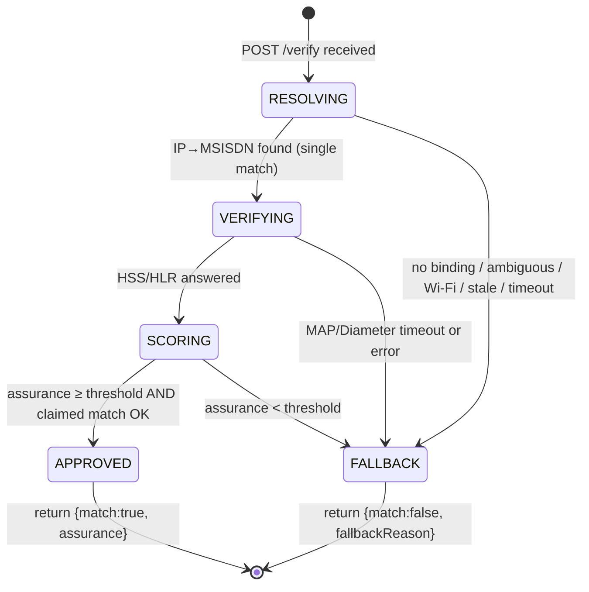
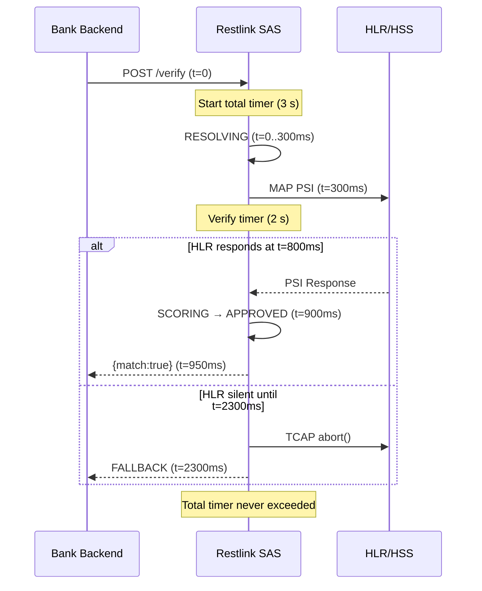
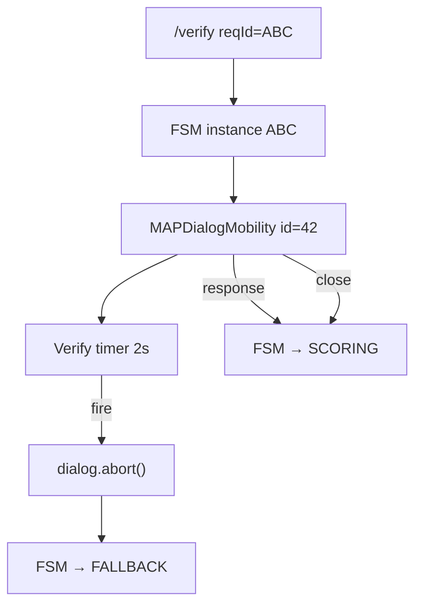

# Chapter 6 — SAS Finite-State Machine, Timeouts, and Dialog Management

**Restlink Silent Authentication for Government & Banking**  
*Per-request state machine, latency budgets, and jSS7 integration*

---

## 6.1 Scope

Every `POST /verify` request is processed by Restlink SAS as an independent, short-lived transaction governed by a **per-request finite-state machine (FSM)**. This chapter defines:

1. FSM states and transitions
2. Timeout budgets and expiry behaviour
3. MAP dialog abort and leak prevention
4. jSS7 hook points for MAP Verifier implementation
5. Idempotency and concurrency rules

The FSM enforces the fail-closed assurance model described in Chapter 4: any transition that cannot be completed with verifiable evidence routes to **FALLBACK**.

---

## 6.2 FSM overview



### 6.2.1 State definitions

| State | Entry condition | Active work | Exit conditions |
|-------|----------------|-------------|-----------------|
| **RESOLVING** | `/verify` accepted; `reqId` registered | IP Resolver lookup `{srcIP, srcPort, ts}` | Single MSISDN → VERIFYING; else → FALLBACK |
| **VERIFYING** | Resolver returned `{msisdn, imsi, bearerAge}` | MAP PSI/ATI/SAI or Diameter ULR/ULA + Sh UDR | HSS response → SCORING; timeout/error → FALLBACK |
| **SCORING** | Verifier evidence complete | Weighted assurance computation | score ≥ threshold → APPROVED; else → FALLBACK |
| **APPROVED** | Policy pass | Build success response | Terminal |
| **FALLBACK** | Any stage failure | Build fallback response; abort open dialogs | Terminal |

**No partial approvals.** The FSM never enters APPROVED unless all prior stages completed successfully. There is no "approve with LOW confidence" path that grants login without fallback — LOW assurance is a FALLBACK outcome.

---

## 6.3 Transition table

| From | Event | Guard / condition | To | Action |
|------|-------|-------------------|-----|--------|
| `[*]` | `verifyReceived` | Valid mTLS, schema, `reqId` not duplicate-in-flight | RESOLVING | Start resolver timer (300 ms) |
| `[*]` | `verifyReceived` | Duplicate `reqId` (completed) | `[*]` | Return cached result |
| RESOLVING | `bindingFound` | Exactly 1 MSISDN; `bearerAge` ≤ max | VERIFYING | Start MAP/Diameter timer (2 s) |
| RESOLVING | `bindingFound` | `claimedMSISDN` present AND `resolved ≠ claimed` | FALLBACK | reason=`MSISDN_MISMATCH` |
| RESOLVING | `bindingAmbiguous` | >1 MSISDN | FALLBACK | reason=`AMBIGUOUS_BINDING` |
| RESOLVING | `bindingMissing` | 0 matches | FALLBACK | reason=`NO_BINDING` |
| RESOLVING | `resolverTimeout` | Elapsed > 300 ms | FALLBACK | reason=`RESOLVER_TIMEOUT` |
| VERIFYING | `hssAnswered` | MAP/Diameter response parsed | SCORING | Cancel verify timer |
| VERIFYING | `verifyTimeout` | Elapsed > 2 s | FALLBACK | `abort()` MAP dialog; reason=`VERIFY_TIMEOUT` |
| VERIFYING | `verifyError` | TCAP error, Diameter error, malformed response | FALLBACK | `abort()` dialog; reason=`VERIFY_ERROR` |
| SCORING | `scorePass` | score ≥ threshold; SIM-swap OK | APPROVED | Emit `{match:true, assurance}` |
| SCORING | `scoreFail` | score < threshold OR SIM-swap detected | FALLBACK | reason=`LOW_ASSURANCE` or `SIM_SWAP_SUSPECT` |
| APPROVED | — | — | `[*]` | Log, cache by `reqId`, respond |
| FALLBACK | — | — | `[*]` | Log, cache by `reqId`, respond |

---

## 6.4 Timeout budgets

SAS is the **dialog anchor**: it never allows a hung HLR/HSS query to stall the bank application. All timers are enforced at the SAS process; the bank receives a definitive response within the total budget.

### 6.4.1 Budget table

| Stage / timer | Budget | Scope | On expiry |
|---------------|--------|-------|-----------|
| **Resolver lookup** | **300 ms** | PGW/PCRF/CGNAT query | → FALLBACK (`RESOLVER_TIMEOUT`) |
| **MAP dialog** (PSI/ATI/SAI) | **2 s** | TCAP dialog timer (TC-BEGIN to response or abort) | `abort()` dialog → FALLBACK (`VERIFY_TIMEOUT`) |
| **Diameter S6a/Sh** (ULR/ULA + Sh UDR) | **2 s** | Request–answer round-trip | Cancel request → FALLBACK (`VERIFY_TIMEOUT`) |
| **Total SAS** | **≤ 3 s** | Wall-clock from `/verify` received to response sent | Hard ceiling; bank shows normal login |

### 6.4.2 Budget allocation rationale

```
Total 3000 ms
├── Resolver:     300 ms  (10%)   — local/DC query; fail fast if PGW unreachable
├── Verifier:    2000 ms  (67%)   — SS7/Diameter round-trip to HLR/HSS
└── Scoring + overhead: 700 ms (23%) — policy, serialisation, mTLS response
```

The 2 s MAP/Diameter budget aligns with the TCAP dialog timer convention and FS.11 guidance on bounded dialogue duration. Exceeding 2 s indicates HLR congestion or routing failure; the correct behaviour is FALLBACK, not retry within the same request (retries are the bank's responsibility via a new `reqId`).

### 6.4.3 Total budget enforcement



---

## 6.5 MAP dialog abort and leak prevention

### 6.5.1 Dialog lifecycle

Each `/verify` request opens **at most one MAP dialog** in the VERIFYING state. The dialog lifecycle:

| Phase | jSS7 component | Action |
|-------|---------------|--------|
| Open | `MAPProviderImpl.getMAPServiceMobility().createNewDialog(...)` | Allocate TCAP dialog ID |
| Send | `MAPDialogMobilityImpl.addProvideSubscriberInfoRequest(...)` (or ATI/SAI) | TC-BEGIN + Invoke |
| Await | Dialog listener callback | Wait for ReturnResult or timeout |
| Close (success) | `dialog.close(false)` | TC-END; release dialog ID |
| Abort (timeout/error) | `dialog.abort()` | TC-ABORT; release dialog ID |

### 6.5.2 Abort rules

| Condition | Action | Rationale |
|-----------|--------|-----------|
| Verify timer expires (2 s) | `dialog.abort()` | Prevent hung dialog consuming STP resources |
| Malformed TCAP response | `dialog.abort()` | Fail-closed; do not retry in-dialog |
| SAS process shutdown | Abort all in-flight dialogs | Clean SIGTRAN teardown |
| Duplicate response after terminal state | Ignore | Idempotent callback handling |

**Dialog leak** is a production-critical failure mode: each leaked dialog consumes a TCAP dialogue ID and STP resources until the remote timer clears it. Restlink SAS binds every dialog to the FSM instance and the verify timer; timeout **always** invokes `abort()`.

### 6.5.3 Dialog-to-FSM binding



One `reqId` maps to one FSM instance, one resolver call, and one MAP/Diameter transaction. Retries with the same `reqId` after completion receive the cached terminal result; retries while in-flight are rejected or coalesced.

---

## 6.6 jSS7 hook points

The MAP Verifier is implemented on **coral-valley jSS7** (`org.restcomm.protocols.ss7.map`). The following classes are the primary integration hooks.

### 6.6.1 Request implementations

| Message | jSS7 class | Package |
|---------|-----------|---------|
| ATI | `AnyTimeInterrogationRequestImpl` | `map/service/mobility/subscriberInformation/` |
| PSI | `ProvideSubscriberInfoRequestImpl` | `map/service/mobility/subscriberInformation/` |
| SAI | `SendAuthenticationInfoRequestImpl` | `map/service/mobility/authentication/` |

### 6.6.2 Service and dialog layer

| Component | jSS7 class | Role |
|-----------|-----------|------|
| MAP provider | `MAPProviderImpl` | Entry point; service lookup |
| Mobility service | `MAPServiceMobilityImpl` | Creates mobility dialogs |
| Dialog | `MAPDialogMobilityImpl` | Send/receive/abort per dialog |
| Parameter factory | `MAPParameterFactoryImpl` | Build ASN.1 primitives |

### 6.6.3 Typical PSI invocation pattern (pseudocode)

The Verifier service wraps jSS7 in a non-blocking callback model aligned with the FSM:

```java
// FSM enters VERIFYING — called from resolver success handler
MAPDialogMobility dialog = mapProvider.getMAPServiceMobility()
    .createNewDialog(localSsn, remoteSsn, localGt, remoteGt, imsi);

ProvideSubscriberInfoRequestImpl psi = new ProvideSubscriberInfoRequestImpl(
    subscriberIdentity, requestedInfo, ...);

dialog.addProvideSubscriberInfoRequest(psi);
dialog.send();

verifyTimer.schedule(reqId, 2000, () -> {
    dialog.abort();
    fsm.transition(FALLBACK, VERIFY_TIMEOUT);
});

dialog.setCallback(new MAPDialogCallback() {
    void onProvideSubscriberInfoResponse(ProvideSubscriberInfoResponse res) {
        verifyTimer.cancel(reqId);
        dialog.close(false);
        fsm.transition(SCORING, parseEvidence(res));
    }
});
```

The same pattern applies to `AnyTimeInterrogationRequestImpl` and `SendAuthenticationInfoRequestImpl`, substituting the dialog add-method and response callback.

### 6.6.4 Listener registration

| Hook | Interface / class | Purpose |
|------|-------------------|---------|
| MAP service listener | `MAPServiceMobilityListener` | Inbound MAP messages (not used for Verifier — SAS is client) |
| Dialog callback | Per-dialog listener on `MAPDialogMobilityImpl` | Correlate response to FSM |
| TCAP stack | `TcapStackImpl` | SIGTRAN transport; dialog timer at TCAP layer |

---

## 6.7 Idempotency and concurrency

| Rule | Implementation |
|------|----------------|
| One FSM per `reqId` | In-flight map: `reqId → FSM`; completed map: `reqId → cached result` (TTL) |
| One dialog per FSM | No parallel MAP messages for the same `/verify` |
| Duplicate in-flight | Return `409` or await same FSM (bank-configurable) |
| Duplicate completed | Return cached `{match, assurance, reqId}` |
| Concurrent different `reqId` | Independent FSMs; separate dialog IDs |

Banks should generate a new `reqId` (UUID v4) per login attempt. Retries after FALLBACK use a new `reqId` to avoid serving a stale FALLBACK cache.

---

## 6.8 Observability and audit

| Event | Logged fields | Metric |
|-------|--------------|--------|
| FSM state transition | `reqId`, from, to, elapsed_ms | Counter per transition |
| Resolver outcome | `reqId`, outcome, bearerAge | Histogram (resolver latency) |
| MAP dialog open/close/abort | `reqId`, dialogId, opcode | Gauge (active dialogs) |
| Terminal state | `reqId`, APPROVED/FALLBACK, reason | Counter per outcome |
| Total latency | `reqId`, wall_ms | Histogram (p50, p95, p99) |

MSISDN and IMSI are logged at INFO level with field masking in production. Full values are available in restricted audit logs for fraud investigation.

---

## 6.9 Failure mode summary

| Failure | FSM path | Dialog action | Bank receives |
|---------|----------|---------------|---------------|
| PGW unreachable | RESOLVING → FALLBACK (300 ms) | None (no dialog opened) | `RESOLVER_TIMEOUT` |
| CGNAT ambiguous | RESOLVING → FALLBACK | None | `AMBIGUOUS_BINDING` |
| HLR timeout | VERIFYING → FALLBACK (2 s) | `abort()` | `VERIFY_TIMEOUT` |
| TCAP error | VERIFYING → FALLBACK | `abort()` | `VERIFY_ERROR` |
| Recent SIM swap | SCORING → FALLBACK | Dialog already closed | `SIM_SWAP_SUSPECT` |
| Low assurance score | SCORING → FALLBACK | Dialog already closed | `LOW_ASSURANCE` |
| Total budget exceeded | Any → FALLBACK | `abort()` all open | `SAS_TIMEOUT` |

In every case, the bank application receives a definitive response within 3 seconds and routes the user to fallback MFA. Silent Auth never blocks the login path indefinitely.

---

## 6.10 Phase roadmap (FSM extensions)

| Phase | FSM change | Timeout impact |
|-------|-----------|----------------|
| Phase 1 (pilot) | MAP PSI primary; ATI fallback; Resolver via PGW | As defined above |
| Phase 2 | Add Diameter S6a ULR/ULA + read-only Sh UDR branch in VERIFYING | Same 2 s verify budget |
| Phase 3 | TS.43 EAP-AKA path bypasses RESOLVING (SIM credential) | New state: `AUTHENTICATING`; 5 s budget for EAP |

Phase 1 FSM and budgets defined in this chapter are the baseline for the Ethio Telecom pilot.
