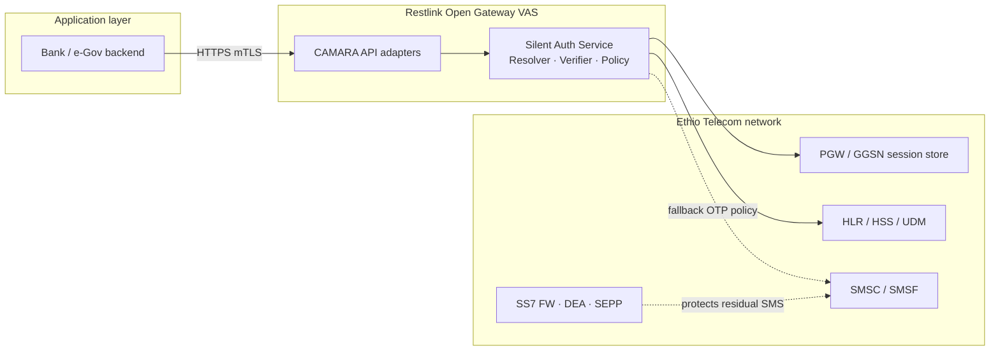

# Chapter 7 — CAMARA Open Gateway APIs

**Restlink Silent Authentication for Ethiopia**  
**Document:** Proposal Chapter 07  
**Version:** 1.0 · July 2026

---

## 7.1 Purpose and scope

This chapter defines how the Restlink Silent Authentication Service (SAS) aligns with the GSMA **Open Gateway** programme and the **CAMARA** API family. CAMARA provides standardised, HTTPS-based network APIs that expose operator-held subscriber signals to authorised application providers under consent and policy. Restlink acts as the **Value-Added Service (VAS) adapter** between Ethiopian government and bank backends and Ethio Telecom's network truth — without displacing operator SMS, interconnect, or core signalling revenue.

The objective is twofold:

1. **Commercial:** offer a portable, standards-aligned API contract that banks and e-Government platforms can integrate once and reuse across Open Gateway markets.
2. **Technical:** map each CAMARA capability onto the Restlink SAS internal architecture (Resolver, Verifier, Policy) so that app-facing contracts remain stable while MAP/Diameter implementation stays operator-internal.

---

## 7.2 Open Gateway architecture in the Ethiopia context

Open Gateway separates three layers:

| Layer | Owner | Responsibility |
|-------|-------|----------------|
| **Network source of truth** | Ethio Telecom | HLR/HSS/UDM, PGW/GGSN session binding, SMSC/SMSF, interconnect borders (SS7 FW, DEA, SEPP) |
| **API exposure & policy** | Restlink (VAS partner) | CAMARA-shaped HTTPS APIs, consent orchestration, assurance scoring, fallback policy, bank/e-Gov onboarding |
| **Application** | Banks, e-Government, fintech | Login, step-up, onboarding; server-to-server calls to Restlink SAS |

Restlink does **not** terminate SS7, Diameter, or N32 signalling at the application boundary. All subscriber interrogation executes **inside** the operator network. Banks receive only CAMARA-conformant JSON responses (`match`, `assurance`, `reqId`, optional step-up hints) over **mutual TLS (mTLS)**.

---

## 7.3 CAMARA API catalogue — full mapping

The table below lists the CAMARA identity and fraud APIs relevant to Silent Authentication in Ethiopia, their standard purpose, and the corresponding Restlink SAS component or phase.

| CAMARA API | Standard function | Primary use case (Ethiopia) | Restlink SAS mapping | Phase |
|------------|-------------------|----------------------------|---------------------|-------|
| **Number Verification (NV)** | Verify that a claimed MSISDN matches the device currently on a live cellular session | Bank app login, e-Gov citizen portal, payment step-up | **`POST /verify`** — Stage 1: IP Resolver (PGW/GGSN `IP:port:ts → MSISDN`); Stage 2: MAP/Diameter Verifier (PSI/SAI + ULR/ULA + Sh UDR); Policy score → `{match, assurance}` | **Pilot (P1)** |
| **Number Verification 2 (NV2)** | Extended verification including non-cellular bearers via SIM-bound credentials | Wi-Fi-only users, browser login without cellular data | **TS.43 EAP-AKA** entitlement path; SIM credential as root of trust (not bearer IP); extends SAS beyond IP-match | **Phase 3 (P3)** |
| **GSMA TS.43** (Service Entitlement Configuration) | SIM-based silent authentication using EAP-AKA; works on Wi-Fi and cellular | Close the Wi-Fi fallback gap where IP-match fails | Entitlement server integration; same SAS Policy engine; shared SIM-swap and assurance logic with NV | **Phase 3 (P3)** |
| **SIM Swap** | Detect recent SIM or number porting events | Downgrade assurance, force step-up MFA on high-value transactions | Verifier reads **`lastUpdateLocation` / IMSI-change age** via PSI/SAI (2G/3G) or read-only Sh UDR (4G/5G) (FS.11 Cat 3.2); exposed as assurance signal or standalone API | **Phase 2 (P2)** |
| **OTP SMS** | Deliver one-time password via operator SMS channel | Residual fallback when silent path unavailable (Wi-Fi-only without TS.43, stale binding, low assurance) | Restlink **orchestrates policy only** — triggers Ethio Telecom SMSC; **no SMS wholesale**; billing remains with operator; OTP traffic subject to Strategy B (Home Routing + signalling FW) | **Fallback (ongoing)** |
| **Scam Signal** | Network-derived fraud/scam indicators associated with a number | Risk-based login denial, transaction friction | Input to SAS **Policy scoring** (`w_scam` weight); combine with assurance threshold; optional standalone CAMARA endpoint | **Phase 2 (P2)** |
| **KYC Match** | Match application-provided identity attributes against operator KYC record | e-Gov onboarding, bank account opening, SIM-registration reconciliation | Optional SAS module querying operator KYC store; **not** on critical login path for P1; consent-gated attribute comparison | **Optional (P2+)** |
| **Number Recycling** | Detect whether an MSISDN has been recycled to a new subscriber | Prevent authentication to wrong person after number reassignment | HSS/HLR **`MSISDN age / recycling flag`** check in Verifier; downgrade or block if recycled within operator-defined window | **Optional (P2+)** |

---

## 7.4 Number Verification — core Silent Auth contract

### 7.4.1 NV ↔ Restlink SAS equivalence

CAMARA Number Verification is the **primary app-facing surface** for Restlink Silent Authentication. The internal SAS flow implements NV semantics through a two-stage pipeline:

| Stage | Input | Mechanism | Output |
|-------|-------|-----------|--------|
| **Resolver** | `{srcIP, srcPort, ts}` from bank backend (collected by mobile app on cellular data) | Query Ethio Telecom PGW/GGSN / PCRF / CGNAT session store | `{MSISDN, IMSI, bearerAge}` or `NOT_FOUND` |
| **Verifier** | `{MSISDN, IMSI}` | Intra-network MAP (PSI, SAI) or Diameter (S6a ULR/ULA + Sh UDR) to **own** HLR/HSS | `{reachable, notSimSwapped, locationPlausible}` |
| **Policy** | Resolver + Verifier evidence + optional `claimedMSISDN` | Weighted assurance score; fail-closed | `{match: true/false, assurance: HIGH/MEDIUM/LOW, reqId}` |

**Deployment invariant:** MAP `AnyTimeInterrogation` (ATI) is GSMA FS.11 **Category 1** on interconnect — blocked at the operator border. Restlink SAS therefore runs **inside** Ethio Telecom and queries only the **own** HLR/HSS. No cross-operator ATI. PSI (Cat 2.1) is the preferred 2G/3G verifier message; ATI may be used intra-network where operator policy permits.

### 7.4.2 NV request/response semantics (conceptual)

| Field | Direction | Purpose |
|-------|-----------|---------|
| `reqId` | Request (bank → Restlink) | Idempotency key; deduplicates retries; one MAP/Diameter dialog per stage |
| `srcIP`, `srcPort`, `ts` | Request | CGNAT-safe 5-tuple disambiguation; anti-replay window |
| `claimedMSISDN` | Request (optional) | If present, SAS asserts `resolved == claimed`; if absent, SAS returns verified MSISDN (pure number verification) |
| `match` | Response | Boolean identity match outcome |
| `assurance` | Response | `HIGH` / `MEDIUM` / `LOW` — drives bank login vs step-up decision |
| `fallbackRecommended` | Response | Hint when silent path unavailable; bank triggers OTP/Passkey/TOTP |

MSISDN and IMSI are returned to the **bank backend only**, never to the mobile application (see Chapter 9).

---

## 7.5 Number Verification 2 and GSMA TS.43

The **IP-matching** NV method requires an **active cellular data bearer**. In Ethiopia, a material share of authentication attempts originate on **Wi-Fi** (home, office, public hotspot). GSMA **TS.43 Service Entitlement Configuration** and CAMARA **NV2** address this by anchoring trust in the **SIM credential** via EAP-AKA, independent of the current IP bearer.

| Aspect | NV (IP-match) | NV2 / TS.43 (SIM method) |
|--------|---------------|----------------------------|
| Root of trust | PGW session binding (IP:port → MSISDN) | SIM EAP-AKA |
| Bearer requirement | Cellular data | Cellular or Wi-Fi |
| Resolver role | Mandatory | Not applicable (SIM proves MSISDN) |
| Verifier role | PSI/SAI + ULR/ULA + Sh UDR + SIM-swap checks | Same Verifier + entitlement server |
| Fallback surface | OTP when no cellular binding | Smaller — Passkey/TOTP only when SIM method unavailable |

Restlink roadmap positions TS.43 as **Phase 3**, after NV pilot stabilisation and SIM Swap signal integration. Both methods share the same SAS Policy engine and assurance thresholds.

---

## 7.6 Ancillary CAMARA APIs — fraud and lifecycle

### 7.6.1 SIM Swap

SIM swap is the primary defeat mechanism for SMS OTP. Silent Authentication addresses it at the Verifier layer before any SMS is sent.

| Signal source | Protocol | Restlink use |
|---------------|----------|-------------|
| `lastUpdateLocation` age | PSI / Sh UDR | If change within `swapCooldown` (configurable, e.g. 24–72 h) → downgrade assurance → `FALLBACK` |
| IMSI change event | HSS subscription data | Hard block on HIGH-value flows |
| Auth vector freshness | SAI (FS.11 Cat 3.2) | Detect recent re-authentication to new SIM |

Exposed to banks either embedded in `/verify` assurance or as a standalone CAMARA SIM Swap API in Phase 2.

### 7.6.2 OTP SMS (fallback orchestration)

| Principle | Detail |
|-----------|--------|
| Restlink role | Policy gate — invoke OTP only when SAS returns `FALLBACK` |
| Operator role | SMSC delivery, interconnect billing, Home Routing |
| Revenue | SMS revenue remains with Ethio Telecom |
| Security | Every OTP sent must traverse Strategy B controls (Chapter 8) |

### 7.6.3 Scam Signal, KYC Match, Number Recycling

| API | Integration pattern | Ethiopia priority |
|-----|---------------------|-------------------|
| **Scam Signal** | Weighted input to Policy score; can block login independently of NV match | Medium — fraud desk alignment |
| **KYC Match** | e-Gov citizen registration vs operator SIM registration record | High for onboarding; low for login P1 |
| **Number Recycling** | Block or step-up when MSISDN recently reassigned | Medium — protects recycled-number false positives |

---

## 7.7 CAMARA ↔ Restlink SAS component map

| CAMARA API | SAS component | Signalling (operator-internal) | App exposure |
|------------|---------------|------------------------------|--------------|
| Number Verification | Resolver + Verifier + Policy | PGW lookup; PSI/ULR; optional ATI intra-net | `POST /verify` |
| NV2 / TS.43 | Entitlement adapter + Verifier + Policy | EAP-AKA; HSS | `POST /verify/v2` (planned) |
| SIM Swap | Verifier + Policy | PSI, SAI, Sh UDR | `/sim-swap` or embedded assurance |
| OTP SMS | Policy (FALLBACK branch) | SMSC MT-SMS via Home Routing | Bank-triggered; Restlink policy token |
| Scam Signal | Policy input | Operator fraud feed | `/scam-signal` or embedded |
| KYC Match | KYC adapter | Operator KYC store | `/kyc-match` |
| Number Recycling | Verifier extension | HLR/HSS recycling flags | Embedded or `/number-recycling` |

All HTTPS endpoints: **OAuth 2.0 / OIDC** client credentials or JWT bearer (per Open Gateway profile) plus **mTLS** for bank backend connections.

---

## 7.8 Ethiopia Open Gateway positioning

### 7.8.1 Market rationale

Ethiopia's digital financial services and e-Government programmes require strong phone-number identity without the friction and fraud exposure of SMS OTP. Open Gateway standardisation allows Ethio Telecom to monetise network capability as **API product** while Restlink captures VAS integration revenue from banks and government — a model that aligns incentives rather than cannibalising operator SMS traffic.

### 7.8.2 Positioning statement

| Stakeholder | Value proposition |
|-------------|-------------------|
| **Ethio Telecom** | New API revenue share; strengthened interconnect security story; SMS OTP volume reduction on silent path; retains SMSC and interconnect revenue on fallback |
| **Banks & e-Government** | CAMARA-portable integration; higher login conversion; lower OTP cost; reduced SS7/phishing ATO exposure |
| **Restlink** | Open Gateway VAS partner; per-`/verify` API revenue; orchestration and assurance policy IP |
| **Regulators** | Standards-aligned identity layer; auditable assurance scoring; GSMA FASG signalling compliance (Chapter 8) |

### 7.8.3 Commercial and technical boundaries

| Boundary | Rule |
|----------|------|
| Signalling | Ethio Telecom owns SS7/Diameter/5G borders and core |
| API contract | Restlink exposes CAMARA-shaped HTTPS to authorised apps |
| SMS billing | Operator SMSC bills all OTP; Restlink never resells SMS |
| Subscriber data | MSISDN/IMSI never exposed to mobile app; backend-only over mTLS |
| Roaming / MVNO | Out of scope for P1; fallback to OTP with Home Routing |

### 7.8.4 Rollout roadmap aligned to CAMARA

| Phase | CAMARA capabilities | Milestone |
|-------|---------------------|-----------|
| **P1 — Pilot** | Number Verification (IP-match) | 2–3 bank/e-Gov apps; `/verify` mTLS; FS.11 intra-network Verifier |
| **P2 — Fraud signals** | SIM Swap, Scam Signal; OTP SMS fallback hardened | Assurance downgrade rules; Strategy B Home Routing confirmed |
| **P3 — Coverage expansion** | NV2 / TS.43 Wi-Fi path | Entitlement server; reduced OTP fallback rate |
| **P4 — Lifecycle** | KYC Match, Number Recycling | e-Gov onboarding integration |

### 7.8.5 Compliance narrative for procurement

Procurement and security reviewers should expect a **dual standards story**:

1. **CAMARA / Open Gateway** — application-layer API contract, consent, and identity assurance semantics.
2. **GSMA FASG (FS.07–FS.36, SG.22, FF.09)** — signalling-layer protection for residual SMS and interconnect (Chapter 8).

Restlink implements the first; Ethio Telecom implements the second with Restlink policy coordination on the fallback OTP path. Together they satisfy the unified identity architecture: **Strategy A (replace OTP)** plus **Strategy B (protect OTP)**.

---

## 7.9 Interoperability and portability

CAMARA alignment ensures that bank integrations developed for the Ethiopia pilot can be adapted to other Open Gateway operator deployments with minimal change — typically endpoint URL, OAuth credentials, and locale-specific assurance thresholds. Restlink will publish an **OpenAPI 3.x** specification derived from CAMARA Number Verification schemas, extended with Restlink-specific `assurance` and `fallbackRecommended` fields documented in the integration guide.

| Portability element | Standard reference |
|--------------------|-------------------|
| Number Verification API schema | CAMARA GitHub / LF Networking |
| TS.43 entitlement flow | GSMA TS.43 |
| OAuth 2.0 client credentials | Open Gateway security profile |
| Assurance enum | Restlink extension (documented) |

---

## 7.10 Summary

Restlink Silent Authentication is positioned as Ethiopia's **Open Gateway VAS layer** for phone-number identity. CAMARA Number Verification maps directly onto the SAS two-stage Resolver/Verifier architecture; NV2/TS.43 extends coverage to Wi-Fi; SIM Swap, Scam Signal, KYC Match, and Number Recycling enrich the Policy engine; OTP SMS remains a operator-delivered fallback protected by GSMA signalling controls. Ethio Telecom retains network ownership and SMS revenue; banks and e-Government receive a standards-portable, mTLS-secured API that eliminates SMS OTP on the majority of login sessions.

---

*References: CAMARA Number Verification API; GSMA TS.43; GSMA Open Gateway; Restlink SAS design (`docs/design/silent-auth-standard-flow.md`); Unified Identity Architecture (`docs/design/unified-identity-sms-security-architecture.md`).*
