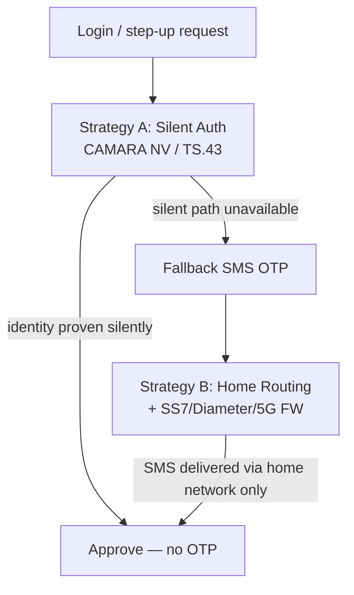
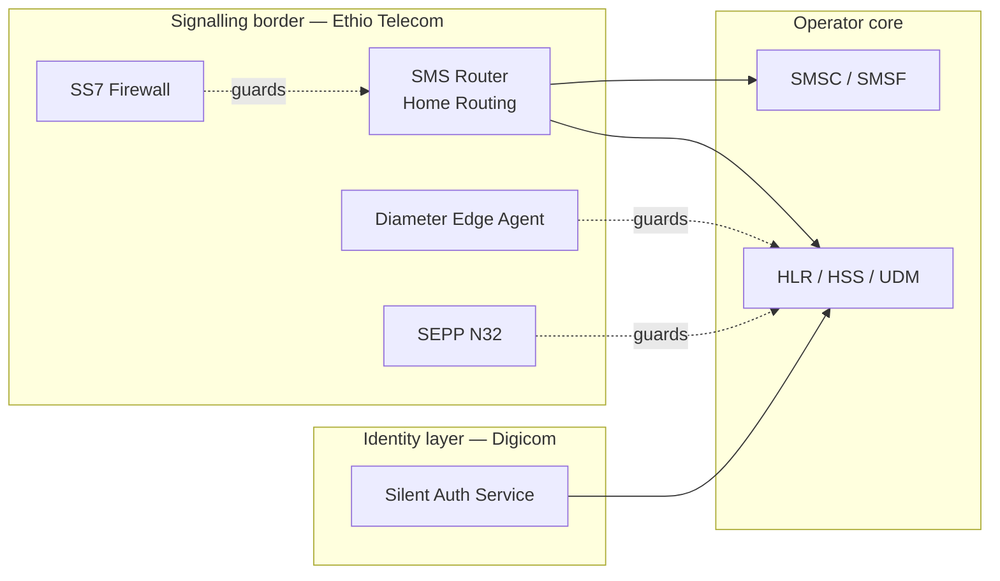

# Chapter 8 — GSMA FASG Signalling and SMS Security

**Digicom-ET Silent Authentication for Ethiopia**  
**Document:** Proposal Chapter 08  
**Version:** 1.0 · July 2026

---

## 8.1 Purpose and scope

This chapter documents how the Digicom-ET Silent Authentication programme aligns with the GSMA **Fraud and Security Group (FASG)** document suite governing interconnect signalling and SMS channel protection. Silent Authentication operates primarily at the **application / identity layer** (Strategy A — replace OTP), but every residual SMS OTP and every MAP/Diameter query depends on a correctly defended **signalling border** (Strategy B — protect OTP). Both strategies are mandatory; neither alone covers the full account-takeover surface.

The FASG references cited here are drawn from the GSMA Cybersecurity Knowledge Base. Most PRDs are members-only; **FS.11 v4.0** is publicly circulated and forms the authoritative basis for SS7 MAP categorisation used by the Digicom Verifier deployment model.

---

## 8.2 FASG document index — full catalogue

| PRD | Title | Scope | Access | Relevance to Digicom-ET |
|-----|-------|-------|--------|-------------------------|
| **FS.07** | SS7 and SIGTRAN Network Security | Stack-layer SS7/SIGTRAN threats, attack methods, countermeasures | GSMA members | Foundation threat model for SS7 SMS interception; informs Verifier threat assumptions |
| **FS.11** | SS7 Interconnect Security Monitoring & Firewall Guidelines | Monitor SS7 MAP/CAMEL; packet categorisation (Cat 1/2/3); firewall rules; Annex A/B (SMS Home Routing) | v4.0 public; v6.0 members | **Core** — ATI Cat 1 block; SRI-SM filtering; MT-spoofing; Double MAP; Home Routing |
| **FS.19** | Diameter Interconnect Security | LTE/5G Diameter attacks and countermeasures; Diameter↔SS7 MAP interworking; must be read with FS.07 & FS.11 | GSMA members | Diameter SMS redirect defence (S6c/S6a/SGd); DEA deployment |
| **FS.20** | GTP Security | Attacks over GRX/IPX/Internet via GTP-C/U; mitigations | GSMA members | Bearer / PGW context integrity; secondary to SMS but supports Resolver trust |
| **FS.21** | Interconnect Signalling Security Recommendations | Umbrella: risk-based categorise → monitor → filter across SS7/Diameter/GTP/5G | GSMA members | Policy consistency framework binding all protocol firewalls |
| **FS.31** | Baseline Security Controls | Control catalogue including roaming/interconnect baseline | GSMA members | Checklist for operator border hardening |
| **FS.36** | 5G Interconnect Security | SEPP/N32 boundary; 5G core message categorisation; IE classification; migration risks | GSMA members | 5G SMS (SMSF) and N32 protection as 4G/5G traffic grows |
| **SG.22** | SMS Firewall Best Practices and Policies | High-level SMS firewall policy; corrective actions; AIT/spam | GSMA members | SMS content/policy layer above signalling FW for fallback OTP |
| **FF.09** | SMS Fraud | Types of SMS fraud; normal vs fraud flows; SIM swap context | GSMA members | Fraud taxonomy informing SIM Swap assurance and OTP fallback policy |

### 8.2.1 Document relationship map

| Layer | Documents | Role |
|-------|-----------|------|
| **Policy umbrella** | FS.21, FS.31 | Risk-based categorise → monitor → filter; baseline control catalogue |
| **Protocol implementation** | FS.07 → FS.11 (SS7); FS.19 (Diameter); FS.20 (GTP); FS.36 (5G) | Per-generation border controls |
| **SMS content / fraud** | FF.09 → SG.22 | Fraud taxonomy and SMS firewall policy above signalling |
| **Identity / app layer** | CAMARA NV/NV2, TS.43 (adjacent, not FASG) | Strategy A — Digicom SAS |

FS.19 explicitly cross-references FS.07 and FS.11 because Diameter↔MAP interworking creates attack paths that span both stacks. FS.21 requires **consistent policy** across all generations — an attacker will exploit the weakest path (typically unprotected 2G MT-SMS even when 5G SEPP is deployed).

---

## 8.3 FS.11 MAP packet categorisation — full table

FS.11 categorises MAP traffic at the interconnect border. The Digicom SAS Verifier **must** comply with these categories because it originates MAP/Diameter queries from inside the operator network.

| Category | Sub-cat | Meaning | Example opcodes / messages | Interconnect handling | Digicom-ET rule |
|----------|---------|---------|---------------------------|----------------------|-----------------|
| **1** | — | Unauthorised on interconnect | **ATI** (AnyTimeInterrogation), SendIMSI, unknown opcode | **BLOCK** | ATI permitted **only to own HLR intra-network**; SAS Verifier deployed inside operator; never cross-PLMN ATI |
| **2** | 2.1 | Operator-only; needs answer; check IMSI vs SCCP | **PSI** (ProvideSubscriberInfo), PRN, PSL | Filter on identity match | **Primary 2G/3G verifier** — subscriber state + location |
| **2** | 2.2 | Operator-only; no answer expected | ISD, DSD | Filter IMSI↔SCCP | Not used by SAS; border must still filter |
| **3** | 3.1 | Inter-operator; VLR/SGSN correlation | MO-FSM, USSD, RegisterSS, IDP | Location/VLR check | Relevant to SMS MO path and Home Routing |
| **3** | 3.2 | Inter-operator; time/location correlation | UL, **SAI** (SendAuthenticationInfo) | Time/location correlation | **SAI for SIM-swap freshness** — auth vector age |
| **3** | 3.3 | IPSM-GW / SMS-specific | SMS gateway checks | SMS-specific rules | Governs **fallback OTP** MT-SMS path |

**Critical deployment invariant:** Category 1 ATI on interconnect is the most commonly abused opcode for subscriber tracking and SMS interception precursors. Digicom SAS therefore runs as an **in-operator VAS component** with direct HLR/HSS connectivity — not as an interconnect-facing application.

---

## 8.4 Strategy A vs Strategy B — complementary controls

The unified identity architecture defines two non-alternative strategies protecting the same asset — the subscriber's phone-number identity.

| Dimension | Strategy A — Replace OTP | Strategy B — Protect OTP |
|-----------|--------------------------|--------------------------|
| **Goal** | Remove SMS from the authentication path | Keep remaining SMS OTP uninterceptable |
| **Mechanism** | Silent Auth (CAMARA NV / NV2 / TS.43 EAP-AKA / IP-match) | SMS Home Routing + SS7/Diameter/5G signalling firewall |
| **Layer** | Application / identity | Signalling / interconnect |
| **Defeats** | Phishing, premium-number AIT, delivery failure, user friction | SS7 SRI-SM intercept, MT-spoofing, Diameter/5G SMS redirect |
| **Primary owner** | Digicom-ET SAS | Ethio Telecom (SMS Router, SS7 FW, DEA, SEPP) + Digicom fallback policy |
| **Primary standards** | CAMARA NV, TS.43; FS.11/FS.19 (intra-network queries) | FS.11, FS.19, FS.36, SG.22, FF.09 |
| **OTP volume impact** | Reduces OTP to fallback-only | Protects the OTP that must still be sent |

**Principle:** Every OTP Digicom cannot eliminate must still be protected. Strategy A closes threats SMS firewalls cannot address (phishing, real-time OTP relay); Strategy B closes threats silent auth cannot address (protecting the OTP that still has to traverse the signalling network).

### 8.4.1 Standards mapping by strategy

| Strategy | Mechanism | Primary GSMA / 3GPP standards | Owner |
|----------|-----------|------------------------------|-------|
| A — Replace OTP | Silent Auth (NV / TS.43) | CAMARA NV, TS.43; FS.11 Cat 2.1/3.2 (intra); FS.19 (S6a intra) | Digicom SAS |
| B — Protect OTP | Home Routing + signalling FW | FS.11 (SRI-SM, MT-spoof, Double MAP); FS.19 (DEA); FS.36 (SEPP/N32); SG.22; FF.09 | Ethio Telecom + Digicom policy |
| Umbrella | Categorise → monitor → filter | FS.21 + FS.31 baseline | Operator border |
| 5G path | SEPP / N32 / SMSF | FS.36; 3GPP TS 33.501 | Operator + Digicom NV2 |

### 8.4.2 Rollout sequencing (recommended)

| Order | Action | Rationale |
|-------|--------|-----------|
| 1 | Confirm/deploy SMS Home Routing + SS7 FW | Biggest immediate risk reduction — OTP sent today is exposed today |
| 2 | Add Diameter DEA (FS.19) and SEPP/N32 (FS.36) | As 4G/5G SMS traffic grows |
| 3 | Introduce Digicom SAS silent auth (NV) | Begin OTP elimination on supported sessions |
| 4 | Shift traffic to silent path; shrink OTP fallback | Residual OTP rides protected Strategy B path |

---

## 8.5 Threat → mitigation matrix (FASG-aligned)

| Threat | Attack path | Strategy A | Strategy B | GSMA ref |
|--------|-------------|------------|------------|----------|
| SIM swap | Number ported to attacker SIM | SIM-swap signal; TS.43 SIM binding fails | n/a (no SMS) | FF.09 |
| SS7 SMS intercept | SRI-SM reveals IMSI/MSC → MT-FSM to attacker | No SMS sent | SMS Home Routing (Correlation ID) | FS.07, FS.11 |
| MT-spoofing | Fake SMSC address in MT-FSM | No SMS sent | MAP vs SCCP SMSC correlation; drop | FS.11 |
| Double MAP evasion | Hidden 2nd MAP component in TCAP Begin | n/a | Block multi-component TCAP Begin | FS.11 (CVD-2018-0015) |
| Diameter SMS redirect | S6c SRR + S6a ULR reroute serving node | Silent auth avoids SMS | DEA edge filter; topology hiding | FS.19, FS.21 |
| Diameter DoS on SMS | S6a NOR/PUR/DSR disable SMS | Silent path independent | DEA rate/flag validation | FS.19 |
| 5G interconnect injection | N32 message tampering / IE manipulation | NV at app layer | SEPP + N32-c/f; PRINS policies | FS.36, TS 33.501 |
| Phishing / OTP relay | Victim forwards OTP to attacker | No code to phish | n/a (code eliminated) | Meta SA white paper |
| Premium-number / AIT | OTP triggered to premium MSISDN | No SMS billed | SMS FW rate/destination policy | SG.22 |

---

## 8.6 Strategy B — SS7 / MAP protection (2G / 3G)

### 8.6.1 SMS Home Routing (primary control)

Normal MT-SMS delivery is a two-step process that leaks subscriber identity at the interconnect:

| Step | Message | Leak |
|------|---------|------|
| 1 | `SendRoutingInfoForSM` (SRI-SM) to HLR | Returns target **IMSI + serving MSC/SGSN** to requestor |
| 2 | `MT-ForwardSM` to serving node | Delivers SMS |

**SMS Home Routing** (3GPP TS 23.040 §8.1.4) inserts an **SMS Router** in front of the HLR:

| SRI-SM response element | Normal HLR | Home Routing router |
|-------------------------|------------|---------------------|
| Subscriber identity | Real IMSI | **Correlation ID** (opaque) |
| Delivery address | Real MSC/SGSN GT | **SMS Router address** |
| Internal store | — | `{CorrelationID → IMSI, MSC}` short-lived |

The external SMSC must send MT-ForwardSM back to the router, which restores real IMSI/MSC internally. **IMSI and location never leave the home network.**

**Hardening controls:**

| Control | Purpose |
|---------|---------|
| LMSI-based correlation key with unpredictable projection | Prevents forged MT-FSM with guessed Correlation ID |
| `SM-Delivery-Not-Intended` in SRI-SM | Skip Correlation ID creation — deny reconnaissance probes |
| SRI-SM CgPA allow-list | Permit only legitimate SMSCs / roaming partners (FS.11) |

### 8.6.2 SRI-SM filtering (FS.11)

| Rule | Action |
|------|--------|
| Allow SRI-SM only from legitimate SMSCs / roaming partners | CgPA allow-list |
| Unexpected interconnect sources | Drop; Cat 2/3 IMSI-vs-SCCP checks |
| Volume monitoring | Track SRI-SM rate per peer; detect MSISDN enumeration sweeps |

### 8.6.3 MT-spoofing correlation (FS.11)

MT-spoofing occurs when the SMSC address embedded in `MT-ForwardSM` does not reflect the true origin — enabling fraudulent tariff manipulation or phishing delivery.

| Detection step | Detail |
|----------------|--------|
| Layer comparison | Compare SMSC address at **MAP layer vs SCCP layer** in both SRI-SM and MT-FSM |
| Correlation | Match each SRI-SM from suspect SMSC with subsequent MT-FSM; compare SMSC addresses |
| Action | Mismatch or unsolicited MT-FSM (no preceding SRI-SM) → discard with configurable error |

---

## 8.7 Double MAP attack and countermeasures

**CVE/CVD-2018-0015** (documented in FS.11 CR): an attacker embeds a **second illegitimate MAP component** after a legitimate-looking first component within the same TCAP `Begin`. Firewalls that inspect only the first component pass the dialog; the hidden component executes the attack (e.g. unauthorised SRI-SM or ATI).

| Attack characteristic | Detail |
|----------------------|--------|
| Transport | Single TCAP Begin, multiple MAP components |
| Evasion | First component appears legitimate; second carries attack opcode |
| Observed legal exception | Only `BeginSubscriberActivity + ProcessUnstructuredSS-Data` pair |

| Countermeasure | Implementation |
|----------------|----------------|
| **Block TCAP Begin with multiple MAP components** | Default deny; allow only the single documented legal pair |
| Inspect **local** opcodes | Attackers may use local opcodes ignored by STP/FW |
| Pair SS7 FW with IDS | Automated GT blocking on detection |
| FS.11 reference | CVD-2018-0015 CR |

Digicom-ET recommends Ethio Telecom verify Double MAP rules on the SS7 interconnect firewall **before** Silent Auth pilot go-live, because fallback OTP delivery depends on the same MAP SMS path.

---

## 8.8 Diameter SMS redirect protection (4G / LTE)

As subscribers migrate to LTE, SMS interception attacks migrate from SS7 MAP to **Diameter** interfaces. FS.19 and industry exposure reports (Positive Technologies 2018, ENISA, FCC CSRIC) document practical SMS redirect via S6c and S6a manipulation.

### 8.8.1 Diameter interface abuse table

| Interface | Message | Abuse | Countermeasure (DEA / FS.19) |
|-----------|---------|-------|------------------------------|
| **S6c** | `SRR` (Send-Routing-Info-for-SM) | Query serving MME + IMSI of target | Allow only from trusted origins; topology hiding |
| **S6a** | `ULR` (Update-Location) | Spoof MME to redirect subscriber | Origin validation; IMSI-vs-realm; velocity check |
| **S6a** | `NOR` (Notify) | Disable SMS when SGd/GGd in use | Flag/value validation; drop illegitimate |
| **S6a** | `PUR` (Purge-UE) | Purge subscriber from serving MME → unreachable | Reject PUR spoofing current MME |
| **S6a** | `DSR` (Delete-Subscriber-Data) | Delete profile → disconnect | Block external DSR with dangerous flags |
| **SGd** | MT SMS over Diameter | Deliver SMS via forged serving node | Correlate with S6c; SMSF/IP-SM-GW policy |
| **T4** | Device Trigger (TS 29.337) | Intra-PLMN only | Reject external T4; SMS-SC validates UE service |

### 8.8.2 Diameter Edge Agent (DEA) controls

| Control | Priority | Detail |
|---------|----------|--------|
| Deploy DEA at network edge | Mandatory | Filter before traffic reaches core |
| **S6a first priority** | High | Exposes PII and network topology |
| Command whitelist per interface | Mandatory | Blacklist all non-allowlisted commands |
| Topology hiding | Mandatory | Hide internal MME/HSS identities |
| Multi-layer filtering | Mandatory | Transport, application/command, SMS layer |
| Roamer integrity | Note | FW alone cannot protect inbound roamers — combine with authentication where available |

Digicom SAS Verifier uses **intra-network S6a** (IDR/AIR) only — mirroring the FS.11 ATI rule: subscriber queries originate inside the PLMN, not from interconnect peers.

---

## 8.9 5G interconnect protection (FS.36)

5G replaces Diameter with **HTTP/2 + JSON** service-based interfaces but retains the principle: validate at an inspectable border.

| Element | Function | Standard |
|---------|----------|----------|
| **SEPP** (Security Edge Protection Proxy) | Perimeter proxy; message filtering, policing, topology hiding | FS.36 |
| **N32-c** | SEPP mutual authentication; protection policy negotiation | FS.36 |
| **N32-f** | Signalling transport; TLS (direct roaming) or **PRINS** (mediated roaming) | FS.36, TS 33.501 |
| **SMSF** | SMS over NAS in 5G SA | FS.36 message categorisation |

**Migration risk:** Multi-generation Ethiopian networks must enforce FS.11 (SS7) + FS.19 (Diameter) + FS.36 (5G) **simultaneously** for the same roaming relationships. An unprotected 2G MT-SMS path undermines 5G SEPP controls — FS.21 mandates consistent cross-generation policy.

---

## 8.10 Monitoring, SMS firewall policy, and fraud taxonomy

### 8.10.1 FS.21 operational model

| Phase | Action |
|-------|--------|
| Categorise | Classify messages per FS.11 / FS.19 / FS.36 rules |
| Monitor | Collect per-peer metrics before blind-blocking |
| Filter | Tighten rules based on observed legitimate vs attack traffic |

**Per-peer metrics (minimum):**

| Metric | Purpose |
|--------|---------|
| SRI-SM volume and refusal codes | Detect enumeration |
| SRI-SM without matching MT-FSM | Detect probing |
| Unsolicited MT-FSM | Detect MT-spoofing / inject |
| Destination MSISDN rate | Detect AIT / premium abuse |
| Feed to SIEM/SOAR | Automated GT blocking |

### 8.10.2 SG.22 and FF.09 — content and fraud layer

| Document | Scope | Digicom relevance |
|----------|-------|-------------------|
| **SG.22** | SMS firewall best practices; spam; AIT; premium route abuse | Governs fallback OTP SMS content/rate policy |
| **FF.09** | SMS fraud taxonomy; SIM swap in fraud context | Informs SIM Swap assurance thresholds and step-up rules |

SG.22 sits **above** the signalling firewall — handling SMS content, destination policy, and application-to-person (A2P) abuse that FS.11 alone cannot see.

---

## 8.11 Component architecture — signalling border

| Component | Strategy | Owner |
|-----------|----------|-------|
| SAS (Resolver + Verifier + Policy) | A | Digicom-ET |
| SMS Router (Home Routing) | B | Ethio Telecom |
| SS7 Firewall (FS.11, Double MAP) | B | Ethio Telecom |
| DEA (FS.19) | B | Ethio Telecom |
| SEPP/N32 (FS.36) | B | Ethio Telecom |
| SMS FW policy (SG.22) | B | Ethio Telecom + Digicom OTP policy |

Both SAS and the signalling border consume the same subscriber source of truth (HLR/HSS/UDM). Digicom recommends a **shared identity-policy and rate-limit store** so an attacker cannot abuse the legacy OTP path when the silent path is blocked (and vice versa).

---

## 8.12 FS.31 baseline controls — border checklist (summary)

FS.31 provides the baseline interconnect control catalogue. The following subset applies directly to the Silent Auth + residual OTP programme:

| FS.31 control area | Requirement | Strategy |
|--------------------|-------------|----------|
| Interconnect access control | Restrict signalling peers to authorised GT/realm list | B |
| Monitoring and alerting | SIEM integration for signalling anomalies | B |
| Segregation | VAS (Digicom SAS) in operator DMZ; no direct interconnect exposure | A + B |
| Roaming security | Consistent FS.11/19/36 policy per partner | B |
| Incident response | Documented GT blocking and partner notification | B |

Full FS.31 mapping to be completed during Ethio Telecom security assessment; FS.11 v4.0 provides the immediately actionable MAP rules.

---

## 8.13 Evidence base and research artefacts

The following sources informed this chapter (external references; not committed to repository):

| Source | Contribution |
|--------|--------------|
| GSMA FS.11 v4.0 (public PDF) | MAP categorisation; Annex A/B Home Routing |
| GSMA Diameter Vulnerabilities Exposure Report 2018 | S6a/S6c SMS intercept evidence |
| ENISA Signalling Security in Telecom SS7/Diameter/5G | Cross-stack threat synthesis |
| FCC CSRIC report | Diameter edge / DEA guidance |
| 3GPP TS 29.337 (T4), TS 23.040 §8.1.4, TS 33.501 | Home Routing; 5G security |
| HITB 2019 (Puzankov) | Double MAP attack demonstration |

Authoritative rule tables for production implementation must be obtained from the GSMA Cybersecurity Knowledge Base (members-only PRDs).

---

## 8.14 Summary

GSMA FASG documents define the signalling-layer contract that makes Silent Authentication trustworthy in production. **FS.11** governs where Digicom SAS may query (intra-network PSI/SAI, never interconnect ATI) and how residual OTP SMS must be protected (Home Routing, MT-spoofing, Double MAP). **FS.19** and **FS.36** extend that protection to Diameter and 5G. **FS.21** and **FS.31** provide the umbrella policy framework. **SG.22** and **FF.09** cover the SMS fraud layer for fallback OTP. Strategy A and Strategy B are jointly necessary: Digicom replaces OTP where the cellular identity path is available; Ethio Telecom protects every OTP that remains.

---

*References: GSMA FS.07, FS.11 v4.0, FS.19, FS.20, FS.21, FS.31, FS.36, SG.22, FF.09; `docs/research/gsma-fs-index.md`; `docs/research/sms-channel-protection.md`; `docs/design/unified-identity-sms-security-architecture.md`.*
