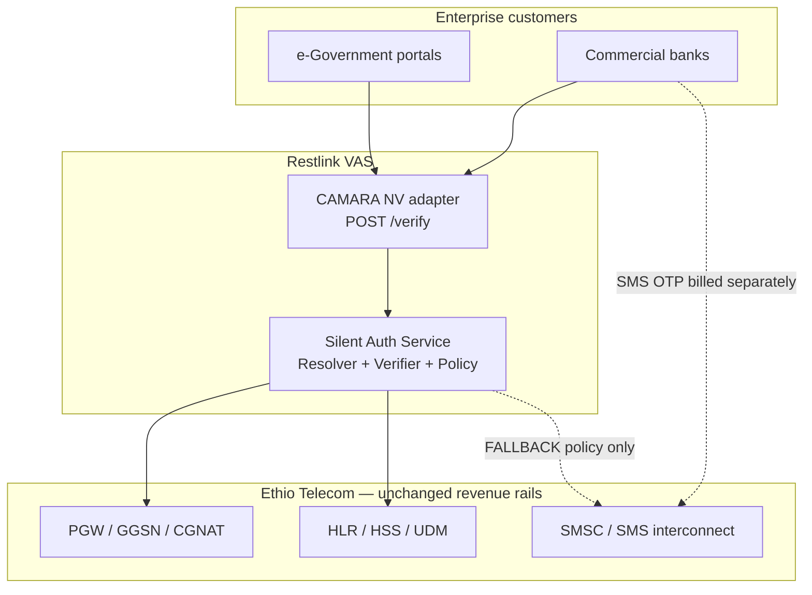

# Chapter 10 — Commercial Model

**Restlink Silent Authentication for Government & Banks (Ethiopia)**  
**Document:** Proposal §10  
**Classification:** Commercial-in-Confidence  
**Version:** 1.0 (Draft)  
**Date:** 2026-07-20

---

## 10.1 Executive summary

Restlink proposes a **Value-Added Service (VAS) adapter** deployed in partnership with **Ethio Telecom**. The adapter exposes a CAMARA-aligned Silent Authentication Service (SAS) to **government agencies** and **commercial banks**. Revenue is generated by billing enterprise customers per successful or attempted `/verify` API call — **not** by intercepting, reselling, or replacing Ethio Telecom SMS wholesale or interconnect traffic.

This commercial structure is deliberate: it aligns incentives across regulators, the national operator, financial institutions, and Restlink. Government and banks gain lower authentication friction and reduced account-takeover (ATO) exposure; Ethio Telecom retains existing SMS and data revenue streams while optionally participating in a **new** enterprise API revenue layer; Restlink earns recurring platform fees for orchestration, policy, and integration.

All monetary figures in this chapter marked **ILLUSTRATIVE** are modelling assumptions for proposal discussion. They do **not** constitute binding commercial offers, tariff filings, or Ethio Telecom-approved rates.

---

## 10.2 Commercial positioning

### 10.2.1 What Restlink is — and is not

| Aspect | Restlink role | Explicitly **not** in scope |
|--------|-----------------|-----------------------------|
| Product | Thin VAS / Open Gateway adapter between bank & e-Gov backends and operator network truth | Replacement SMSC, SMS aggregator, or A2P bypass |
| Billing | Per-`/verify` (and optional tiered assurance) to enterprise customers | Per-SMS margin on operator interconnect |
| Network | Orchestrates Resolver (IP→MSISDN) + Verifier (MAP/Diameter) **inside** operator trust domain | Cross-operator MAP ATI (FS.11 Category 1) |
| Fallback | Policy-driven step-up to OTP / Passkey / TOTP when silent path unavailable | Capturing fallback SMS revenue from Ethio Telecom |
| Integration | SDK, mTLS API, CAMARA NV adapter, SIEM hooks | Direct bank-to-HLR integration |

### 10.2.2 VAS adapter on operator rails

The adapter sits **above** Ethio Telecom core elements (PGW/GGSN, HLR/HSS, SMSC). Banks and government backends call Restlink; Restlink calls operator-hosted Resolver and Verifier interfaces under a partnership agreement. SMS OTP messages that remain after silent-auth adoption continue to originate from and be billed through **Ethio Telecom SMSC** using existing A2P or enterprise SMS contracts.

**Key invariant:** Restlink does **not** take Ethio Telecom SMS revenue. Fallback OTP traffic is an **operator-billed** residual channel, not a Restlink margin pool.

---

## 10.3 Revenue architecture

### 10.3.1 Primary revenue stream — enterprise `/verify` API

| Billing element | Description | Typical buyer |
|-----------------|-------------|---------------|
| **Verification fee** | Per `/verify` request (success or policy-evaluated outcome) | Bank, payment switch, e-Gov identity broker |
| **Assurance tier uplift** | Higher fee when SIM-swap check, location plausibility, or high-value step-up scoring applied | Tier-1 banks, social-benefit disbursement |
| **Platform minimum** | Monthly platform fee covering HA SAS, monitoring, SLA reporting | All enterprise tenants |
| **Onboarding & integration** | One-time SDK/API integration, UAT, penetration-test remediation | Per institution |

**Pricing model (ILLUSTRATIVE — indicative bands for proposal modelling):**

| Tier | Volume (monthly `/verify`) | Indicative unit price (USD) | Indicative unit price (ETB)* |
|------|----------------------------|------------------------------|--------------------------------|
| Pilot | ≤ 50,000 | $0.012 | ~0.67 ETB |
| Growth | 50,001 – 500,000 | $0.009 | ~0.50 ETB |
| National | 500,001 – 2,000,000 | $0.007 | ~0.39 ETB |
| Strategic | > 2,000,000 | Negotiated | Negotiated |

\* ETB conversion **ILLUSTRATIVE** at 1 USD = 56 ETB (July 2026 planning rate; actual settlement per contract).

Government programmes may be priced under a **public-sector tariff** (flat annual entitlement + overage) subject to Ministry of Innovation & Technology and National Bank of Ethiopia procurement rules.

### 10.3.2 Operator revenue — preserved and optionally extended

| Revenue line | Owner | Impact of silent auth |
|--------------|-------|------------------------|
| A2P / enterprise SMS OTP | Ethio Telecom | **Reduced volume** on successful silent path; **unchanged tariff** per message sent |
| SMS interconnect / wholesale | Ethio Telecom | **Preserved** on all fallback and non-auth SMS |
| Mobile data (cellular bearer) | Ethio Telecom | **Neutral to positive** — silent auth requires active cellular data for IP-match method |
| Signalling / core capacity | Ethio Telecom | Minor MAP/Diameter query load; covered by VAS hosting fee or revenue share |
| **New:** Open Gateway / API revenue share | Ethio Telecom (optional) | Additive share of Restlink enterprise `/verify` gross margin |

### 10.3.3 Optional revenue share with Ethio Telecom

Restlink proposes an **optional, additive** revenue-share mechanism — not a replacement of SMS income:

| Share basis | Illustrative split (negotiable) | Rationale |
|-------------|----------------------------------|-----------|
| Net `/verify` margin after cloud/ support costs | 15–25% to Ethio Telecom | Compensates hosting, HLR/HSS query capacity, PGW Resolver access |
| Minimum annual guarantee | Floor payment regardless of volume | De-risks operator partnership during pilot |
| Exclusivity premium | Higher share if Ethio Telecom is sole mobile network partner for national e-Gov silent auth | Aligns with national digital identity strategy |

Revenue share applies **only** to the authentication API product. It does **not** claw back SMS, interconnect, or roaming revenue.

---

## 10.4 Customer segments and go-to-market

### 10.4.1 Government (e-Gov & social programmes)

| Use case | Auth pattern | Commercial note |
|----------|--------------|-----------------|
| Citizen portal login | NV `/verify` + optional claimed MSISDN match | Annual site licence + per-citizen active monthly cap |
| Social benefit / pension disbursement | High assurance tier + SIM-swap signal | Risk-priced tier; SLA 99.9% |
| Tax & customs filing | Silent login; step-up on submission | Integration with national ID broker |
| Emergency alert opt-in verification | Number-verification style (return verified MSISDN) | Lower per-call fee; high volume |

Government contracts are expected to flow through **framework agreement** with Ethio Telecom as network anchor and Restlink as VAS integrator, satisfying public-procurement visibility requirements.

### 10.4.2 Commercial banks

| Use case | Auth pattern | Commercial note |
|----------|--------------|-----------------|
| Retail mobile banking login | Standard `/verify`; FALLBACK to OTP | Per-active-user monthly bundle common |
| Onboarding / device binding | Number verification + assurance score | One-time onboarding fee + recurring |
| High-value transfer step-up | Elevated threshold or forced Passkey | Premium assurance tier |
| Call-centre IVR recovery | Out of scope Phase 1; OTP via operator SMSC | No Restlink SMS margin |

Banks continue existing **Ethio Telecom SMS contracts** for residual OTP. Restlink invoices **authentication API** separately — simplifying audit and avoiding conflict with telco A2P pricing.

---

## 10.5 Cost comparison — SMS OTP vs silent authentication

### 10.5.1 Modelling assumptions (ILLUSTRATIVE)

| Parameter | Value | Source / note |
|-----------|-------|---------------|
| Active authenticated users (scenario) | 100k / 500k / 1M | See `proposal/assets/roi_illustrative.json` |
| Auth events per user per year | 24 | ~2 logins/month |
| Silent-auth adoption rate (steady state) | 70% | After Phase 2 rollout |
| SMS OTP unit cost (enterprise A2P) | $0.042 / message | **ILLUSTRATIVE** — Ethio Telecom enterprise tariff placeholder |
| Silent auth unit cost (Restlink `/verify`) | $0.010 / call | **ILLUSTRATIVE** — Growth tier |
| Fallback OTP share | 30% of events | Wi-Fi-only, stale bearer, policy downgrade |
| Average fraud loss per prevented ATO | $85 | **ILLUSTRATIVE** — industry mid-range retail banking |
| Baseline ATO rate (SMS OTP only) | 0.12% of auth events | **ILLUSTRATIVE** |
| ATO rate reduction with silent auth | 65% | SIM-swap + no SMS intercept surface |

### 10.5.2 Annual cost comparison — enterprise buyer view (ILLUSTRATIVE)

*All figures USD, rounded. ETB equivalent at 56 ETB/USD.*

| Metric | 100k users | 500k users | 1M users |
|--------|------------|------------|----------|
| Total auth events / year | 2.40M | 12.0M | 24.0M |
| **SMS OTP only** — annual cost | $100,800 | $504,000 | $1,008,000 |
| **Blended (70% silent)** — annual cost | $45,360 | $226,800 | $453,600 |
| **Annual savings (SMS line)** | $55,440 | $277,200 | $554,400 |
| SMS OTP cost (ETB) | 5.64M | 28.2M | 56.4M |
| Blended cost (ETB) | 2.54M | 12.7M | 25.4M |
| Savings (ETB) | 3.10M | 15.5M | 31.0M |

**Interpretation:** Silent authentication replaces the majority of billable SMS OTP attempts. Residual SMS remains on operator rails — preserving Ethio Telecom revenue on fallback traffic while reducing **enterprise** SMS spend.

### 10.5.3 ROI summary — including fraud avoidance (ILLUSTRATIVE)

| Line item | 100k users | 500k users | 1M users |
|-----------|------------|------------|----------|
| SMS cost reduction | $55,440 | $277,200 | $554,400 |
| Silent auth API spend (70% × events × $0.010) | $16,800 | $84,000 | $168,000 |
| Fallback SMS (30% × events × $0.042) | $30,240 | $151,200 | $302,400 |
| **Net auth-channel savings** | $8,400 | $41,800 | $83,600 |
| Fraud loss avoided | $157,680 | $788,400 | $1,576,800 |
| **Total annual benefit** | $166,080 | $830,200 | $1,660,400 |
| Restlink platform + integration (Year 1) | $120,000 | $280,000 | $450,000 |
| **Simple Year-1 ROI** | 38% | 196% | 269% |
| Payback period (months) | ~9 | ~4 | ~3 |

Fraud avoidance dominates ROI at scale. SMS savings alone may not cover platform fees at very small scale — pilot business cases should include fraud-risk reduction and customer-experience metrics (login completion rate, call-centre load).

### 10.5.4 Ethio Telecom revenue impact (ILLUSTRATIVE)

| Line | 100k users | 500k users | 1M users |
|------|------------|------------|----------|
| SMS OTP messages (baseline) | 2.40M | 12.0M | 24.0M |
| SMS OTP messages (after 70% silent) | 720k | 3.60M | 7.20M |
| SMS revenue at $0.042/msg | $100,800 → $30,240 | $504k → $151k | $1.01M → $302k |
| Optional API revenue share (20% of $0.010 × silent calls) | $3,360 | $16,800 | $33,600 |
| Data bearer uplift (ILLUSTRATIVE, +5% data ARPU on auth cohort) | $42,000 | $210,000 | $420,000 |

Ethio Telecom SMS revenue **declines proportionally** to successful silent-auth substitution — an expected enterprise efficiency gain, not revenue diversion to Restlink. Optional API share and increased cellular-data engagement partially offset SMS volume reduction. **Restlink does not capture the SMS delta.**

---

## 10.6 Stakeholder value summary

| Stakeholder | Primary value | Financial / operational effect | Risk mitigated |
|-------------|---------------|-------------------------------|----------------|
| **Citizens** | Passwordless, low-friction login to e-Gov and bank apps | Fewer abandoned sessions; no OTP wait | Phishing, SMS delay |
| **Government** | Strong phone-number identity for digital services | Lower SMS budget; higher portal completion | Benefit fraud, ghost accounts |
| **Commercial banks** | Reduced ATO; improved mobile adoption | SMS OPEX reduction; fraud loss avoidance | SIM swap, SS7 SMS intercept |
| **Ethio Telecom** | New enterprise VAS partnership; no channel conflict | Retains fallback SMS + data; optional API share | Regulatory scrutiny on SMS bypass |
| **National Bank of Ethiopia** | Supervised auth uplift for financial inclusion | Observable SLA / audit trail from SAS | Unsupervised A2P aggregators |
| **Restlink** | Recurring `/verify` platform revenue | Integration + managed service margins | — |

---

## 10.7 Contractual & commercial terms (outline)

| Term | Proposed structure |
|------|-------------------|
| **Master Services Agreement (MSA)** | Restlink ↔ each enterprise tenant |
| **Network Attachment Agreement** | Restlink ↔ Ethio Telecom (VAS hosting, Resolver access, signalling quotas) |
| **SLA** | 99.5% API availability (Pilot); 99.9% (Production); P95 latency ≤ 3s inclusive of FALLBACK signal |
| **Data processing** | MSISDN/IMSI processed in-operator; pseudonymised `reqId` in Restlink logs; no sale of subscriber data |
| **Liability cap** | Aligned with authentication assurance tier; high-value flows require bank-side step-up |
| **Audit** | Quarterly usage report; annual security assessment (GSMA FS.11/FS.19 control mapping) |
| **Currency** | ETB invoicing for local banks; USD or ETB for multilateral development bank-funded e-Gov |
| **Term** | Pilot 6 months; production 3+2 years |

---

## 10.8 Competitive & regulatory considerations

| Topic | Restlink approach |
|-------|---------------------|
| **SMS bypass perception** | Public commitment: fallback OTP billed by operator; Restlink publishes traffic split quarterly |
| **Open Gateway / CAMARA** | API shapes follow CAMARA Number Verification; future SIM Swap API Phase 2 |
| **Local content / data residency** | SAS hosted in Ethio Telecom DC or approved Ethiopian cloud region |
| **Interconnect compliance** | No Category 1 MAP on interconnect; intra-network HLR/HSS only (FS.11) |
| **Incumbent aggregators** | Complementary — aggregators retain SMS delivery; Restlink replaces OTP *requirement*, not SMS infrastructure |

---

## 10.9 Summary

The Restlink commercial model is an **additive enterprise authentication layer**. Government and banks pay per `/verify`; Ethio Telecom continues to earn SMS and interconnect fees on every fallback message and retains optional participation in API margin. The model is designed for **regulatory acceptance**, **operator partnership**, and **positive ROI** for financial institutions when fraud avoidance and completion-rate gains are included — not SMS arbitrage.

Structured ROI scenarios for charting are maintained in [`../assets/roi_illustrative.json`](../assets/roi_illustrative.json).

---

*Next: [Chapter 11 — Implementation Roadmap](11_implementation_roadmap.md)*
