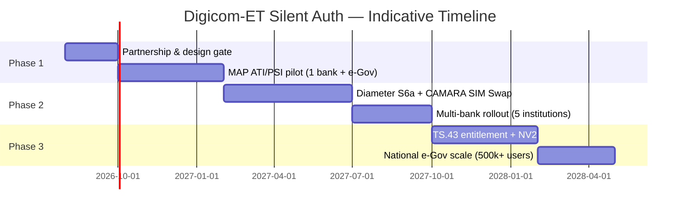

# Chapter 11 — Implementation Roadmap

**Digicom-ET Silent Authentication for Government & Banks (Ethiopia)**  
**Document:** Proposal §11  
**Classification:** Commercial-in-Confidence  
**Version:** 1.0 (Draft)  
**Date:** 2026-07-20

---

## 11.1 Roadmap overview

Implementation is structured in **three phases** over approximately eighteen months from contract signature to national-scale production. Each phase delivers a **standalone security and business increment**: Phase 1 proves IP-match silent auth on 2G/3G MAP; Phase 2 extends to 4G/5G Diameter and CAMARA SIM Swap; Phase 3 adds TS.43 / CAMARA NV2 for Wi-Fi and browser coverage.

Phases align with the unified identity architecture principle — **protect residual OTP first** (operator SMS Home Routing + signalling firewall confirmation in parallel), then **substitute OTP** where the silent path succeeds.

---

## 11.2 Phase 1 — MAP ATI/PSI pilot

**Duration:** Months 1–6  
**Objective:** Prove end-to-end silent authentication for **cellular-data** sessions using IP Resolver + MAP Verifier on Ethio Telecom 2G/3G core.

### 11.2.1 Scope

| In scope | Out of scope |
|----------|--------------|
| Digicom SAS deployment in operator DMZ / VAS zone | TS.43 Wi-Fi path |
| PGW/GGSN or CGNAT Resolver integration (one binding source) | Multi-operator / MVNO |
| MAP **PSI** (primary) + **ATI** (intra-network only) + **SAI** for SIM-swap freshness | CAMARA SIM Swap API (Phase 2) |
| CAMARA Number Verification adapter (`POST /verify`) | Production Diameter S6a (Phase 2) |
| One commercial bank + one e-Gov portal (UAT cohort ≤ 10,000 users) | National marketing launch |
| mTLS bank↔Digicom; audit logging; FALLBACK policy to operator SMS OTP | Custom HSS vendor changes |

### 11.2.2 Deliverables

| # | Deliverable | Acceptance criterion |
|---|-------------|---------------------|
| D1.1 | Signed Network Attachment Agreement (Ethio Telecom ↔ Digicom) | Resolver + MAP GT routing approved |
| D1.2 | SAS HA pair (active/passive) in operator DC | Failover ≤ 30s |
| D1.3 | Resolver interface (IP + port + timestamp → MSISDN) | P95 ≤ 300ms; CGNAT disambiguation tested |
| D1.4 | MAP Verifier (PSI/ATI/SAI via jSS7) | Dialog timeout 2s; zero dialog leak in 72h soak |
| D1.5 | Assurance scoring v1 (login tier) | Configurable weights; fail-closed documented |
| D1.6 | CAMARA NV adapter + bank SDK (Android pilot) | OpenAPI 3.1 contract; mock + live endpoints |
| D1.7 | Pilot run report | ≥ 60% silent-auth success on cellular; FALLBACK ≤ 40% |

### 11.2.3 Work packages — Phase 1

| WP | Title | Owner | Duration | Dependencies |
|----|-------|-------|----------|--------------|
| WP1.1 | Governance & security architecture sign-off | Digicom + Ethio Telecom + NBE observer | 4 weeks | MSA draft |
| WP1.2 | Resolver source selection (PGW RADIUS vs PCRF Sd vs CGNAT log) | Ethio Telecom core + Digicom | 3 weeks | WP1.1 |
| WP1.3 | jSS7 MAP Verifier module (PSI/ATI/SAI) | Digicom engineering | 6 weeks | WP1.2 |
| WP1.4 | SAS policy engine + `/verify` API | Digicom engineering | 4 weeks | WP1.3 (parallel start week 3) |
| WP1.5 | Bank + e-Gov integration (1+1) | Digicom PS + tenant IT | 8 weeks | WP1.4 |
| WP1.6 | Pilot UAT, penetration test, go-live | Joint | 4 weeks | WP1.5 |
| WP1.7 | Operator SMS Home Routing / SS7 FW confirmation | Ethio Telecom | Parallel | WP1.1 |

---

## 11.3 Phase 2 — Diameter S6a + CAMARA SIM Swap

**Duration:** Months 7–11  
**Objective:** Extend verification to **4G/5G** subscribers via Diameter S6a (IDR/AIR); expose **CAMARA SIM Swap** API for high-value and e-Gov disbursement flows.

### 11.3.1 Scope

| In scope | Out of scope |
|----------|--------------|
| jDiameter S6a client (mirror MAP verifier pattern) | TS.43 EAP-AKA (Phase 3) |
| Dual-path verifier: MAP for 2G/3G, Diameter for 4G/5G | 5G SEPP/N32 implementation (operator-led) |
| CAMARA SIM Swap API (check + notification webhook) | Number Recycling API |
| Assurance tiering (login vs transfer vs benefit) | International roaming silent auth |
| Rollout to **five** commercial banks | Full national e-Gov |

### 11.3.2 Deliverables

| # | Deliverable | Acceptance criterion |
|---|-------------|---------------------|
| D2.1 | Diameter S6a Verifier (IDR/AIR) | P95 ≤ 2s; parity with MAP assurance outputs |
| D2.2 | Access-technology auto-selection | Correct MAP vs Diameter path per serving node |
| D2.3 | CAMARA SIM Swap API v0.5+ adapter | GSMA Open Gateway conformance self-test |
| D2.4 | Shared identity-policy store (SAS + operator FW) | Rate limits coherent across silent + OTP paths |
| D2.5 | Multi-tenant billing & usage dashboard | Per-bank `/verify` metering |
| D2.6 | Production SLA (99.9%) | Quarterly review with NBE-aligned banks |

### 11.3.3 Work packages — Phase 2

| WP | Title | Owner | Duration | Dependencies |
|----|-------|-------|----------|--------------|
| WP2.1 | jDiameter S6a module | Digicom engineering | 8 weeks | Phase 1 complete |
| WP2.2 | Verifier routing logic (MAP ↔ Diameter) | Digicom engineering | 3 weeks | WP2.1 |
| WP2.3 | CAMARA SIM Swap adapter | Digicom engineering | 6 weeks | WP2.2 |
| WP2.4 | Bank rollout wave (5 institutions) | Digicom PS | 12 weeks | WP2.3 |
| WP2.5 | DEA / Diameter edge validation (operator) | Ethio Telecom | Parallel | FS.19 checklist |
| WP2.6 | Assurance calibration & fraud analytics v1 | Digicom + bank risk | 4 weeks | WP2.4 mid-point |

---

## 11.4 Phase 3 — TS.43 & CAMARA NV2

**Duration:** Months 12–18  
**Objective:** Close the **Wi-Fi-only** coverage gap via GSMA TS.43 Service Entitlement (EAP-AKA SIM method) and CAMARA **Number Verification v2 (NV2)** for browser and native apps without active cellular bearer.

### 11.4.1 Scope

| In scope | Out of scope |
|----------|--------------|
| TS.43 entitlement server (operator-hosted or co-managed) | Non-SIM device auth |
| NV2 API surface (CAMARA) | Full GSMA Open Gateway catalogue |
| iOS + Android SDK parity | Desktop browser FIDO-only (recommend Passkey fallback) |
| National e-Gov scale (500k+ registered users) | Cross-border NV |

### 11.4.2 Deliverables

| # | Deliverable | Acceptance criterion |
|---|-------------|---------------------|
| D3.1 | TS.43 entitlement server integration | EAP-AKA success on Wi-Fi test matrix |
| D3.2 | NV2 adapter unified with SAS `/verify` | Single policy engine; method negotiation |
| D3.3 | Fallback surface ≤ 15% of auth events (steady state) | Measured over 90 days post-launch |
| D3.4 | National e-Gov production cutover | Ministry sign-off; DR tested |
| D3.5 | FS.36 / 5G SMSF path readiness assessment | Operator report; Digicom SAS unchanged at app layer |

### 11.4.3 Work packages — Phase 3

| WP | Title | Owner | Duration | Dependencies |
|----|-------|-------|----------|--------------|
| WP3.1 | TS.43 feasibility & entitlement server | Ethio Telecom + Digicom | 10 weeks | Phase 2 complete |
| WP3.2 | NV2 / CAMARA adapter | Digicom engineering | 8 weeks | WP3.1 |
| WP3.3 | SDK v2 (Wi-Fi + cellular unified) | Digicom engineering | 6 weeks | WP3.2 |
| WP3.4 | National e-Gov integration | Digicom PS + government SI | 10 weeks | WP3.3 |
| WP3.5 | Hypercare & optimisation (90 days) | Digicom ops | 12 weeks | WP3.4 go-live |

---

## 11.5 Cross-phase work packages

| WP | Title | Phases | Description |
|----|-------|--------|-------------|
| WP-X.1 | Security & compliance | 1–3 | FS.11/FS.19 control mapping; annual pen-test |
| WP-X.2 | Observability | 1–3 | Metrics: success/FALLBACK/latency/dialog abort; SIEM export |
| WP-X.3 | Documentation & training | 1–3 | Bank integration guides; operator NOC runbooks |
| WP-X.4 | Commercial metering | 2–3 | Usage API → billing system |
| WP-X.5 | Disaster recovery | 2–3 | RPO 15 min; RTO 1 hr for SAS tier |

---

## 11.6 Resource plan (indicative)

| Role | Phase 1 FTE | Phase 2 FTE | Phase 3 FTE |
|------|---------------|-------------|-------------|
| Digicom solution architect | 0.5 | 0.5 | 0.25 |
| Digicom MAP/Diameter engineers | 2.0 | 2.5 | 1.5 |
| Digicom backend / API | 1.5 | 1.0 | 1.0 |
| Digicom PS / integration | 1.0 | 2.0 | 2.5 |
| Ethio Telecom core liaison | 0.5 | 0.5 | 0.25 |
| Ethio Telecom PGW/HSS engineer | 0.25 | 0.25 | 0.25 |
| Bank tenant IT (per pilot) | 0.5 | 0.25 × 5 | 0.1 × N |

---

## 11.7 Risks and mitigations

| ID | Risk | Likelihood | Impact | Mitigation | Owner |
|----|------|------------|--------|------------|-------|
| R1 | Resolver binding source delayed or ambiguous under CGNAT | Medium | High | Early WP1.2 proof; require IP+port+timestamp; reject multi-MSISDN | Ethio Telecom + Digicom |
| R2 | FS.11 Category 1 ATI misuse perception | Low | High | Document intra-network-only deployment; PSI as primary | Digicom |
| R3 | MAP dialog leak / timeout under HSS load | Medium | Medium | Bounded TC timers; soak test; abort on 2s budget | Digicom |
| R4 | Low cellular-data adoption in rural cohort | Medium | Medium | Phase 3 TS.43; Passkey fallback; measure bearer mix | Joint |
| R5 | Bank IT integration backlog | High | Medium | CAMARA mock server; reference SDK; fixed-scope pilot SOW | Digicom PS |
| R6 | SMS revenue concern blocks operator sign-off | Medium | High | Commercial model §10: no SMS margin to Digicom; optional API share | Commercial |
| R7 | SIM-swap signal false positive / negative | Medium | High | SAI + last-update age; tunable cooldown; CAMARA SIM Swap Phase 2 | Digicom |
| R8 | Regulatory delay (NBE / MoIT approval) | Medium | Medium | Early observer engagement; FS.11/19 mapping pack | Digicom |
| R9 | jDiameter S6a interoperability gaps | Medium | Medium | Lab HSS; vendor test harness; MAP fallback for 4G attach | Digicom |
| R10 | TS.43 entitlement complexity | High | Medium | Phase 3 gate; Wi-Fi remains OTP+Home Routing until proven | Ethio Telecom |

---

## 11.8 Success metrics

### 11.8.1 Phase exit criteria

| Phase | Metric | Target |
|-------|--------|--------|
| **1** | Silent-auth success rate (cellular sessions) | ≥ 60% |
| **1** | API P95 latency (inclusive) | ≤ 3.0 s |
| **1** | MAP dialog leak incidents | 0 in 30-day pilot |
| **1** | Pilot user NPS (login experience) | ≥ +30 vs OTP baseline |
| **2** | 4G/5G verifier success parity | ≥ 95% vs MAP path |
| **2** | SIM Swap API false positive rate | ≤ 2% (tuned cohort) |
| **2** | Active bank tenants | ≥ 5 |
| **3** | Wi-Fi silent-auth success (TS.43) | ≥ 50% of Wi-Fi-only attempts |
| **3** | Overall FALLBACK rate | ≤ 15% |
| **3** | e-Gov registered users on silent auth | ≥ 500,000 |

### 11.8.2 Ongoing operational KPIs

| KPI | Target (production) | Measurement |
|-----|---------------------|-------------|
| SAS availability | 99.9% | Monthly |
| `/verify` success (non-FALLBACK) | ≥ 70% | Rolling 30 days |
| ATO rate reduction vs baseline | ≥ 50% | Bank fraud ops quarterly |
| Enterprise SMS OTP volume reduction | ≥ 60% | Operator A2P billing |
| Mean time to detect SAS degradation | ≤ 5 min | Alerting |
| Security incidents (auth bypass) | 0 critical | Per incident |

### 11.8.3 Business outcomes (12-month post Phase 2)

| Outcome | ILLUSTRATIVE target |
|---------|---------------------|
| Combined bank + e-Gov active users | 500,000 |
| Annual `/verify` volume | 12M |
| Enterprise SMS OTP spend reduction | See §10.5.2 |
| Fraud loss avoided | See `roi_illustrative.json` |

---

## 11.9 Governance and decision gates

| Gate | Timing | Decision body | Go criteria |
|------|--------|---------------|-------------|
| G0 | Contract signature | Ethio Telecom + Digicom exec | Commercial model agreed |
| G1 | End Phase 1 | Technical steering committee | D1.* accepted; pen-test remediated |
| G2 | Phase 2 funding release | Digicom + bank sponsors | ≥ 60% pilot success; 2 LOIs for rollout |
| G3 | Phase 3 TS.43 commit | Operator product board | TS.43 lab success; entitlement host ready |
| G4 | National e-Gov | Ministry + NBE | Security audit; DR drill passed |

---

## 11.10 Summary

The roadmap de-risks delivery by proving **MAP ATI/PSI** on a constrained pilot, then layering **Diameter + CAMARA SIM Swap** for modern attach, and finally **TS.43 / NV2** for Wi-Fi completeness. Operator SMS revenue remains on existing rails throughout; Digicom monetises the authentication API layer only. Success is measured in **security outcomes**, **user experience**, and **enterprise economics** — not SMS displacement.

---

*Previous: [Chapter 10 — Commercial Model](10_commercial_model.md) · Next: [Chapter 12 — Appendices](12_appendices.md)*
